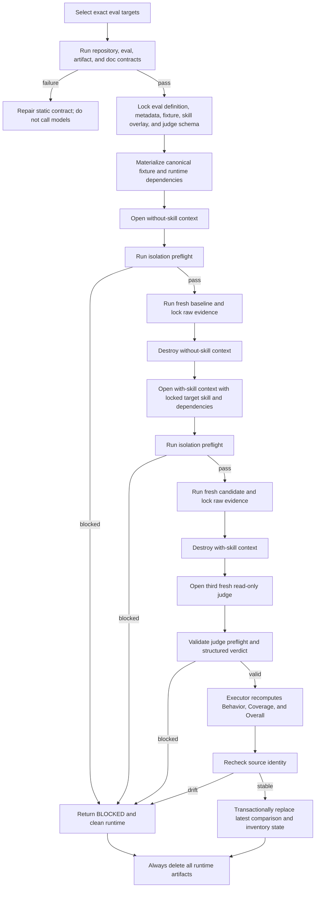

# Skill Eval Runbook

## Purpose

Use this runbook to operate the shared paired evaluator introduced by Issue #246. It
describes the current repository behavior; the Python implementation remains the
authority when commands or fields change.

## Contents

- [End-to-End Flow](#end-to-end-flow)
- [Parallelism Model](#parallelism-model)
- [Inputs Locked at Start](#inputs-locked-at-start)
- [Isolation Preflight](#isolation-preflight)
- [Candidate and Judge Evidence](#candidate-and-judge-evidence)
- [Durable and Ephemeral Outputs](#durable-and-ephemeral-outputs)
- [Result Triage](#result-triage)
- [Command Reference](#command-reference)

## End-to-End Flow



## Parallelism Model

Use one runner process with `--jobs 1..10`.

```text
runner process
├── worker 1: eval A = without → with → judge
├── worker 2: eval B = without → with → judge
├── ...
└── worker 10: eval J = without → with → judge
```

The worker pool parallelizes independent eval targets. It never parallelizes the three
contexts inside one eval. The in-process durable write lock protects the inventory and
comparison transaction. Starting several runner processes removes that protection and
is unsupported.

Use `--jobs 1` for one target or when reproducing a timing-sensitive infrastructure
failure. Use `--jobs 10` for role, skill, cross-role, or full batches unless resource
pressure makes a lower value necessary.

## Inputs Locked at Start

The runner locks or hashes these inputs before candidate execution:

- the selected eval item and its assertions;
- its `eval_metadata.json` bytes;
- the canonical candidate-visible fixture;
- the target skill plus declared `skill_dependencies` overlay;
- the judge result schema;
- the shared executor and runtime implementations.

Only the locked overlay is installed into the with-skill lane. The runner rechecks
source identity before durable persistence. A drift or mismatch is `BLOCKED`.

## Isolation Preflight

Each candidate context must prove:

- the workspace is readable and writable;
- its isolated `HOME` is writable;
- repository source, sibling context, and isolated `CODEX_HOME` authentication bytes
  are unreadable;
- the two canonical fixtures have the same manifest and prompt hash;
- without-skill cannot see the target overlay and with-skill sees only the locked
  target plus declared dependencies;
- Git topology and runtime dependencies match the declared metadata;
- declared process, port, database, browser, login, and download state is isolated,
  reset, or explicitly `not_used`;
- the judge context is a fresh third context and is read-only.

Unknown or unprovable isolation is `BLOCKED`, never a degraded run.

## Candidate and Judge Evidence

Both candidate lanes receive the same natural user prompt. Neither receives mode
labels, assertions, expected output, historical comparison, judge instructions, or
other eval scaffolding.

The executor locks candidate final output, delivery snapshot, initial and final Git
state, ref changes, committed diffs, relevant blobs, dependency hashes, return code,
timeout state, prompt hash, and fixture hash. The independent judge receives only the
assertions, both locked outputs, and the raw evidence needed to verify them. Candidate
self-assessment is not evidence.

The executor validates the judge JSON schema and enforces the result combination:

| Behavior | Coverage | Overall |
| --- | --- | --- |
| FAIL | FULL or PARTIAL | FAIL |
| PASS | FULL | PASS |
| PASS | PARTIAL | PASS (partial coverage) |

External data that does not exercise an assertion affects Coverage, not Behavior.

## Durable and Ephemeral Outputs

A completed fresh judge writes the latest `comparison.md` and the matching inventory
record in one transaction. A fresh `FAIL` is valid durable evidence and is persisted;
it must not be disguised as `BLOCKED` or `PASS`.

The durable comparison records the target, source identity, preflight, assertion
evidence, both lane summaries, Behavior, Coverage, Overall, failures, next steps, and
runtime artifact policy. It contains only the latest result; previous results remain in
Git history.

The runner deletes all ephemeral state in `finally`, including workspaces, skill and
dependency copies, outputs, snapshots, judge package and verdict, transcripts, timing,
diagnostics, and run status. Do not commit or upload `tmp/eval-runs/`.

## Result Triage

| Observation | Primary classification | Next action |
| --- | --- | --- |
| Preflight, dependency, candidate process, model, or judge cannot complete | Runner/infrastructure blocker | Reproduce with one target and `--jobs 1`; fix isolation or execution without scoring the skill. |
| Prompt or fixture tells the baseline the protocol, gate, answer, or expected behavior | Eval defect | Rewrite the scenario or host material; keep the skill unchanged. |
| Scenario claims materials, refs, runtime, or dependencies that the lane does not contain | Eval defect | Repair the fixture or narrow the assertion to real evidence. |
| Valid with-skill lane violates a documented skill obligation | Skill defect | Open a skill issue with assertion and raw behavior evidence. |
| Both lanes pass the same assertion | Leakage, shipped-template behavior, or baseline capability | Identify the cause; do not manufacture differentiation. |
| Behavior passes but an assertion is not exercised | Coverage gap | Keep partial coverage and add a realistic scenario only if the missing path matters. |
| Several evals fail on the same routing or evidence rule | Shared contract or skill-family defect | Cluster by root cause before editing individual evals. |

Keep issue scopes separate so later remediation can answer whether the eval drifted from
the skill design, the skill has an execution defect, or the runner could not produce
trustworthy evidence.

## Command Reference

Static validation, without model calls:

```bash
uv run scripts/check_repository_contract.py
uv run scripts/check_eval_contract.py
uv run scripts/check_eval_artifacts.py
uv run scripts/check_doc_contract.py
uv run --with pytest pytest \
  scripts/test_eval_runtime.py \
  scripts/test_run_skill_eval.py \
  agents/test_eval_contract.py \
  scripts/test_check_eval_artifacts.py \
  scripts/test_summarize_eval_results.py
```

Fresh model execution:

```bash
# Exact eval
uv run scripts/run_skill_eval.py \
  --agent <agent> --skill <skill> --eval <eval-id> --jobs 1

# Exact mixed set
uv run scripts/run_skill_eval.py --jobs 10 \
  --select <agent>/<skill>/<eval-id> \
  --select <agent>/<skill>/<eval-id>

# Filtered or full batch
uv run scripts/run_skill_eval.py --agent <agent> --jobs 10
uv run scripts/run_skill_eval.py --agent <agent> --skill <skill> --jobs 10
uv run scripts/run_skill_eval.py --jobs 10
```

Post-run verification:

```bash
uv run scripts/check_eval_contract.py
uv run scripts/check_eval_artifacts.py
uv run scripts/summarize_eval_results.py
git status --short
git diff --check
```

The manual GitHub Actions workflow exposes `target`, optional `skill`, and optional
`eval_id`, then invokes the same runner with `--jobs 10`. Required CI intentionally
runs only deterministic contract checks and Python tests; it does not spend model eval
capacity.
