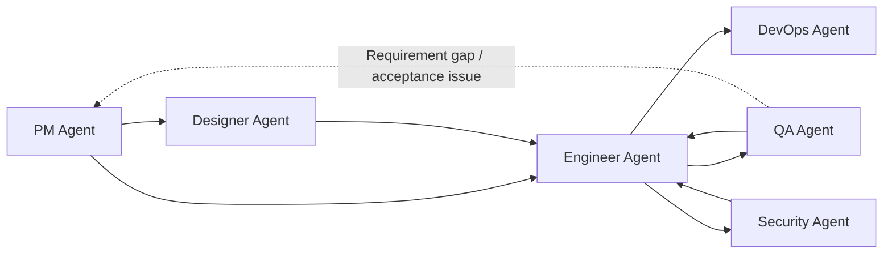
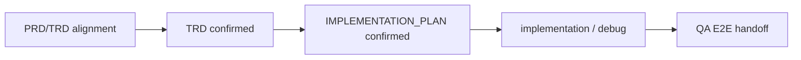

<div align="center">

# Dev Agent Skills

Multi-agent skills for the full software delivery lifecycle.

[](#agents)
[](#agents)
[](LICENSE)

`pm-agent` • `designer-agent` • `engineer-agent` • `qa-agent` • `devops-agent` • `security-agent`

[Quick Start](#quick-start) • [Agents](#agents) • [Collaboration Model](#collaboration-model) • [Repository Structure](#repository-structure) • [Local Validation](#local-validation)

</div>

> [!NOTE]
> Other languages: [中文](./README_zh.md)

## Overview

This repository publishes six role-based agents from one marketplace/source, covering the full path from product planning to design, implementation, testing, deployment, and security review.

It includes:

- 1 public PM entry skill plus 5 downstream role routers
- 29 internal specialist skills across product, engineering, QA, DevOps, design, and security work
- Claude Code marketplace configuration
- Codex native skill discovery installation instructions
- Agent-level eval fixtures and local validation scripts
- Reference-backed visual design system data and lookup scripts for Designer Agent

> [!NOTE]
> These agents collaborate through Markdown documents and project assets. They do not require a shared runtime or fixed state machine. Use `pm-agent` as the direct user entry; install downstream role plugins only when PM handoff should have those capabilities available.

## Agents

| Agent | Focus | Skills | Invocation | Docs |
| --- | --- | :---: | --- | --- |
| `pm-agent` | Requirements, specs, competitor research, roadmap, release communication, GitHub project status | 9 (`1 + 8`) | Direct entry: `/pm-agent` | [product_manager](./agents/product_manager/README.md) |
| `designer-agent` | UX flows, information architecture, wireframes, visual systems, design handoff | 3 (`1 + 2`) | PM handoff only | [designer](./agents/designer/README.md) |
| `engineer-agent` | Codebase analysis, TRD generation, project bootstrap, feature implementation, tests, debugging, delivery | 8 (`1 + 7`) | PM handoff only | [engineer](./agents/engineer/README.md) |
| `qa-agent` | Spec validation, exploratory testing, bug analysis, regression verification | 5 (`1 + 4`) | PM handoff only | [qa](./agents/qa/README.md) |
| `devops-agent` | Deployment planning, CI/CD, environment configuration audits, incident playbooks | 5 (`1 + 4`) | PM handoff only | [devops](./agents/devops/README.md) |
| `security-agent` | AppSec, authorization review, dependency risk, privacy data-flow mapping | 5 (`1 + 4`) | PM handoff only | [security](./agents/security/README.md) |

> [!TIP]
> Use `/pm-agent` as the direct user entry. PM classifies the request and hands off to downstream role routers or specialist skills when the scope is ready.

## Collaboration Model



Engineering guardrails:



Existing feature changes, bug fixes, and user-visible implementation should pass PRD/TRD alignment before engineering execution. Engineer confirms the TRD and `IMPLEMENTATION_PLAN.md` before implementation, then hands user-flow impact to QA through a QA E2E package.

Common chains:

1. `pm-agent -> engineer-agent -> qa-agent`
2. `pm-agent -> designer-agent -> engineer-agent -> qa-agent`
3. `engineer-agent <-> qa-agent` for bugfix and regression loops
4. `engineer-agent -> devops-agent` for deployment, CI/CD, and runtime readiness
5. `engineer-agent -> security-agent` for pre-release or focused security review

Not every project needs the full chain. Each agent can complete its own role-specific loop, and cross-agent handoff happens only when another role is needed.

## Quick Start

### Claude Code

```bash
# Add the marketplace
/plugin marketplace add Neplich/dev-agent-skills

# Install the public entry
/plugin install pm-agent@dev-agent-skills

# Optional downstream capabilities for PM handoff
/plugin install designer-agent@dev-agent-skills
/plugin install engineer-agent@dev-agent-skills
/plugin install qa-agent@dev-agent-skills
/plugin install devops-agent@dev-agent-skills
/plugin install security-agent@dev-agent-skills
```

Claude Code scans installed plugins by plugin root. This repository scopes each plugin to its own agent directory, but installing only the agents you need is still recommended.

### Codex

Clone or update this repository, then run the copy-based installer:

```bash
git clone https://github.com/Neplich/dev-agent-skills.git ~/.agents/dev-agent-skills
cd ~/.agents/dev-agent-skills

# Install all role router and specialist skills by default.
python3 scripts/install_codex_skills.py

# Optional minimal mode: install only the six role router skills.
python3 scripts/install_codex_skills.py --routers-only
```

Codex resolves skill symlinks to their real path before looking upward for plugin manifests. If skills are symlinked into this repository clone, Codex can find `agents/{role}/.claude-plugin/plugin.json` and add namespace prefixes such as `Pm Agent:` to every skill. The installer copies skill directories into `~/.agents/skills/` so the target ancestor chain does not include those manifests, and it adds managed support references so shared repo-relative instructions remain loadable. See [issue #95](https://github.com/Neplich/dev-agent-skills/issues/95).

The default install copies all role router and specialist skills so `pm-agent` and role-router orchestration can call downstream specialists. Use `--routers-only` only for a minimal entry-classification install; in that mode specialist skills are not installed, so `pm-agent` and role routers cannot call downstream specialist workflows. If a target already contains managed specialist skills, `--routers-only` stops with cleanup instructions unless `--force` is used to remove the unselected managed skills; unowned same-name directories are never deleted automatically. Use `--target <path>` for a project-local or custom skill directory, and `--force` to replace existing copied skill directories.

To disable one copied skill by path, add a path-specific entry to `~/.codex/config.toml`:

```toml
[[skills.config]]
path = "/Users/you/.agents/skills/debugger"
enabled = false
```

See [docs/README.codex.md](./docs/README.codex.md) for the full Codex guide.

## Usage Examples

```text
/pm-agent "I want to build a task management app. Help me shape the requirements first."
/pm-agent "There is a bug in the login flow. Classify the expected behavior and route the fix."
/pm-agent "Validate the checkout flow against the spec."
/pm-agent "Prepare CI/CD and release readiness checks."
/pm-agent "Review authorization and dependency risk before release."
```

Downstream role routers and specialist skills remain installed as PM-orchestrated capabilities. Prefer `pm-agent` for direct user requests; downstream skills are intended for work whose scope has already been confirmed by PM handoff or an equivalent document chain.

## Repository Structure

```text
dev-agent-skills/
├── .claude-plugin/          # Claude Code marketplace configuration
├── .codex/                  # Codex installation entrypoint
├── agents/                  # 6 agents with skills and evals
├── docs/                    # Public docs and historical design notes
├── skills-lock.json         # Skill metadata lock file
├── AGENTS.md                # Single source of repository guidance
└── CLAUDE.md                # Symlink to AGENTS.md for Claude Code compatibility
```

Each agent follows the same basic shape:

```text
agents/{agent}/
├── README.md
├── skills/
│   └── {skill}/
│       └── SKILL.md
└── test/
    └── {skill}/
        └── evals/
            └── evals.json
```

Some skills also include `_internal/`, `references/`, or script directories for protocol details, design data, or validation helpers.

## Design System Data

Designer Agent's `visual-design` skill includes reference-backed design system capability:

- Local path: `agents/designer/skills/visual-design/references/design-system-data/`
- Data coverage: product types, style patterns, colors, typography, UX guidelines, charts, landing patterns, icons, and stack guidelines
- Usage boundary: design reasoning and design-system documentation only; it must not generate application code, install commands, or engineering task lists

The data design follows ui ux pro max's organization model and is maintained under this repository's own paths and documentation.

## Local Validation

> [!NOTE]
> Use `uv run ...` for Python-based validation scripts and eval runners in this repository.

PR CI uses four required checks in this order:

```bash
# repository-contract
uv run scripts/check_repository_contract.py

# eval-contract
uv run scripts/check_eval_contract.py
uv run scripts/check_eval_artifacts.py

# doc-contract
uv run scripts/check_doc_contract.py

# python-tests
uv run --with pytest pytest \
  agents/product_manager/test/idea-to-spec \
  agents/product_manager/test/pm-agent \
  agents/qa/test/test_qa_run_eval.py \
  agents/designer/test/test_designer_run_eval.py \
  agents/devops/test/test_devops_run_eval.py \
  agents/test_doc_contract.py \
  agents/test_eval_contract.py
```

Additional local model evals are manual quality checks, not first-version PR required checks:

```bash
# Designer eval diagnostics
uv run agents/designer/test/run_all_evals.py

# QA model eval
uv run agents/qa/test/run_all_evals.py
```

For changes that affect skill behavior, routing, eval fixtures, or release readiness, an administrator should run the manual model eval workflow before merging and use the result as merge evidence. Model evals are not required status checks because model output, runtime, and environment can vary.

The same manual checks are available from GitHub Actions: open `Manual Evals`, choose `Run workflow`, select `all`, `designer`, or `qa`, and review the uploaded short-lived runtime artifacts. The QA eval job requires the `OPENAI_API_KEY` repository secret because it calls `codex exec`; `designer` can be run independently without that secret and reports runtime-output gaps as warnings for artifact review.

Extra static format checks:

```bash
# JSON format checks
uv run python -m json.tool .claude-plugin/marketplace.json >/tmp/marketplace.json.out
uv run python -m json.tool skills-lock.json >/tmp/skills-lock.json.out
```

## Maintenance Notes

- Follow the existing `agents/*` structure when adding a new agent or skill.
- Keep `AGENTS.md` as the only edited guidance source; `CLAUDE.md` must remain a symlink to it.
- Update versioned changelog files under [`docs/changelog/`](./docs/changelog/) for release-facing, user-facing, or developer-facing changes; keep root [`CHANGELOG.md`](./CHANGELOG.md) as an index and keep README focused on the current project state.
- Keep `.claude-plugin/marketplace.json` `metadata.version` aligned with the repository release version without the `v` prefix. Before creating a release tag, update `metadata.version`, add the matching `docs/changelog/changelog-v{version}.md`, and update the root changelog index.
- Restrictive repository permissions default to the sole administrator; add maintainers or bots explicitly when needed.
- Skill evals should verify role boundaries, context reading, execution-path selection, and structured artifacts instead of generic answer quality alone.
- All skill eval definitions use the shared `evals.json` schema v1.0; do not add agent-specific schema exceptions.

### Eval maintenance flow

When adding or updating a skill eval, keep the repository as the source of eval definitions and latest conclusions, not a log archive:

1. Create or update the skill and its eval fixture.
2. Run the existing or updated test set. Use a temporary or scratch workspace when the runner supports it.
3. Write the latest comparison in `comparison.md`.
4. Delete runtime files before opening a PR.
5. Commit only eval definitions, metadata, fixtures, README files, and `comparison.md`.

Do not commit `with_skill/`, `without_skill/`, `baseline/`, `iteration2/`, `outputs/`, `comparison.auto.md`, transcripts, candidate outputs, subagent verdicts, timing files, run status files, or diagnostics directories. Eval runners write runtime files under scratch workspaces such as `tmp/eval-runs/...`; these files are temporary and must not be copied into eval fixtures. Metadata fields such as `with_skill_outputs`, `without_skill_outputs`, and baseline outputs describe runner expectations; they do not mean those runtime files belong in git. `with_skill_outputs` may act as runner gates; `without_skill_outputs` and baseline output metadata are comparison evidence and should be reported without independently failing deterministic runners. Manual or scheduled model eval workflows may upload transcripts, verdicts, timing, and diagnostics as short-lived CI artifacts for debugging, but the durable repository result remains `comparison.md`.

The baseline is the without-skill comparison input for `comparison.md`; it is not an independently machine-graded artifact. The durable `Latest result` is the conclusion from the sub-agent, fresh judge, or human reviewer after comparing with-skill behavior, without-skill baseline behavior, assertions, and fixture context. Deterministic contract checks validate eval definitions, required workspaces, durable comparison presence, and runtime artifact hygiene; they do not infer PASS, PARTIAL, or BLOCKED from free-form baseline text.

Fresh Sub-Agent gate: every fresh Codex subagent skill eval must generate a new `without_skill` baseline from the same eval prompt and fixture. Do not reuse historical baseline text as the current run. If the new baseline cannot be generated or reviewed, record the impact in `comparison.md`; deterministic runners should not grade the baseline prose itself.

Every `evals.json` must live at `agents/{agent}/test/{skill-name}/evals/evals.json` and declare `schema_version: "1.0"`, `agent`, `skill_name`, and non-empty `evals`. Each eval item must include `id`, `name`, `description`, `prompt`, explicit `workspace` pointing to `workspace/...`, `expected_output`, and object assertions with lower snake_case `id`, `description`, and semantic `text`. Prompt-only evals still need a minimal workspace with `eval_metadata.json` and durable `comparison.md`. Run `uv run scripts/check_eval_contract.py` with eval definition changes.

Eval runners write runtime files to a system temp directory or `tmp/eval-runs/...`, then copy only the confirmed `comparison.md` back to the eval workspace. New metadata schemas should make the split explicit with runtime-output fields and a durable-result field. Keep Python test module names unique across test roots, such as `test_pm_run_eval.py` and `test_qa_run_eval.py`, so pytest can collect all deterministic tests in one process.

### QA E2E Local Account File

QA E2E credentials use a local ignored account file instead of committed
plaintext or encrypted credential files:

```text
.qa/e2e/accounts.local.json
```

The file is excluded by `.gitignore`. QA documents, test cases, scripts,
results, and eval fixtures may only reference credential IDs such as
`platform.default.admin` or `ssh.default.deploy`; they must not include real
usernames, passwords, tokens, cookies, sessions, SSH passwords, SSH key
contents, or passphrases.

When a QA agent receives platform or SSH credential details from a user, it
should upsert them into `.qa/e2e/accounts.local.json` according to
[`e2e-credential-store.md`](./agents/qa/skills/qa-agent/references/e2e-credential-store.md)
and keep file permissions local-only when possible. E2E summary reports must
follow
[`e2e-test-report.md`](./agents/qa/skills/qa-agent/references/e2e-test-report.md).

Use this `comparison.md` shape for durable results:

```markdown
# Eval Result: <eval-name>

## Evaluation Target
## Test Set / Fixture Version
## Latest Result
## With Skill
## Without Skill / Baseline
## Failures
## Next Steps
## Runtime Artifacts Policy
```

<div align="center">

[中文](./README_zh.md) • [Claude Guide](./CLAUDE.md) • [Agents Guide](./AGENTS.md) • [Codex Guide](./docs/README.codex.md)

</div>
