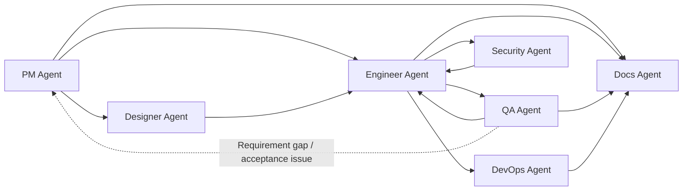

<div align="center">

# Dev Agent Skills

Multi-agent skills for the full software delivery lifecycle.

[](#agents)
[](#agents)
[](LICENSE)

`pm-agent` • `designer-agent` • `engineer-agent` • `qa-agent` • `devops-agent` • `security-agent` • `docs-agent`

[Quick Start](#quick-start) • [Usage Examples](#usage-examples) • [Agents](#agents) • [Collaboration Model](#collaboration-model) • [Documentation](#documentation)

</div>

> [!NOTE]
> Other languages: [中文](./README_zh.md)

## Overview

This repository publishes seven role-based agents from one marketplace/source, covering the full path from product planning to design, implementation, testing, deployment, security review, and formal documentation.

It includes:

- 1 public PM entry skill plus 6 downstream role routers
- 31 internal specialist skills across product, engineering, QA, DevOps, design, security, and formal documentation work
- Claude Code marketplace configuration
- Codex native skill discovery installation instructions
- Agent-level eval fixtures and local validation scripts

> [!NOTE]
> These agents collaborate through Markdown documents and project assets. They do not require a shared runtime or fixed state machine. Use `pm-agent` as the direct user entry; install downstream role plugins only when PM handoff should have those capabilities available.

## Quick Start

### Claude Code

```bash
# Add the marketplace
/plugin marketplace add Neplich/dev-agent-skills

# Install the public entry
/plugin install pm-agent@dev-agent-skills

# Optional downstream capabilities for PM handoff
/plugin install designer-agent@dev-agent-skills
/plugin install engineer-agent@dev-agent-skills
/plugin install qa-agent@dev-agent-skills
/plugin install devops-agent@dev-agent-skills
/plugin install security-agent@dev-agent-skills
/plugin install docs-agent@dev-agent-skills
```

### Codex

```bash
git clone https://github.com/Neplich/dev-agent-skills.git ~/.agents/dev-agent-skills
cd ~/.agents/dev-agent-skills

# Install all role router and specialist skills by default.
python3 scripts/install_codex_skills.py

# Optional minimal mode: expose only the seven role router skills.
python3 scripts/install_codex_skills.py --routers-only
```

Implementation details and troubleshooting are in the [Codex Guide](./docs/README.codex.md).

## Usage Examples

```text
/pm-agent "I want to build a task management app. Help me shape the requirements first."
/pm-agent "There is a bug in the login flow. Classify the expected behavior and route the fix."
/pm-agent "Validate the checkout flow against the spec."
/pm-agent "Prepare CI/CD and release readiness checks."
/pm-agent "Review authorization and dependency risk before release."
```

Downstream role routers and specialist skills remain installed as PM-orchestrated capabilities. Prefer `pm-agent` for direct user requests; downstream skills are intended for work whose scope has already been confirmed by PM handoff or an equivalent document chain.

## Agents

| Agent | Focus | Skills | Invocation | Docs |
| --- | --- | :---: | --- | --- |
| `pm-agent` | Requirements, specs, competitor research, roadmap, release communication, GitHub project status | 9 (`1 + 8`) | Direct entry: `/pm-agent` | [product_manager](./agents/product_manager/README.md) |
| `designer-agent` | UX flows, information architecture, wireframes, visual systems, design handoff | 3 (`1 + 2`) | PM handoff only | [designer](./agents/designer/README.md) |
| `engineer-agent` | Codebase analysis, TRD generation, project bootstrap, feature implementation, tests, debugging, delivery | 8 (`1 + 7`) | PM handoff only | [engineer](./agents/engineer/README.md) |
| `qa-agent` | Spec validation, exploratory testing, bug analysis, regression verification | 5 (`1 + 4`) | PM handoff only | [qa](./agents/qa/README.md) |
| `devops-agent` | Deployment planning, CI/CD, environment configuration audits, incident playbooks | 5 (`1 + 4`) | PM handoff only | [devops](./agents/devops/README.md) |
| `security-agent` | AppSec, authorization review, dependency risk, privacy data-flow mapping | 5 (`1 + 4`) | PM handoff only | [security](./agents/security/README.md) |
| `docs-agent` | Formal documentation routing, site bootstrap, and evidence-backed synchronization; audit follows in WS3 | 3 (`1 + 2`) | PM handoff only | [docs](./agents/docs/README.md) |

> [!TIP]
> Use `/pm-agent` as the direct user entry. PM classifies the request and hands off to downstream role routers or specialist skills when the scope is ready.

## Collaboration Model



Engineering guardrails for PRD/TRD alignment, implementation planning, and QA E2E handoff are documented in the [Engineer Agent guide](./agents/engineer/README.md).

Common chains:

1. `pm-agent -> engineer-agent -> qa-agent`
2. `pm-agent -> designer-agent -> engineer-agent -> qa-agent`
3. `engineer-agent <-> qa-agent` for bugfix and regression loops
4. `engineer-agent -> devops-agent` for deployment, CI/CD, and runtime readiness
5. `engineer-agent -> security-agent` for pre-release or focused security review
6. `pm-agent -> docs-agent` for formal documentation bootstrap or synchronization after scope is confirmed; audit follows in WS3

Not every project needs the full chain. Each agent can complete its own role-specific loop, and cross-agent handoff happens only when another role is needed.

## Documentation

- [Codex Guide](./docs/README.codex.md): Codex installation model, mirror behavior, troubleshooting, and path-based disabling.
- [Agents Guide](./AGENTS.md): repository guidance source for agents, document contracts, maintenance workflow, eval rules, and PR checks.
- [Contributing](./CONTRIBUTING.md): local validation commands and maintainer workflow links.
- [Changelog Index](./CHANGELOG.md): versioned release changelog entrypoint.
- Agent guides: [PM](./agents/product_manager/README.md), [Designer](./agents/designer/README.md), [Engineer](./agents/engineer/README.md), [QA](./agents/qa/README.md), [DevOps](./agents/devops/README.md), [Security](./agents/security/README.md), [Docs](./agents/docs/README.md).

## Contributing

See [CONTRIBUTING.md](./CONTRIBUTING.md) for local checks and contributor workflow. `AGENTS.md` remains the single source of repository guidance.

## License

This project is licensed under the [Apache License 2.0](./LICENSE).
