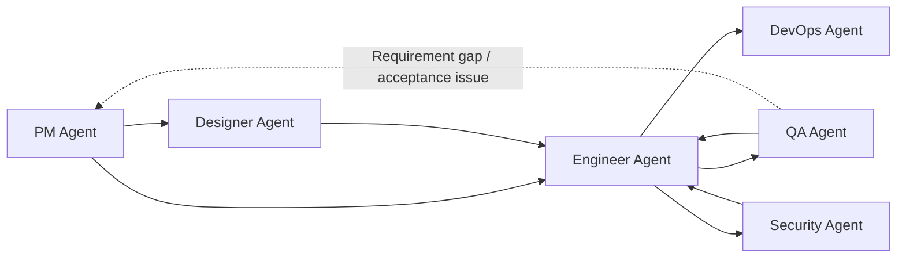

<div align="center">

# Dev Agent Skills

Multi-agent skills for the full software delivery lifecycle.

[](#agents)
[](#agents)
[](LICENSE)

`pm-agent` • `designer-agent` • `engineer-agent` • `qa-agent` • `devops-agent` • `security-agent`

[Quick Start](#quick-start) • [Agents](#agents) • [Collaboration Model](#collaboration-model) • [Repository Structure](#repository-structure) • [Local Validation](#local-validation)

</div>

> [!NOTE]
> Other languages: [中文](./README_zh.md)

## Overview

This repository publishes six role-based agents from one marketplace/source, covering the full path from product planning to design, implementation, testing, deployment, and security review.

It includes:

- 6 dispatcher skills, one entrypoint per agent
- 27 specialist skills across product, engineering, QA, DevOps, design, and security work
- Claude Code marketplace configuration
- Codex native skill discovery installation instructions
- Agent-level eval fixtures and local validation scripts
- Reference-backed visual design system data and lookup scripts for Designer Agent

> [!NOTE]
> These agents collaborate through Markdown documents and project assets. They do not require a shared runtime or fixed state machine, and you can install only the agents you need.

## Agents

| Agent | Focus | Skills | Entry | Docs |
| --- | --- | :---: | --- | --- |
| `pm-agent` | Requirements, specs, competitor research, roadmap, release communication, GitHub project status | 8 (`1 + 7`) | `/pm-agent` | [product_manager](./agents/product_manager/README.md) |
| `designer-agent` | UX flows, information architecture, wireframes, visual systems, design handoff | 3 (`1 + 2`) | `/designer-agent` | [designer](./agents/designer/README.md) |
| `engineer-agent` | Codebase analysis, project bootstrap, feature implementation, tests, debugging, delivery | 7 (`1 + 6`) | `/engineer-agent` | [engineer](./agents/engineer/README.md) |
| `qa-agent` | Spec validation, exploratory testing, bug analysis, regression verification | 5 (`1 + 4`) | `/qa-agent` | [qa](./agents/qa/README.md) |
| `devops-agent` | Deployment planning, CI/CD, environment configuration audits, incident playbooks | 5 (`1 + 4`) | `/devops-agent` | [devops](./agents/devops/README.md) |
| `security-agent` | AppSec, authorization review, dependency risk, privacy data-flow mapping | 5 (`1 + 4`) | `/security-agent` | [security](./agents/security/README.md) |

> [!TIP]
> Prefer an agent entry command such as `/pm-agent` or `/engineer-agent`. The dispatcher skill will classify the request and choose the right specialist skill.

## Collaboration Model



Common chains:

1. `pm-agent -> engineer-agent -> qa-agent`
2. `pm-agent -> designer-agent -> engineer-agent -> qa-agent`
3. `engineer-agent <-> qa-agent` for bugfix and regression loops
4. `engineer-agent -> devops-agent` for deployment, CI/CD, and runtime readiness
5. `engineer-agent -> security-agent` for pre-release or focused security review

Not every project needs the full chain. Each agent can complete its own role-specific loop, and cross-agent handoff happens only when another role is needed.

## Quick Start

### Claude Code

```bash
# Add the marketplace
/plugin marketplace add Neplich/dev-agent-skills

# Install only the agents you need
/plugin install pm-agent@dev-agent-skills
/plugin install designer-agent@dev-agent-skills
/plugin install engineer-agent@dev-agent-skills
/plugin install qa-agent@dev-agent-skills
/plugin install devops-agent@dev-agent-skills
/plugin install security-agent@dev-agent-skills
```

Claude Code scans installed plugins by plugin root. This repository scopes each plugin to its own agent directory, but installing only the agents you need is still recommended.

### Codex

In Codex, say:

```text
Fetch and follow instructions from https://raw.githubusercontent.com/Neplich/dev-agent-skills/refs/heads/main/.codex/INSTALL.md
```

The install flow will ask:

- whether this should be a `personal` or `project` install
- whether to install `all` agents or a selected subset

See [docs/README.codex.md](./docs/README.codex.md) for the full Codex guide.

## Usage Examples

```text
/pm-agent "I want to build a task management app. Help me shape the requirements first."
/designer-agent "Design the login and registration flow from the PRD."
/engineer-agent "Implement the login feature from the design docs."
/qa-agent "Validate the login feature against the spec."
/devops-agent "Add Docker and GitHub Actions."
/security-agent "Review authorization and dependency risk before release."
```

If you already know the specialist skill you need, you can call it directly:

```text
/idea-to-spec
/github-reader
/ui-ux-design
/visual-design
/feature-implementor
/spec-based-tester
/deployment-planner
/appsec-checklist
```

## Repository Structure

```text
dev-agent-skills/
├── .claude-plugin/          # Claude Code marketplace configuration
├── .codex/                  # Codex installation entrypoint
├── agents/                  # 6 agents with skills and evals
├── docs/                    # Public docs and historical design notes
├── skills-lock.json         # Skill metadata lock file
├── AGENTS.md                # Single source of repository guidance
└── CLAUDE.md                # Symlink to AGENTS.md for Claude Code compatibility
```

Each agent follows the same basic shape:

```text
agents/{agent}/
├── README.md
├── skills/
│   └── {skill}/
│       └── SKILL.md
└── test/
    └── {skill}/
        └── evals/
            └── evals.json
```

Some skills also include `_internal/`, `references/`, or script directories for protocol details, design data, or validation helpers.

## Design System Data

Designer Agent's `visual-design` skill includes reference-backed design system capability:

- Local path: `agents/designer/skills/visual-design/references/design-system-data/`
- Data coverage: product types, style patterns, colors, typography, UX guidelines, charts, landing patterns, icons, and stack guidelines
- Usage boundary: design reasoning and design-system documentation only; it must not generate application code, install commands, or engineering task lists

The data design follows ui ux pro max's organization model and is maintained under this repository's own paths and documentation.

## Local Validation

> [!NOTE]
> Use `uv run ...` for Python-based validation scripts and eval runners in this repository.

PR CI uses three required checks in this order:

```bash
# repository-contract
uv run scripts/check_repository_contract.py

# eval-contract
uv run scripts/check_eval_contract.py
uv run scripts/check_eval_artifacts.py

# python-tests
uv run --with pytest pytest \
  agents/product_manager/test/idea-to-spec \
  agents/qa/test/test_qa_run_eval.py \
  agents/designer/test/test_designer_run_eval.py \
  agents/devops/test/test_devops_run_eval.py \
  agents/test_eval_contract.py
```

Additional local model evals are manual quality checks, not first-version PR required checks:

```bash
# Designer eval
uv run agents/designer/test/run_all_evals.py

# QA eval
uv run agents/qa/test/run_all_evals.py
```

For changes that affect skill behavior, routing, eval fixtures, or release readiness, an administrator should run the manual model eval workflow before merging and use the result as merge evidence. Model evals are not required status checks because model output, runtime, and environment can vary.

Extra static format checks:

```bash
# JSON format checks
uv run python -m json.tool .claude-plugin/marketplace.json >/tmp/marketplace.json.out
uv run python -m json.tool skills-lock.json >/tmp/skills-lock.json.out
```

## Maintenance Notes

- Follow the existing `agents/*` structure when adding a new agent or skill.
- Keep `AGENTS.md` as the only edited guidance source; `CLAUDE.md` must remain a symlink to it.
- Update root [`CHANGELOG.md`](./CHANGELOG.md) for release-facing, user-facing, or developer-facing changes; keep README focused on the current project state.
- Restrictive repository permissions default to the sole administrator; add maintainers or bots explicitly when needed.
- Skill evals should verify role boundaries, context reading, execution-path selection, and structured artifacts instead of generic answer quality alone.
- All skill eval definitions use the shared `evals.json` schema v1.0; do not add agent-specific schema exceptions.

### Eval maintenance flow

When adding or updating a skill eval, keep the repository as the source of eval definitions and latest conclusions, not a log archive:

1. Create or update the skill and its eval fixture.
2. Run the existing or updated test set. Use a temporary or scratch workspace when the runner supports it.
3. Write the latest comparison in `comparison.md`.
4. Delete runtime files before opening a PR.
5. Commit only eval definitions, metadata, fixtures, README files, and `comparison.md`.

Do not commit `with_skill/`, `without_skill/`, `baseline/`, `iteration2/`, `outputs/`, `comparison.auto.md`, transcripts, candidate outputs, subagent verdicts, timing files, run status files, or diagnostics directories. Some existing runners may generate these files under eval fixtures during local runs; they are temporary and must be removed before commit. Metadata fields such as `with_skill_outputs`, `without_skill_outputs`, and baseline outputs describe runner expectations; they do not mean those runtime files belong in git. Manual or scheduled model eval workflows may upload transcripts, verdicts, timing, and diagnostics as short-lived CI artifacts for debugging, but the durable repository result remains `comparison.md`.

Every `evals.json` must live at `agents/{agent}/test/{skill-name}/evals/evals.json` and declare `schema_version: "1.0"`, `agent`, `skill_name`, and non-empty `evals`. Each eval item must include `id`, `name`, `description`, `prompt`, explicit `workspace`, `expected_output`, and object assertions with lower snake_case `id`, `description`, and semantic `text`. Use `workspace: null` for prompt-only evals. Run `uv run scripts/check_eval_contract.py` with eval definition changes.

New eval runners should write runtime files to a system temp directory or `tmp/eval-runs/...`, then copy only the confirmed `comparison.md` back to the eval workspace. Existing runners that write runtime files into fixtures must be followed by `uv run scripts/check_eval_artifacts.py` before submitting. New metadata schemas should make the split explicit with runtime-output fields and a durable-result field. Keep Python test module names unique across test roots, such as `test_pm_run_eval.py` and `test_qa_run_eval.py`, so pytest can collect all deterministic tests in one process.

Use this `comparison.md` shape for durable results:

```markdown
# Eval Result: <eval-name>

## Evaluation Target
## Test Set / Fixture Version
## Latest Result
## With Skill
## Without Skill / Baseline
## Failures
## Next Steps
## Runtime Artifacts Policy
```

<div align="center">

[中文](./README_zh.md) • [Claude Guide](./CLAUDE.md) • [Agents Guide](./AGENTS.md) • [Codex Guide](./docs/README.codex.md)

</div>
