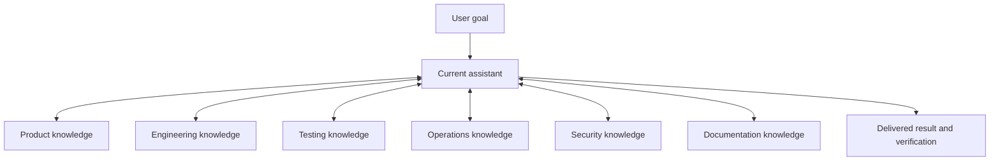

<div align="center">

# Dev Agent Skills

On-demand professional skills for the full software delivery lifecycle.

[](#agents)
[](#agents)
[](LICENSE)

`pm-agent` • `engineer-agent` • `qa-agent` • `devops-agent` • `security-agent` • `docs-agent`

[Quick Start](#quick-start) • [Usage Examples](#usage-examples) • [Agents](#agents) • [Collaboration Model](#collaboration-model) • [Documentation](#documentation)

</div>

> [!NOTE]
> Other languages: [中文](./README_zh.md)

## Overview

This repository publishes six plugins and thirty-seven directly usable skills from one marketplace, covering product planning, technical design, implementation, testing, deployment, security review, and documentation.

It includes:

- 6 role guides for finding relevant professional knowledge
- 31 specialist and composition skills for focused tasks
- Claude Code marketplace configuration and Kimi Code native plugin metadata
- A Codex installer with a hidden mirror and relative skill symlinks
- Document templates, documentation-site assets, and local checks

The assistant owns the requested outcome and combines the relevant capabilities within the same task. User requests, issues, code, tests, and existing documents provide the working context. Plans, formal specifications, and independent collaboration are selected when they help the work.

This README describes the current source. A pinned installation uses the behavior shipped in its selected release tag.

## Quick Start

### Claude Code

Add the marketplace, then install the plugins useful to your work:

```text
/plugin marketplace add Neplich/dev-agent-skills

/plugin install pm-agent@dev-agent-skills
/plugin install engineer-agent@dev-agent-skills
/plugin install qa-agent@dev-agent-skills
/plugin install devops-agent@dev-agent-skills
/plugin install security-agent@dev-agent-skills
/plugin install docs-agent@dev-agent-skills
```

Each plugin includes its role guide and the specialists listed below. Choose the engineering plugin for coding, debugging, and interface implementation, or combine plugins for a broader task.

### Codex

Tell Codex:

```text
Fetch and follow instructions from https://raw.githubusercontent.com/Neplich/dev-agent-skills/refs/heads/main/.codex/INSTALL.md
```

Choose a personal installation for use across projects or a project installation for work in one repository. The installer exposes all thirty-seven skills through relative symlinks and preserves references inside a hidden mirror.

For an existing checkout and a chosen target directory:

```bash
python3 scripts/install_codex_skills.py --target /path/to/skills
```

Re-run the installer after updating the checkout to refresh installed content. See the [Codex Guide](./docs/README.codex.md) for paths, mirror ownership, conflict handling, and disabling individual skills.

### Kimi Code

Install the native plugin from the current source:

```text
/plugins install https://github.com/Neplich/dev-agent-skills/tree/main
```

The repository's `.kimi-plugin/plugin.json` registers all six skill directories as one plugin. Select capabilities from the task or invoke the relevant skill directly.

For an immutable release, replace `vX.Y.Z` with a published tag:

```text
/plugins install https://github.com/Neplich/dev-agent-skills/releases/tag/vX.Y.Z
```

When using several hosts, keep track of each installation's source and version. Update each managed copy through its installer so the capabilities available in that host match the intended revision.

## Scope

Use these capabilities for software and product work, from a focused bug fix or document update to an end-to-end feature. Start with a role guide when choosing a method, or call a specialist when the task is already clear.

The assistant continues through analysis, design, implementation, testing, and documentation covered by the request. Existing authorization carries through those activities. It asks when a material decision is missing or an action requires additional permission.

Use the project's established code, tests, and conventions. Choose the amount of planning, documentation, and review that helps achieve a verifiable result.

## Usage Examples

Role guides help choose relevant methods:

```text
/pm-agent "Help me shape a task management app and identify the first useful release."
/engineer-agent "Add status filtering and verify it in the existing test harness."
/qa-agent "Check the checkout journey and report reproducible failures."
/devops-agent "Update deployment and CI for the new worker service."
/security-agent "Review authorization and dependency risk in this change."
/docs-agent "Update the user guide from the current running application."
```

Specialists can also be used directly:

```text
/debugger "Find and fix the login failure; verify success and failure paths."
/feature-implementor "Add filtering by status to the task list."
/github-reader "Summarize open issues and PRs that need attention."
/human-writing "Restore useful detail in the installation guide and keep it clear."
```

Use the host's skill picker or invocation syntax to select these registered names. Each plugin guide contains its complete skill directory.

## Agents

| Agent | Focus | Skills | Role guide | Docs |
| --- | --- | :---: | --- | --- |
| `pm-agent` | Requirements, specifications, research, roadmaps, changelogs, GitHub releases and status, writing | 9 (`1 + 8`) | `/pm-agent` | [Product](./agents/product_manager/README.md) |
| `engineer-agent` | Repository analysis, technical design, implementation, tests, debugging, Git delivery | 7 (`1 + 6`) | `/engineer-agent` | [Engineering](./agents/engineer/README.md) |
| `qa-agent` | Behavior validation, exploration, defect analysis, regression verification | 5 (`1 + 4`) | `/qa-agent` | [QA](./agents/qa/README.md) |
| `devops-agent` | Deployment, CI/CD, environment configuration, incident playbooks | 5 (`1 + 4`) | `/devops-agent` | [Operations](./agents/devops/README.md) |
| `security-agent` | AppSec, authentication and authorization, dependencies, personal-data flows | 5 (`1 + 4`) | `/security-agent` | [Security](./agents/security/README.md) |
| `docs-agent` | Documentation sites, API/database/design/ops/product guides, illustrated manuals, release notes, audits | 6 (`1 + 5`) | `/docs-agent` | [Documentation](./agents/docs/README.md) |

The counts show one role guide plus its specialist and composition skills. All thirty-seven skills are directly usable.

## Collaboration Model

The assistant selects knowledge around the requested outcome and carries the task through verification:


```mermaid
flowchart TD
    Request["User goal"] --> Assistant["Current assistant"]
    Assistant <--> Product["Product knowledge"]
    Assistant <--> Engineering["Engineering knowledge"]
    Assistant <--> QA["Testing knowledge"]
    Assistant <--> Operations["Operations knowledge"]
    Assistant <--> Security["Security knowledge"]
    Assistant <--> Docs["Documentation knowledge"]
    Assistant --> Result["Delivered result and verification"]
```

Common combinations:

1. **Feature delivery:** clarify behavior, implement the change, test it, and update affected usage documentation.
2. **Interface work:** use engineering methods to implement the requested interface and verify rendered behavior.
3. **Bug repair:** reproduce the failure, fix the responsible code, and exercise regression cases.
4. **Deployment:** connect service topology, environment configuration, CI/CD, and runtime checks.
5. **Security:** trace a finding to evidence, apply requested remediation, and verify legitimate behavior.
6. **Documentation:** inspect implementation and the running interface, update the relevant pages, and validate links and builds.
7. **Release preparation:** assemble verified changes, check version and artifact consistency, and perform the authorized release actions.

Use reusable tests, useful documents, and independent collaborators where they improve the result. Each task keeps its own scope and authorization through completion.

## Documentation

- [Architecture](./docs/architecture.md): capability organization, distribution, and shared references.
- [Documentation Guide](./docs/AGENTS.md): current facts, document locations, and reusable test records.
- Maintainer cookbooks: [Skill Maintenance](./docs/cookbook/maintain-skills.md), [Release](./docs/cookbook/release.md).
- [Codex Guide](./docs/README.codex.md): installation, mirror behavior, troubleshooting, and path-based disabling.
- [Repository Instructions](./AGENTS.md): working approach, source layout, Git conventions, and verification.
- [Contributing](./CONTRIBUTING.md): local checks and contribution workflow.
- [Changelog Index](./CHANGELOG.md): released versions and their source references.
- Plugin guides: [Product](./agents/product_manager/README.md), [Engineering](./agents/engineer/README.md), [QA](./agents/qa/README.md), [Operations](./agents/devops/README.md), [Security](./agents/security/README.md), [Docs](./agents/docs/README.md).

## Contributing

See [CONTRIBUTING.md](./CONTRIBUTING.md) for local checks and contributor workflow. `AGENTS.md` remains the single source of repository guidance.

## License

This project is licensed under the [MIT License](./LICENSE).
