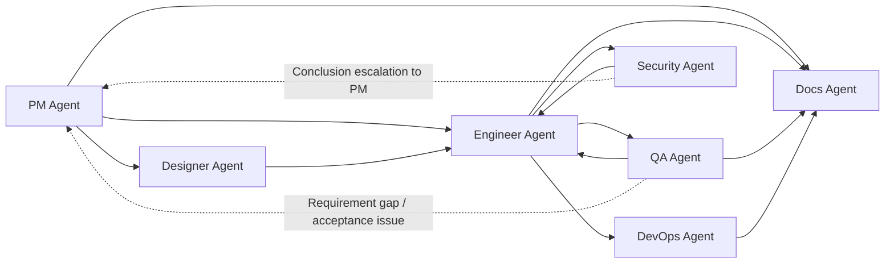

<div align="center">

# Dev Agent Skills

Multi-agent skills for the full software delivery lifecycle.

[](#agents)
[](#agents)
[](LICENSE)

`pm-agent` • `designer-agent` • `engineer-agent` • `qa-agent` • `devops-agent` • `security-agent` • `docs-agent`

[Quick Start](#quick-start) • [Usage Examples](#usage-examples) • [Agents](#agents) • [Collaboration Model](#collaboration-model) • [Documentation](#documentation)

</div>

> [!NOTE]
> Other languages: [中文](./README_zh.md)

## Overview

This repository publishes seven role-based agents from one marketplace/source, covering the full path from product planning to design, implementation, testing, deployment, security review, and formal documentation.

It includes:

- 1 public PM entry skill plus 6 downstream role routers
- 32 internal specialist skills across product, engineering, QA, DevOps, design, security, and formal documentation work
- Claude Code marketplace configuration
- Codex native skill discovery installation instructions
- Kimi Code native plugin manifest
- Agent-level eval fixtures and local validation scripts

> [!NOTE]
> These agents collaborate through Markdown documents and project assets. They do not require a shared runtime or fixed state machine. Use `pm-agent` as the direct user entry; install downstream role plugins only when PM handoff should have those capabilities available.

## Quick Start

### Claude Code

```bash
# Add the marketplace
/plugin marketplace add Neplich/dev-agent-skills

# Install the public entry
/plugin install pm-agent@dev-agent-skills

# Optional downstream capabilities for PM handoff
/plugin install designer-agent@dev-agent-skills
/plugin install engineer-agent@dev-agent-skills
/plugin install qa-agent@dev-agent-skills
/plugin install devops-agent@dev-agent-skills
/plugin install security-agent@dev-agent-skills
/plugin install docs-agent@dev-agent-skills
```

### Codex

Tell Codex:

```text
Fetch and follow instructions from https://raw.githubusercontent.com/Neplich/dev-agent-skills/refs/heads/main/.codex/INSTALL.md
```

Implementation details and troubleshooting are in the [Codex Guide](./docs/README.codex.md).

### Kimi Code

```text
/plugins install https://github.com/Neplich/dev-agent-skills/tree/main
```

The repository ships a `.kimi-plugin/plugin.json` manifest: all seven role skill directories are registered as a single plugin, and `pm-agent` loads automatically at session start via `sessionStart.skill`. The `tree/main` form installs the latest development state, which includes the pm-agent scope guard. Once a release that includes the scope guard is published, pin an immutable version with `/plugins install https://github.com/Neplich/dev-agent-skills/releases/tag/vX.Y.Z`.

Skills previously installed Codex-style into `~/.agents/skills/` are also discovered by Kimi Code automatically; the native plugin above is the recommended path.

**Using both Codex and Kimi Code?** Install only via the Codex path (`~/.agents/skills/`): Kimi Code discovers that directory automatically, so one copy serves both hosts as a single source of truth. Installing the Kimi plugin alongside it creates two same-named copies per skill — a live symlink tree versus an install-time snapshot under `~/.kimi-code/plugins/managed/` — whose versions can drift apart. One caveat: Kimi's generic skill directory group is mutually exclusive, so if `~/.config/agents/skills/` exists it shadows `~/.agents/skills/`; in that case add `~/.agents/skills/` to `extra_skill_dirs` in Kimi's `config.toml`. Trade-off: the Codex path gives Kimi plain skill discovery only — the plugin's `sessionStart.skill` auto-load of `pm-agent` does not apply. To keep the PM-first bootstrap in Kimi sessions, invoke `/skill:pm-agent` manually at session start, or choose the plugin and accept the two-copy caveat above.

## Scope

These agents target in-project R&D workflows. A personal install — the Codex
path (`~/.agents/skills/`), a user-scope Claude plugin, or the Kimi plugin —
makes the skills discoverable in every project the host sees. In a project
that has not enabled dev-agent-skills, `pm-agent` applies a scope guard:
general conversation, local-machine operations, and generic file work stop
with a one-line notice instead of entering the heavy PM workflow. Project
requests and explicit invocation of `pm-agent` or any skill still proceed
normally.

For the tightest isolation, prefer a Codex project install (see
[`docs/README.codex.md`](./docs/README.codex.md)), which keeps the skills
inside the project directory and gives the project an explicit enable marker.

## Usage Examples

```text
/pm-agent "I want to build a task management app. Help me shape the requirements first."
/pm-agent "There is a bug in the login flow. Classify the expected behavior and route the fix."
/pm-agent "Validate the checkout flow against the spec."
/pm-agent "Prepare CI/CD and release readiness checks."
/pm-agent "Review authorization and dependency risk before release."
```

Downstream role routers and specialist skills remain installed as PM-orchestrated capabilities. Prefer `pm-agent` for direct user requests; downstream skills are intended for work whose scope has already been confirmed by PM handoff or an equivalent document chain.

## Agents

| Agent | Focus | Skills | Invocation | Docs |
| --- | --- | :---: | --- | --- |
| `pm-agent` | Requirements, specs, competitor research, roadmap, gated GitHub Release generation, GitHub project status | 8 (`1 + 7`) | Direct entry: `/pm-agent` | [product_manager](./agents/product_manager/README.md) |
| `designer-agent` | UX flows, information architecture, wireframes, visual systems, design handoff | 3 (`1 + 2`) | PM handoff only | [designer](./agents/designer/README.md) |
| `engineer-agent` | Codebase analysis, TRD generation, feature implementation, tests, debugging, delivery | 7 (`1 + 6`) | PM handoff only | [engineer](./agents/engineer/README.md) |
| `qa-agent` | Spec validation, exploratory testing, bug analysis, regression verification | 5 (`1 + 4`) | PM handoff only | [qa](./agents/qa/README.md) |
| `devops-agent` | Deployment planning, CI/CD, environment configuration audits, incident playbooks | 5 (`1 + 4`) | PM handoff only | [devops](./agents/devops/README.md) |
| `security-agent` | AppSec, authorization review, dependency risk, privacy data-flow mapping | 5 (`1 + 4`) | PM handoff only | [security](./agents/security/README.md) |
| `docs-agent` | Formal documentation routing, site bootstrap, evidence-backed API/database/design/ops/product synchronization, illustrated user operation manuals from real running interfaces, site Release Notes, and release audit | 6 (`1 + 5`) | PM handoff only | [docs](./agents/docs/README.md) |

> [!TIP]
> Use `/pm-agent` as the direct user entry. PM classifies the request and hands off to downstream role routers or specialist skills when the scope is ready.

## Collaboration Model


```mermaid
flowchart LR
    PM["PM Agent"] --> Designer["Designer Agent"]
    PM --> Engineer["Engineer Agent"]
    Designer --> Engineer
    Engineer --> QA["QA Agent"]
    QA --> Engineer
    QA -. "Requirement gap / acceptance issue" .-> PM
    Engineer --> DevOps["DevOps Agent"]
    Engineer --> Security["Security Agent"]
    Security --> Engineer
    PM --> Docs["Docs Agent"]
    Engineer --> Docs
    QA --> Docs
    DevOps --> Docs
    Security -. "Conclusion escalation to PM" .-> PM
```

Engineering guardrails for PRD/TRD alignment, implementation planning, and QA E2E handoff are documented in the [Engineer Agent guide](./agents/engineer/README.md).

Common chains:

1. `pm-agent -> engineer-agent -> qa-agent`
2. `pm-agent -> designer-agent -> engineer-agent -> qa-agent`
3. `engineer-agent <-> qa-agent` for bugfix and regression loops
4. `engineer-agent -> devops-agent` for deployment, CI/CD, and runtime readiness
5. `engineer-agent -> security-agent` for pre-release or focused security review
6. `pm-agent -> docs-agent` for formal documentation bootstrap, synchronization, site Release Notes, or pre-release audit after scope is confirmed
7. `docs-agent:release-notes-gen -> docs-agent:docs-audit -> pm-agent:github-release-gen` for confirmed site notes, two-phase release verification, and the GitHub Release

Not every project needs the full chain. Each agent can complete its own role-specific loop, and cross-agent handoff happens only when another role is needed.

## Documentation

- [Codex Guide](./docs/README.codex.md): Codex installation model, mirror behavior, troubleshooting, and path-based disabling.
- [Agents Guide](./AGENTS.md): repository guidance source for agents, document contracts, maintenance workflow, eval rules, and PR checks.
- [Contributing](./CONTRIBUTING.md): local validation commands and maintainer workflow links.
- [Changelog Index](./CHANGELOG.md): versioned release changelog entrypoint.
- Agent guides: [PM](./agents/product_manager/README.md), [Designer](./agents/designer/README.md), [Engineer](./agents/engineer/README.md), [QA](./agents/qa/README.md), [DevOps](./agents/devops/README.md), [Security](./agents/security/README.md), [Docs](./agents/docs/README.md).

## Contributing

See [CONTRIBUTING.md](./CONTRIBUTING.md) for local checks and contributor workflow. `AGENTS.md` remains the single source of repository guidance.

## License

This project is licensed under the [Apache License 2.0](./LICENSE).
