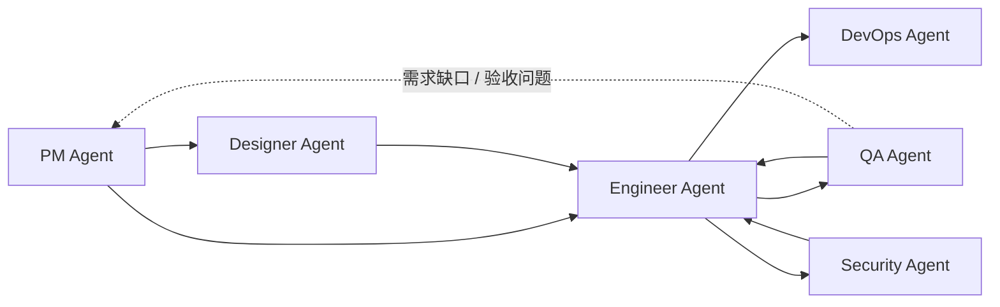
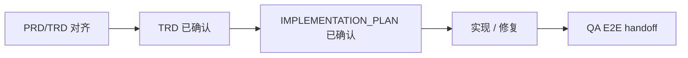

<div align="center">

# Dev Agent Skills

面向软件交付全流程的多 Agent 技能市场。

[](#agents)
[](#agents)
[](LICENSE)

`pm-agent` • `designer-agent` • `engineer-agent` • `qa-agent` • `devops-agent` • `security-agent`

[快速开始](#快速开始) • [Agents](#agents) • [协作方式](#协作方式) • [仓库结构](#仓库结构) • [本地验证](#本地验证)

</div>

> [!NOTE]
> 其他语言：[English](./README.md)

## 概览

这个仓库把 6 个按角色划分的 Agent 集中发布在同一个 marketplace/source 中，用来覆盖一条完整的软件交付链：需求、设计、实现、测试、部署和安全审查。

仓库内容包括：

- 1 个公开 PM 入口 skill，加 5 个下游 role router
- 29 个内部 specialist skills，覆盖产品、工程、QA、DevOps、设计和安全细分任务
- Claude Code marketplace 配置
- Codex 原生 skill discovery 安装入口
- Agent 级 eval fixtures 与本地验证脚本
- Designer Agent 的 reference-backed visual design system 数据和查询能力

> [!NOTE]
> 这些 Agent 通过 Markdown 文档和项目资产协作，不依赖共享运行时或固定状态机。直接用户入口只推荐 `pm-agent`；下游 role plugin 只在 PM handoff 需要对应能力时安装。

## Agents

| Agent | 关注范围 | Skills | 调用方式 | 文档 |
| --- | --- | :---: | --- | --- |
| `pm-agent` | 需求收敛、spec、竞品、路线图、版本沟通、GitHub 项目状态 | 9 (`1 + 8`) | 直接入口：`/pm-agent` | [product_manager](./agents/product_manager/README_zh.md) |
| `designer-agent` | UX 流程、信息架构、线框、视觉系统、设计交接 | 3 (`1 + 2`) | 仅 PM handoff | [designer](./agents/designer/README_zh.md) |
| `engineer-agent` | 代码库分析、TRD 生成、项目初始化、功能实现、测试、调试、交付 | 8 (`1 + 7`) | 仅 PM handoff | [engineer](./agents/engineer/README_zh.md) |
| `qa-agent` | 规范验收、探索测试、缺陷分析、回归验证 | 5 (`1 + 4`) | 仅 PM handoff | [qa](./agents/qa/README_zh.md) |
| `devops-agent` | 部署规划、CI/CD、环境配置审计、故障手册 | 5 (`1 + 4`) | 仅 PM handoff | [devops](./agents/devops/README_zh.md) |
| `security-agent` | 应用安全、授权审查、依赖风险、隐私数据流 | 5 (`1 + 4`) | 仅 PM handoff | [security](./agents/security/README_zh.md) |

> [!TIP]
> 直接用户入口使用 `/pm-agent`。PM 会先分类请求，范围明确后再 handoff 到下游 role router 或 specialist skill。

## 协作方式



工程门禁：



现有功能变更、bug fix 和用户可见实现应先完成 PRD/TRD 对齐，再进入工程执行。Engineer 在实现前确认 TRD 和 `IMPLEMENTATION_PLAN.md`；影响用户流程的实现完成后，通过 QA E2E 交接包移交给 QA。

常见链路：

1. `pm-agent -> engineer-agent -> qa-agent`
2. `pm-agent -> designer-agent -> engineer-agent -> qa-agent`
3. `engineer-agent <-> qa-agent`，用于缺陷修复和回归确认
4. `engineer-agent -> devops-agent`，用于部署、CI/CD 和运行准备
5. `engineer-agent -> security-agent`，用于发布前或专项安全审查

不是所有项目都要走完整链路。每个 Agent 都能独立完成自己的角色闭环，只有在需要跨角色协作时才 handoff。

## 快速开始

### Claude Code

```bash
# 添加 marketplace
/plugin marketplace add Neplich/dev-agent-skills

# 安装公开入口
/plugin install pm-agent@dev-agent-skills

# 按需安装 PM handoff 的下游能力
/plugin install designer-agent@dev-agent-skills
/plugin install engineer-agent@dev-agent-skills
/plugin install qa-agent@dev-agent-skills
/plugin install devops-agent@dev-agent-skills
/plugin install security-agent@dev-agent-skills
```

Claude Code 会按 plugin root 扫描已安装插件。本仓库已经把每个 plugin 收敛到各自的 agent 子目录，但仍建议按需安装，不要默认一次装满 6 个 Agent。

### Codex

clone 或更新本仓库后，运行复制式安装脚本：

```bash
git clone https://github.com/Neplich/dev-agent-skills.git ~/.agents/dev-agent-skills
cd ~/.agents/dev-agent-skills

# 默认安装全部 role router 和 specialist skills
uv run scripts/install_codex_skills.py

# 可选最小模式：只安装 6 个 role router skills
uv run scripts/install_codex_skills.py --routers-only
```

Codex 会先把 skill 软链接解析到真实路径，再向上查找 plugin manifest。若把 skill 软链接进本仓库 clone，Codex 会命中 `agents/{role}/.claude-plugin/plugin.json`，并给所有 skill 加上 `Pm Agent:` 这类 namespace 前缀。该脚本把 skill 目录复制到 `~/.agents/skills/`，让目标目录祖先链避开这些 manifest。详见 [issue #95](https://github.com/Neplich/dev-agent-skills/issues/95)。

默认安装全部 role router 和 specialist skills，确保 `pm-agent` 和 role router 编排流程可以调用下游 specialist。`--routers-only` 只适合入口分类所需的最小安装；该模式不会安装 specialist skills，因此 `pm-agent` 和 role router 无法调用下游 specialist 工作流。如果目标目录已存在本仓库管理的 specialist skills，`--routers-only` 会阻断并给出清理指引；使用 `--force` 才会删除未选中的受管 skills。使用 `--target <path>` 可指定项目级或自定义 skill 目录，使用 `--force` 可替换已存在的复制目录。

如需按路径禁用单个已复制 skill，可在 `~/.codex/config.toml` 中添加：

```toml
[[skills.config]]
path = "/Users/you/.agents/skills/debugger"
enabled = false
```

完整说明见 [docs/README.codex.md](./docs/README.codex.md)。

## 使用示例

```text
/pm-agent "我想做一个任务管理应用，先帮我梳理需求"
/pm-agent "登录流程有 bug，先帮我确认预期再安排修复"
/pm-agent "按 spec 验证登录功能"
/pm-agent "补一套 CI/CD 和发布前检查"
/pm-agent "上线前看一下权限和依赖风险"
```

下游 role router 和 specialist skills 仍会作为 PM 编排能力安装。直接用户请求优先从 `pm-agent` 进入；下游 skills 用于 PM handoff 或等效已确认文档链已经明确范围后的工作。

## 仓库结构

```text
dev-agent-skills/
├── .claude-plugin/          # Claude Code marketplace 配置
├── .codex/                  # Codex 安装入口
├── agents/                  # 6 个 Agent 及其 skills / evals
├── docs/                    # 对外文档和历史设计说明
├── skills-lock.json         # skill 元数据锁文件
├── AGENTS.md                # 仓库指导的唯一事实源
└── CLAUDE.md                # 指向 AGENTS.md 的软链接，用于兼容 Claude Code
```

单个 Agent 的结构：

```text
agents/{agent}/
├── README.md
├── skills/
│   └── {skill}/
│       └── SKILL.md
└── test/
    └── {skill}/
        └── evals/
            └── evals.json
```

部分 skill 会带有 `_internal/`、`references/` 或脚本目录，用于保存协议细节、设计数据库或本地验证辅助工具。

## 设计系统数据

Designer Agent 的 `visual-design` 包含 reference-backed design system 能力：

- 本地路径：`agents/designer/skills/visual-design/references/design-system-data/`
- 数据范围：产品类型、风格模式、颜色、字体、UX guidelines、charts、landing patterns、icons、stack guidelines
- 使用边界：只用于设计推理和设计系统文档，不生成应用代码、安装命令或工程任务清单

该数据设计参考了 ui ux pro max 的组织方式，并按本仓库自己的路径和文档结构维护。

## 本地验证

> [!NOTE]
> 仓库内 Python 验证脚本和 eval runner 默认使用 `uv run ...`。

PR CI 使用 4 个必跑检查，顺序如下：

```bash
# repository-contract
uv run scripts/check_repository_contract.py

# eval-contract
uv run scripts/check_eval_contract.py
uv run scripts/check_eval_artifacts.py

# doc-contract
uv run scripts/check_doc_contract.py

# python-tests
uv run --with pytest pytest \
  agents/product_manager/test/idea-to-spec \
  agents/product_manager/test/pm-agent \
  agents/qa/test/test_qa_run_eval.py \
  agents/designer/test/test_designer_run_eval.py \
  agents/devops/test/test_devops_run_eval.py \
  agents/test_doc_contract.py \
  agents/test_eval_contract.py
```

额外本地模型 eval 是质量检查，不属于第一版 PR 必跑门禁：

```bash
# Designer eval diagnostics
uv run agents/designer/test/run_all_evals.py

# QA model eval
uv run agents/qa/test/run_all_evals.py
```

涉及 skill 行为、routing、eval fixture 或 release 前变更时，管理员应在合并前运行手动模型 eval workflow，并把结果作为 merge 判断依据。模型 eval 不作为 required status check，因为模型输出、运行耗时和环境都可能波动。

同一组手动检查也可在 GitHub Actions 中触发：打开 `Manual Evals`，点击 `Run workflow`，选择 `all`、`designer` 或 `qa`，再查看上传的短期运行 artifact。QA eval job 会调用 `codex exec`，因此需要仓库 secret `OPENAI_API_KEY`；`designer` 可独立运行，不依赖该 secret，并把运行期输出缺口作为 warning 提醒人工查看 artifact。

额外静态格式检查：

```bash
# JSON 格式检查示例
uv run python -m json.tool .claude-plugin/marketplace.json >/tmp/marketplace.json.out
uv run python -m json.tool skills-lock.json >/tmp/skills-lock.json.out
```

## 维护约定

- 新增 Agent 或 skill 时，优先遵循现有 `agents/*` 结构。
- `AGENTS.md` 是唯一编辑源；`CLAUDE.md` 必须保持为指向它的软链接。
- 涉及发布、面向用户或面向开发者的变更时，同步维护 [`docs/changelog/`](./docs/changelog/) 下的版本化 changelog；根目录 [`CHANGELOG.md`](./CHANGELOG.md) 只作为索引，README 只保留当前项目状态。
- `.claude-plugin/marketplace.json` 的 `metadata.version` 必须与仓库 release 版本保持一致，但不带 `v` 前缀。创建 release tag 前，先更新 `metadata.version`、新增对应的 `docs/changelog/changelog-v{version}.md`，并同步根目录 changelog 索引。
- 仓库限制性权限默认只授予唯一管理员；后续需要维护者或机器人时再显式添加。
- Skill eval 应验证角色边界、上下文读取、执行路径和结构化产物，而不是只检查泛化回答质量。
- 所有 skill eval 定义统一使用 `evals.json` schema v1.0，不新增 agent 专属 schema 例外。

### Eval 维护流程

新增或更新 skill eval 时，仓库只作为评测定义和最新结论的事实源，不作为运行日志归档：

1. 新建或更新 skill 与 eval fixture。
2. 使用已有或更新后的测试集进行评测；runner 支持时优先使用临时目录或 scratch workspace。
3. 将最新评测比对结果写入 `comparison.md`。
4. 提交 PR 前删除运行过程文件。
5. 只提交 eval 定义、metadata、fixture、README 和 `comparison.md`。

不要提交 `with_skill/`、`without_skill/`、`baseline/`、`iteration2/`、`outputs/`、`comparison.auto.md`、transcript、candidate output、subagent verdict、timing、run status 或 diagnostics 目录。Eval runner 会把运行期文件写入 `tmp/eval-runs/...` 这类 scratch workspace；这些文件只是临时文件，不应复制回 eval fixture。`with_skill_outputs`、`without_skill_outputs`、baseline outputs 等 metadata 字段只描述 runner 的运行期预期，不代表这些过程文件需要进入 git。手动或定时模型 eval workflow 可以把 transcript、verdict、timing 和 diagnostics 作为短期 CI artifact 上传用于排查，但仓库里长期保留的结果仍然是 `comparison.md`。

每个 `evals.json` 必须位于 `agents/{agent}/test/{skill-name}/evals/evals.json`，并声明 `schema_version: "1.0"`、`agent`、`skill_name` 和非空 `evals`。每个 eval item 必须包含 `id`、`name`、`description`、`prompt`、指向 `workspace/...` 的显式 `workspace`、`expected_output`，以及对象形式的 assertions；assertion 必须包含 lower snake_case `id`、`description` 和语义化 `text`。prompt-only eval 也需要最小 workspace，并包含 `eval_metadata.json` 和 durable `comparison.md`。修改 eval 定义时运行 `uv run scripts/check_eval_contract.py`。

Eval runner 应将运行期文件写入系统临时目录或 `tmp/eval-runs/...`，再只把确认后的 `comparison.md` 同步回 eval workspace。新的 metadata schema 应显式区分 runtime output 字段和 durable result 字段。Python 测试文件名需要跨测试目录保持唯一，例如 `test_pm_run_eval.py` 和 `test_qa_run_eval.py`，确保 pytest 能在同一个进程里收集所有确定性测试。

### QA E2E 本地账号文件

QA E2E 凭据使用本地 ignore 账号文件，不提交明文或加密凭据文件：

```text
.qa/e2e/accounts.local.json
```

该文件已由 `.gitignore` 屏蔽。QA 文档、测试用例、脚本、结果和 eval fixture 只能引用账号 ID，例如 `platform.default.admin` 或 `ssh.default.deploy`；不得写入真实用户名、密码、token、cookie、session、SSH 密码、SSH key 内容或 passphrase。

QA Agent 收到用户提供的平台账号、平台密码、SSH 账号、SSH 密码或 SSH key 路径时，应按 [`e2e-credential-store.md`](./agents/qa/skills/qa-agent/references/e2e-credential-store.md) 自动 upsert 到 `.qa/e2e/accounts.local.json`，并在本地环境允许时设置仅当前用户可读写。E2E 汇总报告必须遵循 [`e2e-test-report.md`](./agents/qa/skills/qa-agent/references/e2e-test-report.md) 的固定格式。

`comparison.md` 使用以下结构：

```markdown
# Eval Result: <eval-name>

## Evaluation Target
## Test Set / Fixture Version
## Latest Result
## With Skill
## Without Skill / Baseline
## Failures
## Next Steps
## Runtime Artifacts Policy
```

<div align="center">

[English](./README.md) • [Claude Guide](./CLAUDE.md) • [Agents Guide](./AGENTS.md) • [Codex Guide](./docs/README.codex.md)

</div>
