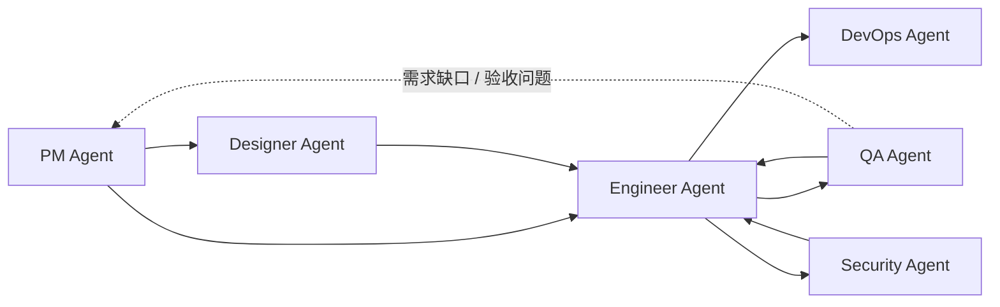

<div align="center">

# Dev Agent Skills

面向软件交付全流程的多 Agent 技能市场。

[](#agents)
[](#agents)
[](LICENSE)

`pm-agent` • `designer-agent` • `engineer-agent` • `qa-agent` • `devops-agent` • `security-agent`

[快速开始](#快速开始) • [Agents](#agents) • [协作方式](#协作方式) • [仓库结构](#仓库结构) • [本地验证](#本地验证)

</div>

> [!NOTE]
> 其他语言：[English](./README.md)

## 概览

这个仓库把 6 个按角色划分的 Agent 集中发布在同一个 marketplace/source 中，用来覆盖一条完整的软件交付链：需求、设计、实现、测试、部署和安全审查。

仓库内容包括：

- 6 个 dispatcher skills，每个 Agent 一个入口
- 27 个 specialist skills，覆盖产品、工程、QA、DevOps、设计和安全细分任务
- Claude Code marketplace 配置
- Codex 原生 skill discovery 安装入口
- Agent 级 eval fixtures 与本地验证脚本
- Designer Agent 的 reference-backed visual design system 数据和查询能力

> [!NOTE]
> 这些 Agent 通过 Markdown 文档和项目资产协作，不依赖共享运行时或固定状态机。你可以只安装当前需要的 Agent。

## Agents

| Agent | 关注范围 | Skills | 入口 | 文档 |
| --- | --- | :---: | --- | --- |
| `pm-agent` | 需求收敛、spec、竞品、路线图、版本沟通、GitHub 项目状态 | 8 (`1 + 7`) | `/pm-agent` | [product_manager](./agents/product_manager/README_zh.md) |
| `designer-agent` | UX 流程、信息架构、线框、视觉系统、设计交接 | 3 (`1 + 2`) | `/designer-agent` | [designer](./agents/designer/README_zh.md) |
| `engineer-agent` | 代码库分析、项目初始化、功能实现、测试、调试、交付 | 7 (`1 + 6`) | `/engineer-agent` | [engineer](./agents/engineer/README_zh.md) |
| `qa-agent` | 规范验收、探索测试、缺陷分析、回归验证 | 5 (`1 + 4`) | `/qa-agent` | [qa](./agents/qa/README_zh.md) |
| `devops-agent` | 部署规划、CI/CD、环境配置审计、故障手册 | 5 (`1 + 4`) | `/devops-agent` | [devops](./agents/devops/README_zh.md) |
| `security-agent` | 应用安全、授权审查、依赖风险、隐私数据流 | 5 (`1 + 4`) | `/security-agent` | [security](./agents/security/README_zh.md) |

> [!TIP]
> 优先使用 Agent 入口命令，例如 `/pm-agent` 或 `/engineer-agent`。Dispatcher skill 会先判断意图，再选择合适的 specialist skill。

## 协作方式



常见链路：

1. `pm-agent -> engineer-agent -> qa-agent`
2. `pm-agent -> designer-agent -> engineer-agent -> qa-agent`
3. `engineer-agent <-> qa-agent`，用于缺陷修复和回归确认
4. `engineer-agent -> devops-agent`，用于部署、CI/CD 和运行准备
5. `engineer-agent -> security-agent`，用于发布前或专项安全审查

不是所有项目都要走完整链路。每个 Agent 都能独立完成自己的角色闭环，只有在需要跨角色协作时才 handoff。

## 快速开始

### Claude Code

```bash
# 添加 marketplace
/plugin marketplace add Neplich/dev-agent-skills

# 按需安装 Agent
/plugin install pm-agent@dev-agent-skills
/plugin install designer-agent@dev-agent-skills
/plugin install engineer-agent@dev-agent-skills
/plugin install qa-agent@dev-agent-skills
/plugin install devops-agent@dev-agent-skills
/plugin install security-agent@dev-agent-skills
```

Claude Code 会按 plugin root 扫描已安装插件。本仓库已经把每个 plugin 收敛到各自的 agent 子目录，但仍建议按需安装，不要默认一次装满 6 个 Agent。

### Codex

在 Codex 中输入：

```text
Fetch and follow instructions from https://raw.githubusercontent.com/Neplich/dev-agent-skills/refs/heads/main/.codex/INSTALL.md
```

安装流程会先确认：

- 安装到 `personal` 还是 `project` 层级
- 安装 `all` agents，还是选择其中一部分

完整说明见 [docs/README.codex.md](./docs/README.codex.md)。

## 使用示例

```text
/pm-agent "我想做一个任务管理应用，先帮我梳理需求"
/designer-agent "根据 PRD 设计登录和注册流程"
/engineer-agent "按设计文档实现登录功能"
/qa-agent "按 spec 验证登录功能"
/devops-agent "补一套 Docker 和 GitHub Actions"
/security-agent "上线前看一下权限和依赖风险"
```

如果已经知道要调用的 specialist skill，也可以直接使用：

```text
/idea-to-spec
/github-reader
/ui-ux-design
/visual-design
/feature-implementor
/spec-based-tester
/deployment-planner
/appsec-checklist
```

## 仓库结构

```text
dev-agent-skills/
├── .claude-plugin/          # Claude Code marketplace 配置
├── .codex/                  # Codex 安装入口
├── agents/                  # 6 个 Agent 及其 skills / evals
├── docs/                    # 对外文档和历史设计说明
├── skills-lock.json         # skill 元数据锁文件
├── CLAUDE.md                # Claude Code 仓库说明
└── AGENTS.md                # 通用 Agent 仓库说明
```

单个 Agent 的结构：

```text
agents/{agent}/
├── README.md
├── skills/
│   └── {skill}/
│       └── SKILL.md
└── test/
    └── {skill}/
        └── evals/
            └── evals.json
```

部分 skill 会带有 `_internal/`、`references/` 或脚本目录，用于保存协议细节、设计数据库或本地验证辅助工具。

## 设计系统数据

Designer Agent 的 `visual-design` 包含 reference-backed design system 能力：

- 本地路径：`agents/designer/skills/visual-design/references/design-system-data/`
- 数据范围：产品类型、风格模式、颜色、字体、UX guidelines、charts、landing patterns、icons、stack guidelines
- 使用边界：只用于设计推理和设计系统文档，不生成应用代码、安装命令或工程任务清单

该数据设计参考了 ui ux pro max 的组织方式，并按本仓库自己的路径和文档结构维护。

## 本地验证

> [!NOTE]
> 仓库内 Python 验证脚本和 eval runner 默认使用 `uv run ...`。

```bash
# Designer eval
uv run agents/designer/test/run_all_evals.py

# QA eval
uv run agents/qa/test/run_all_evals.py

# PM idea-to-spec 测试
uv run --with pytest pytest agents/product_manager/test/idea-to-spec

# JSON 格式检查示例
uv run python -m json.tool .claude-plugin/marketplace.json >/tmp/marketplace.json.out
uv run python -m json.tool skills-lock.json >/tmp/skills-lock.json.out
```

## 维护约定

- 新增 Agent 或 skill 时，优先遵循现有 `agents/*` 结构。
- `CLAUDE.md` 与 `AGENTS.md` 必须保持一致。
- `docs/superpowers/` 是工作文档区，不作为公开版本化文档入口。
- Skill eval 应验证角色边界、上下文读取、执行路径和结构化产物，而不是只检查泛化回答质量。

<div align="center">

[English](./README.md) • [Claude Guide](./CLAUDE.md) • [Agents Guide](./AGENTS.md) • [Codex Guide](./docs/README.codex.md)

</div>
