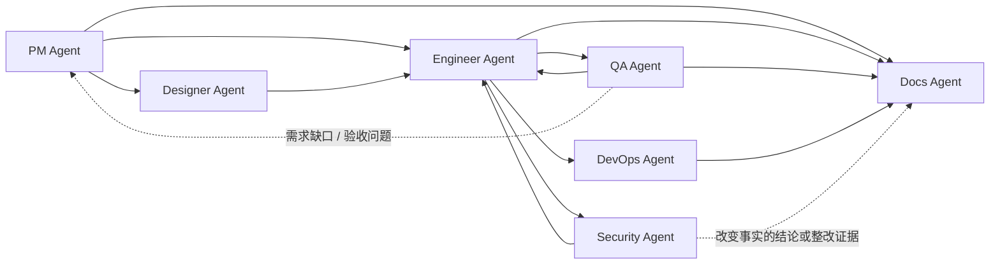

<div align="center">

# Dev Agent Skills

面向软件交付全流程的多 Agent 技能市场。

[](#agents)
[](#agents)
[](LICENSE)

`pm-agent` • `designer-agent` • `engineer-agent` • `qa-agent` • `devops-agent` • `security-agent` • `docs-agent`

[快速开始](#快速开始) • [使用示例](#使用示例) • [Agents](#agents) • [协作方式](#协作方式) • [文档索引](#文档索引)

</div>

> [!NOTE]
> 其他语言：[English](./README.md)

## 概览

这个仓库把 7 个按角色划分的 Agent 集中发布在同一个 marketplace/source 中，用来覆盖一条完整的软件交付链：需求、设计、实现、测试、部署、安全审查和正式文档。

仓库内容包括：

- 1 个公开 PM 入口 skill，加 6 个下游 role router
- 33 个内部 specialist skills，覆盖产品、工程、QA、DevOps、设计、安全和正式文档细分任务
- Claude Code marketplace 配置
- Codex 原生 skill discovery 安装入口
- Agent 级 eval fixtures 与本地验证脚本

> [!NOTE]
> 这些 Agent 通过 Markdown 文档和项目资产协作，不依赖共享运行时或固定状态机。直接用户入口只推荐 `pm-agent`；下游 role plugin 只在 PM handoff 需要对应能力时安装。

## 快速开始

### Claude Code

```bash
# 添加 marketplace
/plugin marketplace add Neplich/dev-agent-skills

# 安装公开入口
/plugin install pm-agent@dev-agent-skills

# 按需安装 PM handoff 的下游能力
/plugin install designer-agent@dev-agent-skills
/plugin install engineer-agent@dev-agent-skills
/plugin install qa-agent@dev-agent-skills
/plugin install devops-agent@dev-agent-skills
/plugin install security-agent@dev-agent-skills
/plugin install docs-agent@dev-agent-skills
```

### Codex

```bash
git clone https://github.com/Neplich/dev-agent-skills.git ~/.agents/dev-agent-skills
cd ~/.agents/dev-agent-skills

# 默认安装全部 role router 和 specialist skills
python3 scripts/install_codex_skills.py

# 可选最小模式：只暴露 7 个 role router skills
python3 scripts/install_codex_skills.py --routers-only
```

实现原理与排障见 [Codex Guide](./docs/README.codex.md)。

## 使用示例

```text
/pm-agent "我想做一个任务管理应用，先帮我梳理需求"
/pm-agent "登录流程有 bug，先帮我确认预期再安排修复"
/pm-agent "按 spec 验证登录功能"
/pm-agent "补一套 CI/CD 和发布前检查"
/pm-agent "上线前看一下权限和依赖风险"
```

下游 role router 和 specialist skills 仍会作为 PM 编排能力安装。直接用户请求优先从 `pm-agent` 进入；下游 skills 用于 PM handoff 或等效已确认文档链已经明确范围后的工作。

## Agents

| Agent | 关注范围 | Skills | 调用方式 | 文档 |
| --- | --- | :---: | --- | --- |
| `pm-agent` | 需求收敛、spec、竞品、路线图、带门禁的 GitHub Release、GitHub 项目状态 | 9 (`1 + 8`) | 直接入口：`/pm-agent` | [product_manager](./agents/product_manager/README_zh.md) |
| `designer-agent` | UX 流程、信息架构、线框、视觉系统、设计交接 | 3 (`1 + 2`) | 仅 PM handoff | [designer](./agents/designer/README_zh.md) |
| `engineer-agent` | 代码库分析、TRD 生成、项目初始化、功能实现、测试、调试、交付 | 8 (`1 + 7`) | 仅 PM handoff | [engineer](./agents/engineer/README_zh.md) |
| `qa-agent` | 规范验收、探索测试、缺陷分析、回归验证 | 5 (`1 + 4`) | 仅 PM handoff | [qa](./agents/qa/README_zh.md) |
| `devops-agent` | 部署规划、CI/CD、环境配置审计、故障手册 | 5 (`1 + 4`) | 仅 PM handoff | [devops](./agents/devops/README_zh.md) |
| `security-agent` | 应用安全、授权审查、依赖风险、隐私数据流 | 5 (`1 + 4`) | 仅 PM handoff | [security](./agents/security/README_zh.md) |
| `docs-agent` | 正式文档分流、站点初始化、证据驱动的 API/database/design/ops/product 同步（#121 已在 v0.3.0 仅 API 的基础上扩展）、站内 Release Notes 与发版审计 | 5 (`1 + 4`) | 仅 PM handoff | [docs](./agents/docs/README_zh.md) |

> [!TIP]
> 直接用户入口使用 `/pm-agent`。PM 会先分类请求，范围明确后再 handoff 到下游 role router 或 specialist skill。

## 协作方式



PRD/TRD 对齐、实现计划确认和 QA E2E handoff 等工程门禁见 [Engineer Agent 文档](./agents/engineer/README_zh.md)。

常见链路：

1. `pm-agent -> engineer-agent -> qa-agent`
2. `pm-agent -> designer-agent -> engineer-agent -> qa-agent`
3. `engineer-agent <-> qa-agent`，用于缺陷修复和回归确认
4. `engineer-agent -> devops-agent`，用于部署、CI/CD 和运行准备
5. `engineer-agent -> security-agent`，用于发布前或专项安全审查
6. `pm-agent -> docs-agent`，用于范围确认后的正式文档站点初始化、同步、站内 Release Notes 或发版前审计
7. `docs-agent:release-notes-generator -> docs-agent:docs-audit -> pm-agent:github-release-generator`，用于已确认站内版本说明、双阶段发版验证和 GitHub Release

不是所有项目都要走完整链路。每个 Agent 都能独立完成自己的角色闭环，只有在需要跨角色协作时才 handoff。

## 文档索引

- [Codex Guide](./docs/README.codex.md)：Codex 安装模型、镜像机制、排障和按路径禁用。
- [Agents Guide](./AGENTS.md)：agent 仓库指导、文档契约、维护流程、eval 规则和 PR 检查的唯一事实源。
- [Contributing](./CONTRIBUTING_zh.md)：本地验证命令和维护流程链接。
- [Changelog Index](./CHANGELOG.md)：版本化 release changelog 入口。
- Agent 文档：[PM](./agents/product_manager/README_zh.md)、[Designer](./agents/designer/README_zh.md)、[Engineer](./agents/engineer/README_zh.md)、[QA](./agents/qa/README_zh.md)、[DevOps](./agents/devops/README_zh.md)、[Security](./agents/security/README_zh.md)、[Docs](./agents/docs/README_zh.md)。

## 贡献

本地检查和贡献流程见 [CONTRIBUTING_zh.md](./CONTRIBUTING_zh.md)。`AGENTS.md` 仍是仓库指导的唯一事实源。

## License

本项目使用 [Apache License 2.0](./LICENSE)。
