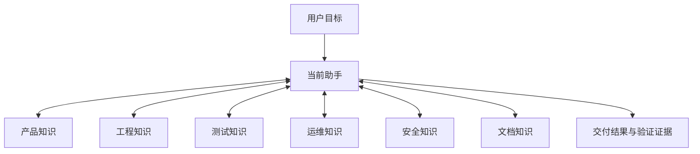

<div align="center">

# Dev Agent Skills

面向软件交付全流程、按需使用的专业技能库。

[](#agents)
[](#agents)
[](LICENSE)

`pm-agent` • `engineer-agent` • `qa-agent` • `devops-agent` • `security-agent` • `docs-agent`

[快速开始](#快速开始) • [使用示例](#使用示例) • [Agents](#agents) • [协作方式](#协作方式) • [文档索引](#文档索引)

</div>

> [!NOTE]
> 其他语言：[English](./README.md)

## 概览

这个仓库将 6 个插件、37 个可直接使用的 Skill 集中发布在同一个 marketplace 中，覆盖产品规划、技术设计、实现、测试、部署、安全审查和文档。

仓库内容包括：

- 6 个角色导航，帮助选择相关专业知识
- 31 个专项与组合 Skill，处理具体任务
- Claude Code marketplace 配置与 Kimi Code 原生插件信息
- 使用隐藏镜像和相对软链的 Codex 安装器
- 可复用的文档模板、文档站资产和本地检查脚本

当前助手负责用户目标，在同一任务中组合有帮助的能力。用户请求、issue、代码、测试和已有文档共同提供工作依据；计划、正式规格和独立协作按实际价值选用。

本 README 描述当前源码。固定版本安装使用对应 release tag 中的能力和行为。

## 快速开始

### Claude Code

添加 marketplace，按工作需要安装插件：

```text
/plugin marketplace add Neplich/dev-agent-skills

/plugin install pm-agent@dev-agent-skills
/plugin install engineer-agent@dev-agent-skills
/plugin install qa-agent@dev-agent-skills
/plugin install devops-agent@dev-agent-skills
/plugin install security-agent@dev-agent-skills
/plugin install docs-agent@dev-agent-skills
```

每个插件包含角色导航及下表中的专项能力。编码、调试和界面实现可安装工程插件，完整功能交付可组合相关插件。

### Codex

告诉 Codex：

```text
Fetch and follow instructions from https://raw.githubusercontent.com/Neplich/dev-agent-skills/refs/heads/main/.codex/INSTALL.md
```

个人级安装适合跨项目使用，项目级安装适合单个仓库。安装器通过相对软链暴露全部 37 个 Skill，并在隐藏镜像中保留内部参考关系。

已有本地 checkout 且已选好安装目录时，可以运行：

```bash
python3 scripts/install_codex_skills.py --target /path/to/skills
```

更新 checkout 后重新运行安装器，即可刷新安装内容。路径选择、镜像归属、冲突处理和单个 Skill 的禁用方法见 [Codex Guide](./docs/README.codex.md)。

### Kimi Code

从当前源码安装原生插件：

```text
/plugins install https://github.com/Neplich/dev-agent-skills/tree/main
```

仓库的 `.kimi-plugin/plugin.json` 将 6 个 Skill 目录注册为一个插件。根据任务选择能力，也可直接调用对应 Skill。

需要固定发布版本时，将 `vX.Y.Z` 替换为实际 tag：

```text
/plugins install https://github.com/Neplich/dev-agent-skills/releases/tag/vX.Y.Z
```

同时使用多个宿主时，记录各自安装来源和版本，通过对应安装器更新管理副本，使宿主中的能力与目标版本保持一致。

## 使用范围

这些能力适用于软件与产品工作，从单个 bug 修复、文档更新，到完整功能交付。需要选择方法时使用角色导航，任务明确时直接调用专项 Skill。

助手持续完成请求范围内的分析、设计、实现、测试和文档工作。已有授权在这些活动中持续有效；存在影响结果的关键决策缺口，或操作需要额外权限时，再向用户询问。

沿用项目的代码、测试与约定，选择有助于交付可验证结果的计划、文档和审查深度。

## 使用示例

角色导航帮助选择相关方法：

```text
/pm-agent "我想做一个任务管理应用，帮我梳理目标和第一版范围"
/engineer-agent "添加状态筛选，并用现有测试验证"
/qa-agent "检查结算流程，报告可复现的问题"
/devops-agent "为新 worker 更新部署配置和 CI"
/security-agent "审查这次变更的权限和依赖风险"
/docs-agent "根据当前运行中的应用更新用户手册"
```

也可以直接调用专项能力：

```text
/debugger "定位并修复登录失败，验证成功和失败路径"
/feature-implementor "给任务列表添加按状态筛选"
/github-reader "汇总需要关注的开放 issue 和 PR"
/human-writing "恢复安装指南的实用细节，保持表达清楚"
```

通过宿主的 Skill 选择器或调用语法选择这些注册名称。每个插件的文档列出了完整能力目录。

## Agents

| Agent | 关注范围 | Skills | 角色导航 | 文档 |
| --- | --- | :---: | --- | --- |
| `pm-agent` | 需求、规格、研究、路线图、changelog、GitHub Release 与状态、写作 | 9 (`1 + 8`) | `/pm-agent` | [产品](./agents/product_manager/README_zh.md) |
| `engineer-agent` | 代码分析、技术设计、实现、测试、调试、Git 交付 | 7 (`1 + 6`) | `/engineer-agent` | [工程](./agents/engineer/README_zh.md) |
| `qa-agent` | 行为验收、探索测试、缺陷分析、回归验证 | 5 (`1 + 4`) | `/qa-agent` | [QA](./agents/qa/README_zh.md) |
| `devops-agent` | 部署、CI/CD、环境配置、故障手册 | 5 (`1 + 4`) | `/devops-agent` | [运维](./agents/devops/README_zh.md) |
| `security-agent` | 应用安全、认证与授权、依赖、个人数据流 | 5 (`1 + 4`) | `/security-agent` | [安全](./agents/security/README_zh.md) |
| `docs-agent` | 文档站、API/数据库/设计/运维/产品文档、图文手册、发布说明、审计 | 6 (`1 + 5`) | `/docs-agent` | [文档](./agents/docs/README_zh.md) |

数量表示一个角色导航加对应的专项与组合 Skill。全部 37 个 Skill 均可直接使用。

## 协作方式

助手围绕用户目标选择知识，并持续完成交付与验证：


```mermaid
flowchart TD
    Request["用户目标"] --> Assistant["当前助手"]
    Assistant <--> Product["产品知识"]
    Assistant <--> Engineering["工程知识"]
    Assistant <--> QA["测试知识"]
    Assistant <--> Operations["运维知识"]
    Assistant <--> Security["安全知识"]
    Assistant <--> Docs["文档知识"]
    Assistant --> Result["交付结果与验证证据"]
```

常见组合：

1. **功能交付**：明确行为，完成实现与测试，更新相关使用文档。
2. **界面工作**：使用工程方法实现所需界面，并验证实际渲染与交互。
3. **缺陷修复**：复现问题，修复责任代码，执行回归用例。
4. **部署工作**：串起服务结构、环境配置、CI/CD 和运行检查。
5. **安全工作**：追踪发现的证据，完成已授权修复，验证正常使用行为。
6. **文档工作**：查看实现和运行界面，更新对应页面，检查链接与构建。
7. **发布准备**：汇总已验证变更，核对版本和资产一致性，完成已授权发布动作。

按实际需要使用可复用测试、持久化文档和独立协作者。每个任务持续沿用自身范围和授权。

## 文档索引

- [架构](./docs/architecture.md)：能力组织、分发方式和共享参考。
- [文档说明](./docs/AGENTS.md)：当前事实、文档位置和可复用测试记录。
- 维护 cookbook：[Skill 维护](./docs/cookbook/maintain-skills.md)、[发布](./docs/cookbook/release.md)。
- [Codex Guide](./docs/README.codex.md)：安装、镜像机制、排障和按路径禁用。
- [仓库指导](./AGENTS.md)：工作方式、源码布局、Git 约定和验证。
- [贡献指南](./CONTRIBUTING_zh.md)：本地检查和贡献方式。
- [Changelog 索引](./CHANGELOG.md)：已发布版本与源码引用。
- 插件文档：[产品](./agents/product_manager/README_zh.md)、[工程](./agents/engineer/README_zh.md)、[QA](./agents/qa/README_zh.md)、[运维](./agents/devops/README_zh.md)、[安全](./agents/security/README_zh.md)、[文档](./agents/docs/README_zh.md)。

## 贡献

本地检查和贡献流程见 [CONTRIBUTING_zh.md](./CONTRIBUTING_zh.md)。`AGENTS.md` 仍是仓库指导的唯一事实源。

## License

本项目使用 [MIT License](./LICENSE)。
