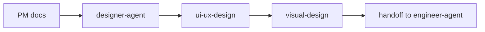

# Designer Agent

`designer-agent` is the design-role dispatcher skill. It routes UX flows, page structure, information architecture, wireframes, reference-style analysis, and visual system requests to the right design specialist skill. It produces design deliverables only and does not implement code.

> [!NOTE]
> Other languages: [中文](./README_zh.md)

> [!IMPORTANT]
> Designer Agent may read PM specs and design context, but reading those documents only authorizes design work. It must stop at handoff and let `engineer-agent` implement the design.

## Quick Facts

| Item | Details |
| --- | --- |
| Entry skill | `designer-agent` |
| Specialist skills | 2 |
| Main inputs | `docs/pm/{feature}/PRD.md`, `BRD.md`, `DECISIONS.md`, `TRD.md`, reference sites, brand cues |
| Main outputs | `docs/design/{feature}/UI_UX_SPEC.md`, `VISUAL_SYSTEM.md` |
| Core boundary | Design documents only; no code, tests, scripts, or deployment config |

## Skills

| Skill | When to use | Main output |
| --- | --- | --- |
| `designer-agent` | Design request routing | Specialist selection and execution path |
| `ui-ux-design` | UX flows, information architecture, page structure, wireframes, interaction states, reference-site analysis | `UI_UX_SPEC.md` |
| `visual-design` | Visual systems, product-type reasoning, style direction, color, typography, component rules, UX quality rules, anti-patterns, copy tone | `VISUAL_SYSTEM.md` |

## Routing Rules

- UX flows, page structure, information architecture, wireframes, interaction rules: use `ui-ux-design`
- Visual style, design system, color, typography, component rules, copy tone: use `visual-design`
- Ambiguous but clearly design-oriented requests: default to `ui-ux-design`
- Full design loop: run `ui-ux-design` first, then `visual-design`

## Design Flow



## Output Directory

```text
docs/
└── design/
    └── {feature-name}/
        ├── UI_UX_SPEC.md
        └── VISUAL_SYSTEM.md
```

## Visual Design References

`visual-design` uses reference material managed under this repository's own path:

```text
agents/designer/skills/visual-design/references/
├── design-system-data/          # CSV design database and design-system lookup scripts
├── design-system-framework.md   # Design system output model and boundary
├── product-patterns.md          # Product type to design pattern mapping
├── style-patterns.md            # Style direction rules
├── color-palettes.md            # Product-aware color recommendations
├── typography-pairings.md       # Font pairing recommendations
├── ux-quality-rules.md          # Visual UX quality checks
└── anti-patterns.md             # General and scenario-specific anti-patterns
```

The `design-system-data/` data design references ui ux pro max across product types, style patterns, colors, typography, UX rules, charts, landing patterns, icons, and stack guidelines. The directory does not carry a separate license file; license management follows the repository root `LICENSE`.

These references are only used for design reasoning. Even if raw data contains stack/code fields, final design documents must not include Tailwind config, CSS variable implementation, React/Vue/SwiftUI components, install commands, or engineering task lists.

## Collaboration Boundary

- Designer produces design documents, Mermaid flows, and ASCII wireframes.
- Designer does not modify project code, generate tests, or create deployment config.
- Engineer is the only role that turns PM/Designer documents into code, tests, and delivery artifacts.

## Local Maintenance

```bash
# Install one Designer skill into the current project runtime
npx skills add ./agents/designer/skills/visual-design

# Run Designer eval
uv run agents/designer/test/run_all_evals.py
```
