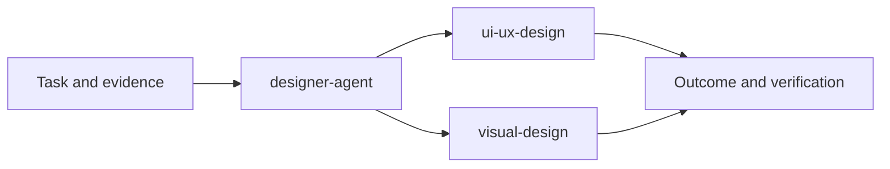

# Designer Agent

`designer-agent` helps select methods for designer agent work. The plugin provides 3 directly usable skills for the specialist tasks below. The assistant combines this knowledge to complete the requested outcome.

> [!NOTE]
> [Architecture](../../docs/architecture.md) · [Documentation Guide](../../docs/AGENTS.md) · [中文](./README_zh.md)

## Quick Facts

| Item | Details |
| --- | --- |
| Role guide | `designer-agent` |
| Specialist and composition skills | 2 |
| Main inputs | Product goals, audience, current interface, brand cues, reference sites, and constraints |
| Main outputs | User journeys, layouts, prototypes, visual systems, and implemented interface improvements |

## Skills

| Skill | When to use | Main output |
| --- | --- | --- |
| [designer-agent](./skills/designer-agent/SKILL.md) | Design capability guide | Design approach and requested artifact |
| [ui-ux-design](./skills/ui-ux-design/SKILL.md) | User flows, information architecture and wireframes | Journeys, layouts, interaction specification |
| [visual-design](./skills/visual-design/SKILL.md) | Visual systems and interface specifications | Visual system or applied UI |

## Choosing a Capability

- Use `ui-ux-design` for navigation, information hierarchy, page structure, forms, and interaction states.
- Use `visual-design` for visual direction, color, typography, spacing, component treatment, and purposeful feedback.
- Combine both for a complete interface change and inspect the rendered result at relevant viewport sizes.

## Installation and Use

```text
/plugin marketplace add Neplich/dev-agent-skills
/plugin install designer-agent@dev-agent-skills
```

For Codex personal and project installations, see the [installation guide](../../docs/README.codex.md). From the repository root, install all capabilities into the selected target:

```bash
python3 scripts/install_codex_skills.py --target /path/to/skills
```

Describe the goal directly or select a skill through the host, for example:

```text
/visual-design "Improve readability and hierarchy in this analytics dashboard."
```

## Inputs and Artifacts

An interaction specification can include journeys, page inventory, layouts, component states, keyboard behavior, and responsive priorities. A visual specification records the chosen direction, type scale, colors, spacing, and component treatments. The requested artifact may also be a prototype or working UI.

For durable artifacts, use the project’s existing locations or adapt this layout:

```text
docs/design/{feature}/
  ui-ux-spec.md
  visual-system.md
```

Choose the useful files for the task. Existing documents, code, and tests jointly support expectations and verification.

## Visual Design References

The visual library includes local product and style patterns, palettes, font
pairings, accessibility checks, and searchable data:

```text
skills/visual-design/references/
  design-system-data/
  design-system-framework.md
  product-patterns.md
  style-patterns.md
  color-palettes.md
  typography-pairings.md
  ux-quality-rules.md
  anti-patterns.md
```

[Design data and CLI examples](./skills/visual-design/references/design-system-data/README.md)
cover product, style, color, typography, UX, charts, landing pages, icons, and
stack references. Choose a primary direction, explain its fit to the audience,
and check actual contrast, content hierarchy, interaction states, and responsive
behavior. Apply findings to the requested document, prototype, or interface.

## Typical Workflow

Understand user tasks → organize interaction → choose visual treatment → apply → inspect


```mermaid
flowchart LR
    Context["Task and evidence"] --> Work["designer-agent"]
    Work --> S0["ui-ux-design"]
    S0 --> Result["Outcome and verification"]
    Work --> S1["visual-design"]
    S1 --> Result["Outcome and verification"]
```

## Combining Capabilities

Use existing engineering conventions when applying the design, and QA methods to check interaction and accessibility. Design references support both specifications and implementation within the requested scope.

The assistant continues within existing authorization and identifies concrete decisions when a material product choice or additional operation permission is needed.

## Local Maintenance

Capability sources live under `skills/` in this directory. Update relevant descriptions and installation data with content changes; see the [maintenance guide](../../docs/cookbook/maintain-skills.md) for verification.
