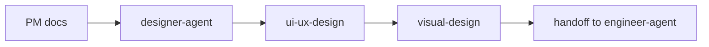

# Designer Agent

`designer-agent` 是设计角色的 dispatcher skill，负责把 UX 流程、页面结构、信息架构、线框、参考风格分析和视觉系统请求路由到合适的设计 specialist skill。它只产出设计交付物，不进入工程实现。

> [!NOTE]
> 其他语言：[English](./README.md)

> [!IMPORTANT]
> Designer Agent 可以读取 PM spec 和设计上下文，但读取这些文档只意味着继续设计，不代表可以开始写代码。设计完成后必须停在 handoff，由 `engineer-agent` 接手实现。

## 快速信息

| 项目 | 内容 |
| --- | --- |
| 入口 skill | `designer-agent` |
| Specialist skills | 2 个 |
| 主要输入 | `docs/pm/{feature}/PRD.md`、`BRD.md`、`DECISIONS.md`、`TRD.md`、参考网站或品牌线索 |
| 主要输出 | `docs/design/{feature}/UI_UX_SPEC.md`、`VISUAL_SYSTEM.md` |
| 核心边界 | 只做设计文档，不生成代码、测试、脚本、部署配置 |

## Skill 清单

| Skill | 适用场景 | 主要产物 |
| --- | --- | --- |
| `designer-agent` | 设计请求入口与路由 | 下游 skill 选择与执行路径 |
| `ui-ux-design` | UX 流程、信息架构、页面结构、线框、交互状态、参考网站分析 | `UI_UX_SPEC.md` |
| `visual-design` | 视觉系统、产品类型推理、风格方向、配色、字体、组件规范、UX 质量规则、反模式、文案语气 | `VISUAL_SYSTEM.md` |

## 路由规则

- UX 流程、页面结构、信息架构、线框、交互规范：使用 `ui-ux-design`
- 视觉风格、设计系统、颜色、字体、组件规范、文案语气：使用 `visual-design`
- 需求模糊但明显是设计问题：默认先走 `ui-ux-design`
- 完整设计闭环：先 `ui-ux-design`，再 `visual-design`

## 设计流程



## 输出目录

```text
docs/
└── design/
    └── {feature-name}/
        ├── UI_UX_SPEC.md
        └── VISUAL_SYSTEM.md
```

## Visual Design References

`visual-design` 的设计系统能力基于本仓库自有路径管理的 reference 资料：

```text
agents/designer/skills/visual-design/references/
├── design-system-data/          # CSV 设计数据库与 design-system 查询脚本
├── design-system-framework.md   # 设计系统输出模型和边界
├── product-patterns.md          # 产品类型到设计模式的映射
├── style-patterns.md            # 风格方向选择规则
├── color-palettes.md            # 产品感知配色建议
├── typography-pairings.md       # 字体组合建议
├── ux-quality-rules.md          # 视觉 UX 质量检查
└── anti-patterns.md             # 通用与场景反模式
```

`design-system-data/` 的数据设计参考了 ui ux pro max，包括产品类型、风格模式、颜色、字体、UX 规则、图表、landing pattern、icons 和 stack guideline 等维度；目录不携带独立 license 文件，授权统一按仓库根 `LICENSE` 管理。

这些 references 只用于设计推理。即使原始数据中存在 stack/code 字段，最终设计文档也不能包含 Tailwind config、CSS 变量落地、React/Vue/SwiftUI 组件、安装命令或工程任务清单。

## 协作边界

- Designer 输出设计文档、Mermaid 流程和 ASCII 线框。
- Designer 不修改项目代码，不生成测试，不创建部署配置。
- Engineer 是唯一负责把 PM/Designer 文档转化为代码、测试和交付产物的角色。

## 本地维护

```bash
# 安装某个 Designer skill 到当前项目运行时
npx skills add ./agents/designer/skills/visual-design

# 运行 Designer eval
uv run agents/designer/test/run_all_evals.py
```
