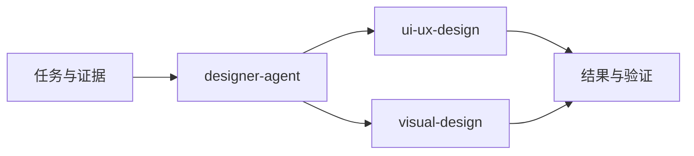

# Designer Agent

`designer-agent` 帮助选择设计能力相关方法。本插件提供 3 个可直接使用的 Skill，覆盖下表中的专项任务。助手根据用户目标组合专业知识，并持续完成请求范围内的工作。

> [!NOTE]
> [仓库架构](../../docs/architecture.md) · [文档说明](../../docs/AGENTS.md) · [English](./README.md)

## 快速信息

| 项目 | 详情 |
| --- | --- |
| 角色导航 | `designer-agent` |
| 专项与组合 Skill | 2 |
| 主要输入 | 产品目标、受众、当前界面、品牌线索、参考站点与实际限制 |
| 主要产物 | 用户旅程、布局、原型、视觉系统与已实现的界面改进 |

## Skill 清单

| Skill | 适用场景 | 主要产物 |
| --- | --- | --- |
| [designer-agent](./skills/designer-agent/SKILL.md) | 设计能力导航 | 设计方法与所需产物 |
| [ui-ux-design](./skills/ui-ux-design/SKILL.md) | 用户流程、信息架构与线框图 | 旅程、布局与交互规格 |
| [visual-design](./skills/visual-design/SKILL.md) | 视觉系统与界面规范 | 视觉系统或已应用的界面 |

## 能力选择

- 导航、信息层级、页面结构、表单和交互状态使用 `ui-ux-design`。
- 视觉方向、色彩、字体、间距、组件表现和反馈使用 `visual-design`。
- 完整界面工作可组合两者，并在相关视口检查实际渲染结果。

## 安装与使用

```text
/plugin marketplace add Neplich/dev-agent-skills
/plugin install designer-agent@dev-agent-skills
```

Codex 的个人级和项目级安装见 [安装指南](../../docs/README.codex.md)。从仓库根目录安装全部能力到已选目标：

```bash
python3 scripts/install_codex_skills.py --target /path/to/skills
```

直接描述目标，或通过宿主的 Skill 选择器调用，例如：

```text
/visual-design "改善数据分析面板的可读性和信息层级"
```

## 输入与产物组织

交互规格可包含旅程、页面清单、布局、组件状态、键盘操作和响应式优先级。视觉规格记录方向、字号层级、色彩、间距和组件表现；用户请求的产物也可以是原型或运行中的界面。

需要持久化资料时，可沿用项目现有位置或参考下列布局：

```text
docs/design/{feature}/
  ui-ux-spec.md
  visual-system.md
```

具体文件按任务价值选用；已有资料、代码和测试共同支持预期与验证。

## 视觉设计参考

视觉资料库包含本地产品与风格模式、色板、字体搭配、可访问性检查和可检索数据：

```text
skills/visual-design/references/
  design-system-data/
  design-system-framework.md
  product-patterns.md
  style-patterns.md
  color-palettes.md
  typography-pairings.md
  ux-quality-rules.md
  anti-patterns.md
```

[设计数据库与命令示例](./skills/visual-design/references/design-system-data/README.md)
覆盖产品、风格、色彩、字体、UX、图表、落地页、图标和技术栈。选择主要视觉方向，说明它与受众的关系，并检查实际对比度、内容层级、交互状态和响应式表现。结果可应用到请求中的文档、原型或界面。

## 典型工作方式

理解用户任务 → 组织交互 → 选择视觉表现 → 应用设计 → 检查结果


```mermaid
flowchart LR
    Context["任务与证据"] --> Work["designer-agent"]
    Work --> S0["ui-ux-design"]
    S0 --> Result["结果与验证"]
    Work --> S1["visual-design"]
    S1 --> Result["结果与验证"]
```

## 与其他能力组合

应用设计时沿用工程约定，结合 QA 方法检查交互与可访问性。设计参考支持请求范围内的规格和实现工作。

助手在已有授权内贯穿相关工作；涉及关键产品选择或新增操作权限时，明确需要用户决定的具体事项。

## 本地维护

能力源码位于本目录的 `skills/`。修改专业内容后，同步相关说明和安装数据；验证方法见 [维护指南](../../docs/cookbook/maintain-skills.md)。
