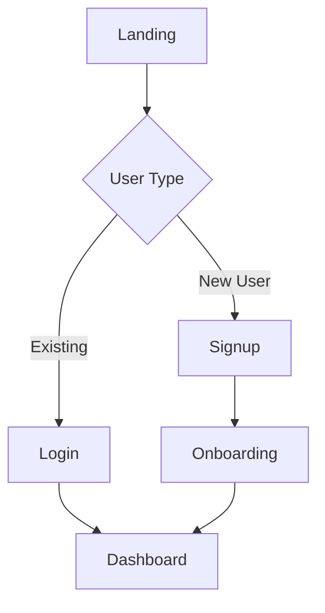

## Hard Boundaries

This skill produces UX and UI design documentation only.

Allowed actions:
- Read PM docs and existing design docs
- Analyze reference websites for design patterns
- Create user journeys, page inventories, ASCII layouts, component lists, and interaction notes
- Write or update `docs/design/{feature_path}/ui-ux-spec.md`

Forbidden actions:
- Writing or modifying source code, tests, build files, or deployment config
- Emitting code patches, implementation checklists, shell commands, or file-by-file coding instructions
- Calling Engineer skills or continuing into implementation after the design doc is complete

If the input includes a completed PM spec, treat it as design input only, not as permission to implement.

Make that boundary explicit in the delivered design document and final
handoff: the PM spec authorizes design input only, no code or implementation.
After writing `docs/design/{feature_path}/ui-ux-spec.md`, record the design path
and remaining implementation scope. Direct the next step to `engineer-agent`
only when implementation continuation was requested or already authorized;
otherwise stop at the completed design result without activating engineering.
When change-map discovery finds a required formal page marked
`last_verified_version: unverified`, state that it is low-trust and verify its
claims against code before using it as design input.

When updating an existing design doc, the body states only the current design:
superseded layouts, journeys, or patterns are rewritten, not kept with
"deprecated" / "superseded" annotations. Removals are recorded in the doc
changelog and git history: the doc carries a `## Changelog` section
(initialized if absent) listing version, date, and change summary, and
`last_updated` metadata is refreshed when present.

## PM Handoff Entry Gate

Before creating design deliverables, require a PM/design handoff packet or
equivalent confirmed PM scope. If the user directly invokes this specialist
without PM handoff context or a confirmed `feature_path`, return the request to
`pm-agent` for classification.

Use the PM-side packet definition in
the plugin-local generated `../designer-agent/_internal/_generated/shared-contracts/handoff-contract.md`.

## Feature Path Gate

Before writing a feature-scoped UI/UX spec, resolve a confirmed `feature_path`
from the PM handoff or `docs/pm/{feature_path}/PRD.md`. Read PM context from
`docs/pm/{feature_path}/` and optional technical constraints from
`docs/engineer/{feature_path}/TRD.md`; write only to
`docs/design/{feature_path}/ui-ux-spec.md`. If the parent feature is unclear,
or the available PM docs suggest the requested work belongs under an existing
parent feature but do not confirm the child path, stop and return to
`pm-agent:idea-to-spec` instead of creating a new top-level design directory.

If the target agent's plugin for a cross-agent handoff is not installed or
unavailable, state the missing stage and required plugin, mark that handoff
stage as blocked, and do not perform the missing agent's responsibilities
yourself.

## Execution Steps

### Step 1: Gather Requirements

宿主存在 `docs/site/standards/change-map.yaml` 时，项目探索先按 pm-agent 维护的 `consumption-contract.md`（the plugin-local generated `../designer-agent/_internal/_generated/shared-contracts/consumption-contract.md`）执行“任务落点 → change-map 反查 → 精准读取 → 关键判断回代码验证”；不存在时静默沿用当前代码探索。

1. **Read PM documents** from `docs/pm/{feature_path}/`:
   - PRD: feature requirements, user stories, use cases, target users, business goals, brand tone
   - DECISIONS: confirmed product decisions, open questions, design constraints
   - TRD: technical constraints, performance requirements

2. **Ask for reference websites** using AskUserQuestion:
   ```
   Question: "Do you have any favorite websites or design references we should follow?"
   Options:
   - "Yes, I have reference websites" (provide URL input)
   - "No, create an original design"
   ```

### Step 2: Analyze Reference (if provided)

If user provides reference website URL:

1. **Fetch reference website** using WebFetch
2. **Extract design patterns**:
   - Layout structure (header/nav/content/footer)
   - Navigation patterns (top nav, sidebar, hamburger)
   - Information architecture
   - Interaction patterns (cards, lists, modals)
   - Visual hierarchy

3. **Document findings** in a temporary analysis note

### Step 3: Design User Journey

Create user journey map using Mermaid flowchart:



Include:
- Main task flows
- Decision points
- Edge cases (empty states, errors, loading)


### Step 4: Create Page Inventory

List all required pages/screens:

```markdown
## Page Inventory

1. **Landing Page** - Marketing homepage
2. **Login/Signup** - Authentication
3. **Dashboard** - Main user interface
4. **Settings** - User preferences
5. **[Feature Page]** - Specific feature screens
```

### Step 5: Design ASCII Prototypes

For each major page, create ASCII layout prototype:

```
┌─────────────────────────────────────────────────┐
│  [Logo]              [Nav Links]      [Profile] │
├─────────────────────────────────────────────────┤
│                                                  │
│  ┌────────────────┐  ┌────────────────┐        │
│  │                │  │                │        │
│  │   Card Title   │  │   Card Title   │        │
│  │   [Image]      │  │   [Image]      │        │
│  │   Description  │  │   Description  │        │
│  │   [Button]     │  │   [Button]     │        │
│  │                │  │                │        │
│  └────────────────┘  └────────────────┘        │
│                                                  │
├─────────────────────────────────────────────────┤
│  Footer: Links | Contact | © 2026              │
└─────────────────────────────────────────────────┘
```

Use box-drawing characters: ┌ ┐ └ ┘ ├ ┤ ─ │


### Step 6: Define Component List

List all UI components needed:

```markdown
## Component List

### Navigation
- Header with logo and nav links
- Mobile hamburger menu
- Breadcrumbs

### Content
- Card component (image, title, description, action)
- List items
- Data tables
- Forms (input, select, checkbox, radio)

### Feedback
- Modals/dialogs
- Toast notifications
- Loading spinners
- Empty states
- Error messages
```


### Step 7: Document Interactions

Describe key interactions and behaviors:

```markdown
## Interaction Behaviors

### Navigation
- Click logo → return to homepage
- Hover nav links → show underline
- Mobile: hamburger menu slides from left

### Forms
- Input focus → show blue border
- Validation → inline error messages
- Submit → loading state → success/error feedback

### Cards
- Hover → slight elevation shadow
- Click → navigate to detail page
```

### Step 8: Handle Responsive Design

Document responsive breakpoints:

```markdown
## Responsive Design

### Desktop (>1024px)
- 3-column card grid
- Full navigation visible

### Tablet (768px-1024px)
- 2-column card grid
- Condensed navigation

### Mobile (<768px)
- 1-column stack
- Hamburger menu
- Touch-friendly buttons (min 44px)
```


### Step 9: Generate Output Document

Create `docs/design/{feature_path}/ui-ux-spec.md` with the following structure:

```markdown
# UI/UX Design Specification

## 1. Reference Analysis (if applicable)
- Reference URL: [url]
- Key patterns extracted: [list]

## 2. User Journey
[Mermaid flowchart]

## 3. Page Inventory
[List of all pages]

## 4. Page Layouts
[ASCII prototypes for each page]

## 5. Component List
[All UI components needed]

## 6. Interaction Behaviors
[Key interactions and states]

## 7. Responsive Design
[Breakpoints and adaptations]
```

## Quality Checklist

Before finalizing, ensure:
- [ ] All user flows are covered (happy path + edge cases)
- [ ] ASCII prototypes are clear and readable
- [ ] Component list is complete
- [ ] Interactions are well-defined
- [ ] Responsive design is addressed
- [ ] Reference patterns (if any) are properly adapted

## Completion Criteria

This skill is complete only when:
- `docs/design/{feature_path}/ui-ux-spec.md` has been written or updated
- The final response summarizes the design deliverable and its file location
- The workflow stops at design handoff

After completion:
- Do not propose code changes
- Do not generate implementation steps
- If build work is requested next, tell the user to invoke `engineer-agent`

## Output Location

Write the final document to: `docs/design/{feature_path}/ui-ux-spec.md`
