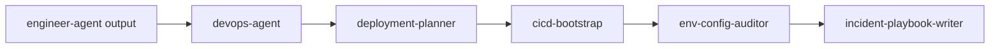

# DevOps Agent

`devops-agent` is the dispatcher skill for deployment, delivery automation, configuration governance, and runtime readiness. It routes deployment planning, CI/CD, environment audits, and incident playbook requests to the right DevOps specialist skill.

> [!NOTE]
> Other languages: [中文](./README_zh.md)

> [!TIP]
> DevOps Agent is not required for every feature. Use it when deployment, automation, config completeness, or rollback readiness becomes the current problem.

## Quick Facts

| Item | Details |
| --- | --- |
| Entry skill | `devops-agent` |
| Specialist skills | 4 |
| Main inputs | Engineering code, PM/TRD constraints, deployment requirements, environment variables, CI/CD state |
| Main outputs | `deploy/` config, CI/CD files, environment audit, runbook |
| Collaboration | Upstream `engineer-agent`; may route back to `pm-agent` or `security-agent` |

## Skills

| Skill | When to use | Main output |
| --- | --- | --- |
| `devops-agent` | DevOps request routing | Specialist selection and execution path |
| `deployment-planner` | New or updated deployment config, containers, Kubernetes/Helm | `deploy/local/`, `deploy/docker/`, `deploy/helm/` |
| `cicd-bootstrap` | GitHub Actions / GitLab CI / release workflow | CI/CD configuration files |
| `env-config-auditor` | Environment variables, secrets, runtime config coverage | Config audit report and gap list |
| `incident-playbook-writer` | Rollback, troubleshooting, on-call preparation | Runbook and incident playbook |

## Routing Rules

- Create or extend deployment assets: use `deployment-planner`
- Add automated build, test, or release pipelines: use `cicd-bootstrap`
- Review environment variables, secrets, or config coverage: use `env-config-auditor`
- Write rollback, troubleshooting, or on-call docs: use `incident-playbook-writer`

Default rule: if the core question is "how do we deploy it?", start with `deployment-planner`. If deployment already exists but automation is missing, start with `cicd-bootstrap`.

## Deployment Artifact Model

```text
deploy/
├── local/      # Local development
├── docker/     # Dockerfile, compose, build scripts
└── helm/       # Helm chart, values, Kubernetes runtime settings
```

When needed, DevOps may also update:

- `.github/workflows/`
- `.gitlab-ci.yml`
- `docs/devops/{feature-name}/`

## Typical Flow



## Collaboration Boundary

- DevOps can generate deployment config, CI/CD, environment audits, and runbooks.
- DevOps does not replace Engineer for business code changes or Security for security review.
- Sensitive configuration risks should be handed to the right role for remediation or security review.

## Local Maintenance

```bash
# Install one DevOps skill into the current project runtime
npx skills add ./agents/devops/skills/deployment-planner

# Run one DevOps eval
uv run agents/devops/test/run_eval.py \
  agents/devops/test/env-config-auditor/workspace/iteration-1/eval-1-missing-variables/eval_metadata.json
```
