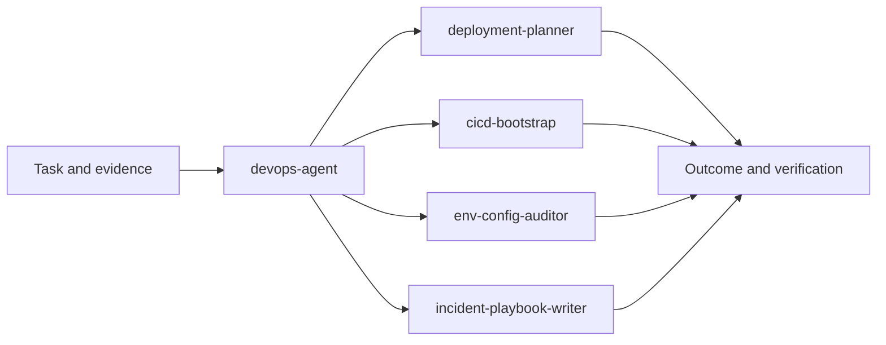

# DevOps Agent

`devops-agent` helps select methods for devops agent work. The plugin provides 5 directly usable skills for the specialist tasks below. The assistant combines this knowledge to complete the requested outcome.

> [!NOTE]
> [Architecture](../../docs/architecture.md) · [Documentation Guide](../../docs/AGENTS.md) · [中文](./README_zh.md)

## Quick Facts

| Item | Details |
| --- | --- |
| Role guide | `devops-agent` |
| Specialist and composition skills | 4 |
| Main inputs | Application runtime, deployment targets, environment configuration, CI, and operational evidence |
| Main outputs | Deployment assets, workflows, configuration findings, and recovery runbooks |

## Skills

| Skill | When to use | Main output |
| --- | --- | --- |
| [devops-agent](./skills/devops-agent/SKILL.md) | DevOps capability guide | Operational approach and evidence |
| [deployment-planner](./skills/deployment-planner/SKILL.md) | Deployment and recovery plans | Targeted startup/deployment assets |
| [cicd-bootstrap](./skills/cicd-bootstrap/SKILL.md) | CI/CD configuration | CI/CD workflow configuration |
| [env-config-auditor](./skills/env-config-auditor/SKILL.md) | Environment and configuration audits | Variable/secret coverage and corrections |
| [incident-playbook-writer](./skills/incident-playbook-writer/SKILL.md) | Incident runbooks | Diagnostic and recovery runbooks |

## Choosing a Capability

- Use `deployment-planner` to create or extend assets for the actual target environment.
- Use `cicd-bootstrap` for build, test, artifact, and deployment automation.
- Use `env-config-auditor` to trace variables and secret references from code through deployment.
- Use `incident-playbook-writer` for symptoms, diagnosis, recovery actions, and success signals.

## Installation and Use

```text
/plugin marketplace add Neplich/dev-agent-skills
/plugin install devops-agent@dev-agent-skills
```

For Codex personal and project installations, see the [installation guide](../../docs/README.codex.md). From the repository root, install all capabilities into the selected target:

```bash
python3 scripts/install_codex_skills.py --target /path/to/skills
```

Describe the goal directly or select a skill through the host, for example:

```text
/deployment-planner "Add a Docker Compose deployment for the worker and database."
```

## Inputs and Artifacts

Select local, Docker/Compose, Kubernetes/Helm, or another target from the request and existing system. Local instructions cover dependencies and startup. Container assets cover build context, ports, volumes, networking, and health. Helm assets cover images, values, workloads, services, ingress, resources, and scaling where applicable.

For durable artifacts, use the project’s existing locations or adapt this layout:

```text
deploy/
  local/
  docker/
  helm/
.github/workflows/
docs/devops/{feature}/
```

Choose the useful files for the task. Existing documents, code, and tests jointly support expectations and verification.

## Operational Verification

| Surface | Useful verification |
| --- | --- |
| Build | Actual entry command, dependency versions, build context, artifact |
| Image | Registry, immutable tag or digest, required architectures |
| Runtime | Startup, network, persistence, resources, health checks |
| Configuration | Required values, environment differences, protected secret references |
| Recovery | Diagnosis, rollback prerequisites, restoration steps, success signals |

Distinguish configuration prepared, automation executed, and runtime observed.
For multiple services or documentation variants, trace each unit from its build
to deployment and health evidence. Keep runbooks close to the assets they explain.

## Typical Workflow

Inspect runtime → prepare target assets → connect automation → verify configuration and health


```mermaid
flowchart LR
    Context["Task and evidence"] --> Work["devops-agent"]
    Work --> S0["deployment-planner"]
    S0 --> Result["Outcome and verification"]
    Work --> S1["cicd-bootstrap"]
    S1 --> Result["Outcome and verification"]
    Work --> S2["env-config-auditor"]
    S2 --> Result["Outcome and verification"]
    Work --> S3["incident-playbook-writer"]
    S3 --> Result["Outcome and verification"]
```

## Combining Capabilities

Use engineering evidence to verify startup and build commands, security knowledge for protected configuration, and documentation methods for executable runbooks. Remote execution and publication follow the task authorization.

The assistant continues within existing authorization and identifies concrete decisions when a material product choice or additional operation permission is needed.

## Local Maintenance

Capability sources live under `skills/` in this directory. Update relevant descriptions and installation data with content changes; see the [maintenance guide](../../docs/cookbook/maintain-skills.md) for verification.
