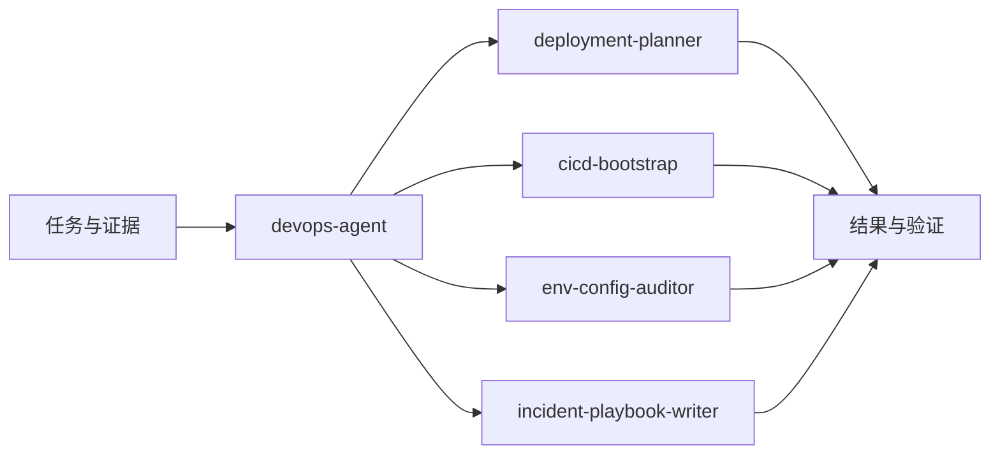

# DevOps Agent

`devops-agent` 帮助选择运维能力相关方法。本插件提供 5 个可直接使用的 Skill，覆盖下表中的专项任务。助手根据用户目标组合专业知识，并持续完成请求范围内的工作。

> [!NOTE]
> [仓库架构](../../docs/architecture.md) · [文档说明](../../docs/AGENTS.md) · [English](./README.md)

## 快速信息

| 项目 | 详情 |
| --- | --- |
| 角色导航 | `devops-agent` |
| 专项与组合 Skill | 4 |
| 主要输入 | 应用运行方式、部署目标、环境配置、CI 与运维证据 |
| 主要产物 | 部署资产、工作流、配置发现与恢复手册 |

## Skill 清单

| Skill | 适用场景 | 主要产物 |
| --- | --- | --- |
| [devops-agent](./skills/devops-agent/SKILL.md) | 运维能力导航 | 运维方案与证据 |
| [deployment-planner](./skills/deployment-planner/SKILL.md) | 部署与恢复方案 | 目标启动与部署资产 |
| [cicd-bootstrap](./skills/cicd-bootstrap/SKILL.md) | CI/CD 配置 | CI/CD 工作流配置 |
| [env-config-auditor](./skills/env-config-auditor/SKILL.md) | 环境与配置审计 | 变量与凭据覆盖及修正 |
| [incident-playbook-writer](./skills/incident-playbook-writer/SKILL.md) | 故障处置手册 | 诊断与恢复手册 |

## 能力选择

- 使用 `deployment-planner` 为实际目标环境创建或扩展部署资产。
- 使用 `cicd-bootstrap` 配置构建、测试、资产和部署自动化。
- 使用 `env-config-auditor` 将变量与凭据引用从代码追踪到部署。
- 使用 `incident-playbook-writer` 编写症状、诊断、恢复动作与成功信号。

## 安装与使用

```text
/plugin marketplace add Neplich/dev-agent-skills
/plugin install devops-agent@dev-agent-skills
```

Codex 的个人级和项目级安装见 [安装指南](../../docs/README.codex.md)。从仓库根目录安装全部能力到已选目标：

```bash
python3 scripts/install_codex_skills.py --target /path/to/skills
```

直接描述目标，或通过宿主的 Skill 选择器调用，例如：

```text
/deployment-planner "为 worker 和数据库补充 Docker Compose 部署"
```

## 输入与产物组织

根据请求与现有系统选择本地、Docker/Compose、Kubernetes/Helm 或其他目标。本地说明覆盖依赖和启动；容器资产覆盖构建上下文、端口、卷、网络与健康检查；Helm 资产按需覆盖镜像、values、工作负载、服务、入口、资源和扩缩容。

需要持久化资料时，可沿用项目现有位置或参考下列布局：

```text
deploy/
  local/
  docker/
  helm/
.github/workflows/
docs/devops/{feature}/
```

具体文件按任务价值选用；已有资料、代码和测试共同支持预期与验证。

## 运维验证

| 关注面 | 有用验证 |
| --- | --- |
| 构建 | 实际入口命令、依赖版本、构建上下文、产物 |
| 镜像 | registry、不可变 tag 或 digest、所需架构 |
| 运行 | 启动、网络、持久化、资源、健康检查 |
| 配置 | 必需值、环境差异、受保护凭据引用 |
| 恢复 | 诊断、回滚前提、恢复步骤、成功信号 |

区分已准备的配置、已执行的自动化和已观察的运行状态。多个服务或文档变体分别追踪构建、部署与健康证据，手册放在相关资产附近。

## 典型工作方式

查看运行方式 → 准备目标资产 → 连接自动化 → 验证配置与健康状态



## 与其他能力组合

用工程证据核实启动与构建命令，用安全知识处理受保护配置，用文档方法形成可执行手册。远端执行和发布沿用任务授权。

助手在已有授权内贯穿相关工作；涉及关键产品选择或新增操作权限时，明确需要用户决定的具体事项。

## 本地维护

能力源码位于本目录的 `skills/`。修改专业内容后，同步相关说明和安装数据；验证方法见 [维护指南](../../docs/cookbook/maintain-skills.md)。
