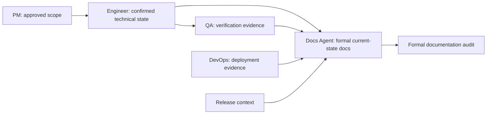

# Docs Agent

`docs-agent` is the seventh role Agent and the owner of the formal
documentation layer. It routes explicit documentation-site bootstrap,
evidence-backed synchronization and backfill, and release documentation audit
requests to the matching documentation specialist.

> [!IMPORTANT]
> Docs Agent is a downstream capability. It starts from a PM handoff packet, an
> equivalent confirmed document chain, or the entry basis defined by the
> selected specialist. Unsettled product scope returns to `pm-agent` first.

## Quick Facts

| Item | Details |
| --- | --- |
| Entry skill | `docs-agent` |
| Specialist skills | 3 |
| Main inputs | PM handoff context, approved product documents, confirmed engineering documents, code and test evidence, deployment evidence, release context |
| Main outputs | Formal documentation-site scaffolding, current-state formal docs, change-map updates, release audit reports |
| Collaboration | Downstream of confirmed PM, Engineer, QA, and DevOps evidence; supports release readiness without replacing their role contracts |

## Skills

| Skill | When to use | Main output |
| --- | --- | --- |
| `docs-agent` | Formal documentation request routing | Specialist selection or a bounded blocked handoff |
| `docs-site-bootstrap` | The maintainer explicitly asks to initialize a formal documentation site | A technology-neutral `docs/site/` foundation and standards |
| `formal-docs-sync` | A confirmed feature, deployment, release, or existing system needs formal documentation synchronization or backfill | Current-state formal docs and `change-map.yaml` updates; the v0.3.0 accepted automation surface is API documentation only |
| `docs-audit` | Release readiness requires formal-document coverage and fact verification | Version-scoped audit report, release recommendation, and unified version stamp when all pages are verified |

## Routing Rules

- Explicit formal documentation-site initialization: use `docs-site-bootstrap`.
- Feature, deployment, or release synchronization, or existing-system backfill:
  use `formal-docs-sync`.
- Release documentation audit: use `docs-audit`.

## `formal-docs-sync` Capability Boundary (v0.3.0)

The v0.3.0 accepted automation surface is API documentation only. This is the
current acceptance boundary, not the final product boundary of
`formal-docs-sync`.

- Feature delivery and existing-system backfill are accepted for API pages and
  API `code_glob` entries only.
- Deployment verification and release modes currently focus on evidence
  checking, scope judgment, and handoff; they do not yet provide a fully
  accepted synchronization surface.
- Database, design, ops, and product formal docs still require manual
  maintenance or a separate handoff; multi-type synchronization migration is
  tracked in [#121](https://github.com/Neplich/dev-agent-skills/issues/121) and
  is not shipped in v0.3.0.
- Release notes are not part of `formal-docs-sync`; a dedicated documentation
  release-notes skill is tracked in
  [#116](https://github.com/Neplich/dev-agent-skills/issues/116).

## Collaboration Position

Docs Agent owns stable formal documentation derived from confirmed process
artifacts and current system evidence. It is not a new product-definition or
implementation stage in the existing role chain.

At closeout, the router follows the PM safety-net contract to recommend the
next role in the established collaboration chain. It waits for confirmation
unless the user has enabled `auto-continue`.

## Process-Document Boundary

Docs Agent owns the host project's formal documentation layer under
`docs/site/`. It consumes approved process documents and current code, test,
deployment, and release evidence, but it does not replace or rewrite the
contracts owned by other roles.

- Product scope and decisions remain under `docs/pm/{feature_path}/` and stay
  owned by PM.
- TRDs, implementation plans, API planning artifacts, and ADRs remain under
  `docs/engineer/{feature_path}/` and stay owned by Engineer.
- Formal documentation states the latest verified system behavior. It does not
  turn process documents into a change log or use formal docs to override code
  and test facts.

If product expectations or technical decisions are missing, stale, or
conflicting, Docs Agent reports the gap and returns it to the owning role rather
than changing that role's documents.

## Collaboration Dependencies

Docs Agent relies on peer capabilities that may be packaged as separate
plugins:

- `pm-agent` for request classification, approved scope, feature catalogs,
  release notes, and the shared handoff contract
- `engineer-agent` for confirmed TRDs, implementation plans, code evidence, and
  unresolved technical impact scope
- `qa-agent` for validation evidence
- `devops-agent` for deployment and operational evidence

If a required target is unavailable, Docs Agent identifies the missing stage
and plugin, marks that stage blocked, and does not perform the missing role's
work.
