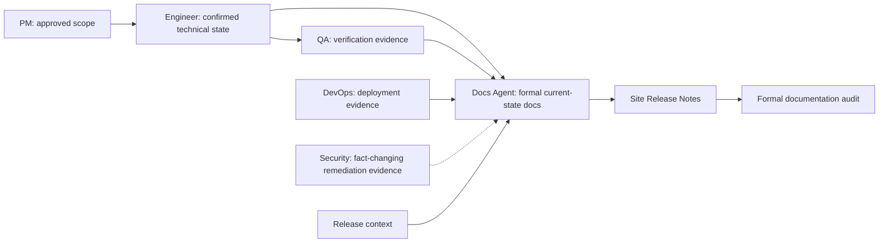

# Docs Agent

`docs-agent` is the seventh role Agent and the owner of the formal
documentation layer. It routes explicit documentation-site bootstrap,
evidence-backed synchronization and backfill, site Release Notes delivery, and
release documentation audit requests to the matching documentation specialist.

> [!NOTE]
> Other languages: [中文](./README_zh.md)

> [!IMPORTANT]
> Docs Agent is a downstream capability. It starts from a PM handoff packet, an
> equivalent confirmed document chain, or the entry basis defined by the
> selected specialist. Unsettled product scope returns to `pm-agent` first.

## Quick Facts

| Item | Details |
| --- | --- |
| Entry skill | `docs-agent` |
| Specialist skills | 4 |
| Main inputs | PM handoff context, approved product documents, confirmed engineering documents, code and test evidence, deployment evidence, fact-changing security remediation evidence, release context |
| Main outputs | Formal documentation-site scaffolding, current-state formal docs, change-map updates, confirmed site Release Notes, release audit reports |
| Collaboration | Downstream of confirmed PM, Engineer, QA, and DevOps evidence; supports release readiness without replacing their role contracts |

## Skills

| Skill | When to use | Main output |
| --- | --- | --- |
| `docs-agent` | Formal documentation request routing | Specialist selection or a bounded blocked handoff |
| `docs-site-bootstrap` | The maintainer explicitly asks to initialize a formal documentation site | A technology-neutral `docs/site/` foundation and standards |
| `formal-docs-sync` | A confirmed feature, deployment, release, or existing system needs formal documentation synchronization or backfill | Current-state API, database, design, ops, and product docs with their `change-map.yaml` updates; v0.3.0 was limited to API automation |
| `release-notes-generator` | A confirmed release needs a versioned page in the host documentation site before GitHub Release preparation | Confirmed `vX.Y.Z.md`, release metadata/index updates, successful docs checks, and a site-ready evidence handoff to issue #117 pre-tag audit; issue #120 remains the downstream GitHub Release owner |
| `docs-audit` | Release readiness requires formal-document coverage and fact verification before and after tag creation | With a maintainer-confirmed `target_release_version`, pre-tag returns `ready_for_tag` after complete-set stamping; post-tag returns `release_verified` or `blocked` after checking the actual tag |

## Routing Rules

- Explicit formal documentation-site initialization: use `docs-site-bootstrap`.
- Feature, deployment, or release synchronization, or existing-system backfill:
  use `formal-docs-sync`.
- Versioned site Release Notes generation, confirmation, indexing, and docs
  validation: use `release-notes-generator`.
- Release documentation audit: use `docs-audit`.

## `formal-docs-sync` Capability Boundary (v0.3.0)

The v0.3.0 accepted automation surface was API documentation only. Issue
[#121](https://github.com/Neplich/dev-agent-skills/issues/121) has since
expanded the accepted synchronization surface to API, database, design, ops,
and product current-state documentation.

- Feature delivery synchronizes affected API, database, design, and applicable
  product pages; design pages remain subject to the delivery closeout gate.
- Deployment verification synchronizes evidenced current ops, upgrade, and
  rollback facts, without presenting plans as current state.
- Release mode synchronizes only affected product and ops pages and reconciles
  them with confirmed version facts.
- Existing-system backfill supports one maintainer-confirmed finite batch
  across any of the five document types.
- Release notes are not part of `formal-docs-sync`; the dedicated
  `release-notes-generator` owns their site generation, confirmation, release
  metadata/index updates, validation, and issue #117 pre-tag handoff; issue #120
  remains the downstream GitHub Release owner after `ready_for_tag`.

## Collaboration Position

Docs Agent owns stable formal documentation derived from confirmed process
artifacts and current system evidence. It is not a new product-definition or
implementation stage in the existing role chain.

At closeout, the router follows the PM safety-net contract to recommend the
next role in the established collaboration chain. It waits for confirmation
unless the user has enabled `auto-continue`.

## Process-Document Boundary

Docs Agent owns the host project's formal documentation layer under
`docs/site/`. It consumes approved process documents and current code, test,
deployment, and release evidence, but it does not replace or rewrite the
contracts owned by other roles.

- Product scope and decisions remain under `docs/pm/{feature_path}/` and stay
  owned by PM.
- TRDs, implementation plans, API planning artifacts, and ADRs remain under
  `docs/engineer/{feature_path}/` and stay owned by Engineer.
- Formal documentation states the latest verified system behavior. It does not
  turn process documents into a change log or use formal docs to override code
  and test facts.

If product expectations or technical decisions are missing, stale, or
conflicting, Docs Agent reports the gap and returns it to the owning role rather
than changing that role's documents.

## Collaboration Dependencies

Docs Agent relies on peer capabilities that may be packaged as separate
plugins:

- `pm-agent` for request classification, approved release scope, feature
  catalogs, and the shared handoff contract; site Release Notes are owned by
  this Agent's `release-notes-generator`, while the gated GitHub Release
  workflow is owned by PM `github-release-generator`
- `engineer-agent` for confirmed TRDs, implementation plans, code evidence, and
  unresolved technical impact scope
- `qa-agent` for validation evidence
- `devops-agent` for deployment and operational evidence
- `security-agent` for confirmed fact-changing security conclusions and remediation evidence, following the conditional `Security-to-Docs Evidence Handoff and Audit Rerun` rule in the shared skill map

If a required target is unavailable, Docs Agent identifies the missing stage
and plugin, marks that stage blocked, and does not perform the missing role's
work.
