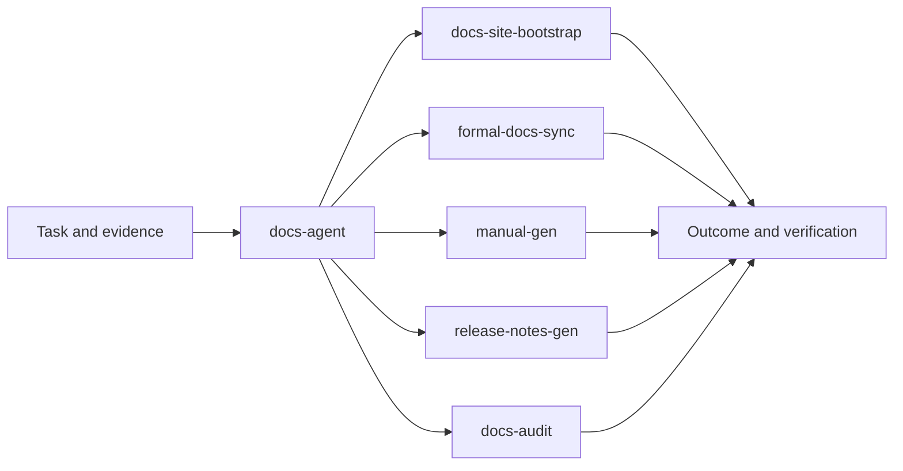

# Docs Agent

`docs-agent` helps select methods for docs agent work. The plugin provides 6 directly usable skills for the specialist tasks below. The assistant combines this knowledge to complete the requested outcome.

> [!NOTE]
> [Architecture](../../docs/architecture.md) · [Documentation Guide](../../docs/AGENTS.md) · [中文](./README_zh.md)

## Quick Facts

| Item | Details |
| --- | --- |
| Role guide | `docs-agent` |
| Specialist and composition skills | 5 |
| Main inputs | User needs, source code, APIs, schemas, runtime interfaces, tests, deployment, and release evidence |
| Main outputs | Documentation sites, current guides, illustrated manuals, release notes, and audit findings |

## Skills

| Skill | When to use | Main output |
| --- | --- | --- |
| [docs-agent](./skills/docs-agent/SKILL.md) | Documentation capability guide | Documentation approach and verified pages |
| [docs-site-bootstrap](./skills/docs-site-bootstrap/SKILL.md) | Initialize documentation sites | Site assets and bootstrap manifest |
| [formal-docs-sync](./skills/formal-docs-sync/SKILL.md) | Synchronize current product and technical facts | Current pages and change-map updates |
| [manual-gen](./skills/manual-gen/SKILL.md) | Write manuals from real interfaces | Task pages and real screenshots |
| [release-notes-gen](./skills/release-notes-gen/SKILL.md) | User-facing release notes | Version page, index, release metadata |
| [docs-audit](./skills/docs-audit/SKILL.md) | Documentation accuracy and release checks | Accuracy findings and verification results |

## Choosing a Capability

- Use `docs-site-bootstrap` to initialize or update the packaged VitePress site assets.
- Use `formal-docs-sync` to update API, database, design, operations, and product facts from actual implementation.
- Use `manual-gen` for task-oriented instructions and screenshots from the running interface.
- Use `release-notes-gen` for versioned site pages, indexes, and release metadata.
- Use `docs-audit` to check content accuracy, coverage, links, assets, and release consistency.

## Installation and Use

```text
/plugin marketplace add Neplich/dev-agent-skills
/plugin install docs-agent@dev-agent-skills
```

For Codex personal and project installations, see the [installation guide](../../docs/README.codex.md). From the repository root, install all capabilities into the selected target:

```bash
python3 scripts/install_codex_skills.py --target /path/to/skills
```

Describe the goal directly or select a skill through the host, for example:

```text
/manual-gen "Update the account setup guide with screenshots from the current UI."
```

## Inputs and Artifacts

The packaged site supports public/internal builds, page metadata, navigation, templates, and version data. Existing host content is merged using its actual provenance and task scope. Re-running bootstrap updates packaged assets while retaining host-authored content.

For durable artifacts, use the project’s existing locations or adapt this layout:

```text
docs/site/
  product/
  design/
  api/
  database/
  manual/
  ops/
  release-notes/
  standards/
  .meta/
```

Choose the useful files for the task. Existing documents, code, and tests jointly support expectations and verification.

## Documentation Types and Site Checks

| Type | Evidence and useful content |
| --- | --- |
| API | Routes, request/response schemas, authentication, errors, examples |
| Database | Migrations, models, relations, indexes, and data lifecycle |
| Design | Runtime components, dependencies, state transitions, and technical decisions |
| Operations | Startup, environment, deployment, verification, recovery |
| Product | Implemented capabilities, concepts, and user-facing behavior |
| Manual | User tasks, actual interface steps, screenshots, outcomes, recovery |
| Release notes | Verified version changes, upgrades, assets, and compatibility |

Inside a bootstrapped `docs/site/`, `npm run test:docs` checks page metadata,
version data, and script behavior. `npm run build:public` and
`npm run build:internal` verify the two site variants. Run
`npm run check:affected -- --base <base-ref>` when a code-to-document impact
comparison is useful.

Update relevant indexes, links, screenshots, and change-map entries together
with changed facts. Release metadata describes actual versions and verification.

## Typical Workflow

Inspect source and interface → organize pages → update content and assets → validate → deliver


```mermaid
flowchart LR
    Context["Task and evidence"] --> Work["docs-agent"]
    Work --> S0["docs-site-bootstrap"]
    S0 --> Result["Outcome and verification"]
    Work --> S1["formal-docs-sync"]
    S1 --> Result["Outcome and verification"]
    Work --> S2["manual-gen"]
    S2 --> Result["Outcome and verification"]
    Work --> S3["release-notes-gen"]
    S3 --> Result["Outcome and verification"]
    Work --> S4["docs-audit"]
    S4 --> Result["Outcome and verification"]
```

## Combining Capabilities

Engineering, testing, operational, and security evidence can directly support documentation in the same task. Use `github-release-gen` for the GitHub publication surface. Keep documented behavior aligned with observed implementation and the intended audience.

The assistant continues within existing authorization and identifies concrete decisions when a material product choice or additional operation permission is needed.

## Local Maintenance

Capability sources live under `skills/` in this directory. Update relevant descriptions and installation data with content changes; see the [maintenance guide](../../docs/cookbook/maintain-skills.md) for verification.
