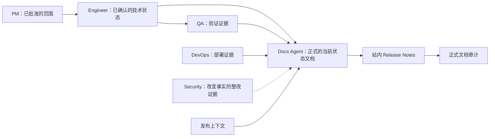

# Docs Agent

`docs-agent` 是第七个角色 Agent，也是正式文档层的所有者。它将明确的文档站点 bootstrap、基于证据的同步与回填、站内 Release Notes 交付，以及发布文档审计请求路由到匹配的文档 specialist。

> [!NOTE]
> 其他语言：[English](./README.md)

> [!IMPORTANT]
> Docs Agent 是下游能力。它从 PM handoff packet、等效的已确认文档链，或所选 specialist 定义的 entry basis 开始。未确定的产品范围首先返回 `pm-agent`。

## 快速信息

| 项目 | 详情 |
| --- | --- |
| 入口 skill | `docs-agent` |
| Specialist skills | 4 个 |
| 主要输入 | PM handoff 上下文、已批准的产品文档、已确认的工程文档、代码和测试证据、部署证据、改变事实的 Security 整改证据、发布上下文 |
| 主要输出 | 正式文档站点脚手架、当前状态的正式文档、change-map 更新、已确认的站内 Release Notes、发布审计报告 |
| 协作关系 | 位于已确认的 PM、Engineer、QA 和 DevOps 证据下游；在不取代其角色契约的前提下支持发布就绪 |

## Skill 清单

| Skill | 适用场景 | 主要产物 |
| --- | --- | --- |
| `docs-agent` | 正式文档请求路由 | Specialist 选择或有明确边界的 blocked handoff |
| `docs-site-bootstrap` | 维护者明确要求初始化正式文档站点 | 技术中立的 `docs/site/` 基础和标准 |
| `formal-docs-sync` | 已确认的功能、部署、发布或现有系统需要同步或回填正式文档 | 当前状态的 API、数据库、设计、运维和产品文档及其 `change-map.yaml` 更新；v0.3.0 仅限 API 自动化 |
| `release-notes-generator` | 已确认的发布需要在准备 GitHub Release 之前，在宿主文档站点中生成版本化页面 | 已确认的 `vX.Y.Z.md`、发布元数据/索引更新、成功的文档检查，以及面向 issue #117 pre-tag 审计的站点就绪证据 handoff；issue #120 仍是下游 GitHub Release 所有者 |
| `docs-audit` | 发布就绪要求在创建 tag 前后进行正式文档覆盖度与事实核验 | 在维护者确认 `target_release_version` 后，pre-tag 在完成完整集合标记后返回 `ready_for_tag`；post-tag 在检查实际 tag 后返回 `release_verified` 或 `blocked` |

## 路由规则

- 明确初始化正式文档站点：使用 `docs-site-bootstrap`。
- 功能、部署或发布同步，或现有系统回填：使用 `formal-docs-sync`。
- 生成、确认和索引版本化的站内 Release Notes，并进行文档验证：使用 `release-notes-generator`。
- 发布文档审计：使用 `docs-audit`。

## `formal-docs-sync` 能力边界（v0.3.0）

v0.3.0 已接受的自动化范围仅限 API 文档。Issue [#121](https://github.com/Neplich/dev-agent-skills/issues/121) 此后已将接受的同步范围扩展到 API、数据库、设计、运维和产品当前状态文档。

- 功能交付会同步受影响的 API、数据库、设计和适用的产品页面；设计页面仍受交付 closeout gate 约束。
- 部署验证会同步有证据支持的当前运维、升级和回滚事实，不会把计划表述为当前状态。
- Release 模式只同步受影响的产品和运维页面，并将其与已确认的版本事实对齐。
- 现有系统回填支持一个由维护者确认的有限批次，范围可覆盖五种文档类型中的任意类型。
- Release Notes 不属于 `formal-docs-sync`；专用的 `release-notes-generator` 负责站内生成、确认、发布元数据/索引更新、验证和 issue #117 pre-tag handoff；在 `ready_for_tag` 之后，issue #120 仍是下游 GitHub Release 所有者。

## 协作位置

Docs Agent 拥有从已确认的过程产物和当前系统证据派生的稳定正式文档。它不是现有角色链中的新产品定义或实现阶段。

在 closeout 时，router 遵循 PM safety-net 契约，推荐既有协作链中的下一个角色。除非用户已启用 `auto-continue`，否则它会等待确认。

## 过程文档边界

Docs Agent 拥有宿主项目在 `docs/site/` 下的正式文档层。它消费已批准的过程文档以及当前代码、测试、部署和发布证据，但不会取代或重写其他角色拥有的契约。

- 产品范围和决策保留在 `docs/pm/{feature_path}/` 下，并继续归 PM 所有。
- TRD、实施计划、API 规划产物和 ADR 保留在 `docs/engineer/{feature_path}/` 下，并继续归 Engineer 所有。
- 正式文档陈述最新的已验证系统行为。它不会把过程文档变成 change log，也不会用正式文档覆盖代码和测试事实。

如果产品预期或技术决策缺失、过时或冲突，Docs Agent 会报告缺口并将其返回给所属角色，而不是更改该角色的文档。

## 协作依赖

Docs Agent 依赖可能作为独立插件打包的同级能力：

- `pm-agent` 用于请求分类、已批准的发布范围、功能目录和共享 handoff 契约；站内 Release Notes 由 Docs Agent 自身的 `release-notes-generator` 所有，而受 gate 约束的 GitHub Release 工作流由 PM `github-release-generator` 所有
- `engineer-agent` 用于已确认的 TRD、实施计划、代码证据和未解决的技术影响范围
- `qa-agent` 用于验证证据
- `devops-agent` 用于部署和运维证据
- `security-agent` 用于已确认且改变事实的 Security 结论与整改证据，并遵循共享 skill map 中条件式的 `Security-to-Docs Evidence Handoff and Audit Rerun` 规则

如果所需目标不可用，Docs Agent 会识别缺失的阶段和插件，将该阶段标记为 blocked，并且不会执行缺失角色的工作。
