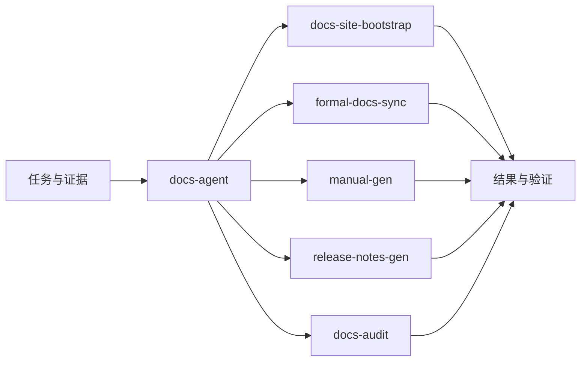

# Docs Agent

`docs-agent` 帮助选择文档能力相关方法。本插件提供 6 个可直接使用的 Skill，覆盖下表中的专项任务。助手根据用户目标组合专业知识，并持续完成请求范围内的工作。

> [!NOTE]
> [仓库架构](../../docs/architecture.md) · [文档说明](../../docs/AGENTS.md) · [English](./README.md)

## 快速信息

| 项目 | 详情 |
| --- | --- |
| 角色导航 | `docs-agent` |
| 专项与组合 Skill | 5 |
| 主要输入 | 用户需求、源码、API、schema、运行界面、测试、部署与发布证据 |
| 主要产物 | 文档站、当前使用说明、图文手册、发布说明与审查发现 |

## Skill 清单

| Skill | 适用场景 | 主要产物 |
| --- | --- | --- |
| [docs-agent](./skills/docs-agent/SKILL.md) | 文档能力导航 | 文档方法与验证页面 |
| [docs-site-bootstrap](./skills/docs-site-bootstrap/SKILL.md) | 初始化文档站 | 站点资产与 bootstrap manifest |
| [formal-docs-sync](./skills/formal-docs-sync/SKILL.md) | 同步当前产品与技术事实 | 当前页面与 change-map 更新 |
| [manual-gen](./skills/manual-gen/SKILL.md) | 编写真实界面操作手册 | 任务页与真实截图 |
| [release-notes-gen](./skills/release-notes-gen/SKILL.md) | 面向用户的版本说明 | 版本页、索引与发布元数据 |
| [docs-audit](./skills/docs-audit/SKILL.md) | 文档准确性与发布检查 | 准确性发现与验证结果 |

## 能力选择

- 使用 `docs-site-bootstrap` 初始化或更新内置 VitePress 站点资产。
- 使用 `formal-docs-sync` 根据实际实现更新 API、数据库、设计、运维和产品事实。
- 使用 `manual-gen` 编写任务导向的操作说明，采集运行界面截图。
- 使用 `release-notes-gen` 维护站内版本页、索引与发布元数据。
- 使用 `docs-audit` 核对内容准确性、覆盖度、链接、资产与版本一致性。

## 安装与使用

```text
/plugin marketplace add Neplich/dev-agent-skills
/plugin install docs-agent@dev-agent-skills
```

Codex 的个人级和项目级安装见 [安装指南](../../docs/README.codex.md)。从仓库根目录安装全部能力到已选目标：

```bash
python3 scripts/install_codex_skills.py --target /path/to/skills
```

直接描述目标，或通过宿主的 Skill 选择器调用，例如：

```text
/manual-gen "根据当前界面截图更新账号设置指南"
```

## 输入与产物组织

内置站点支持 public/internal 构建、页面元数据、导航、模板和版本数据。依据文件来源与任务范围合并宿主内容；重新运行 bootstrap 时更新内置资产并保留宿主自行编写的内容。

需要持久化资料时，可沿用项目现有位置或参考下列布局：

```text
docs/site/
  product/
  design/
  api/
  database/
  manual/
  ops/
  release-notes/
  standards/
  .meta/
```

具体文件按任务价值选用；已有资料、代码和测试共同支持预期与验证。

## 文档类型与站点检查

| 类型 | 证据与实用内容 |
| --- | --- |
| API | 路由、请求与响应 schema、认证、错误、示例 |
| 数据库 | migration、模型、关系、索引、数据生命周期 |
| 设计 | 运行组件、依赖、状态变化、技术选择 |
| 运维 | 启动、环境、部署、验证、恢复 |
| 产品 | 已实现能力、概念、用户可见行为 |
| 手册 | 用户任务、真实界面步骤、截图、结果、恢复方式 |
| 发布说明 | 已核实版本变更、升级、资产与兼容性 |

在已初始化的 `docs/site/` 中，`npm run test:docs` 检查页面字段、版本数据与脚本行为。`npm run build:public` 和 `npm run build:internal` 验证两种站点构建。需要分析代码变化与文档的关系时，运行 `npm run check:affected -- --base <base-ref>`。

事实变化时同步相关索引、链接、截图和 change-map 条目。发布元数据描述实际版本与验证状态。

## 典型工作方式

查看源码与界面 → 组织页面 → 更新内容与资产 → 验证 → 交付


```mermaid
flowchart LR
    Context["任务与证据"] --> Work["docs-agent"]
    Work --> S0["docs-site-bootstrap"]
    S0 --> Result["结果与验证"]
    Work --> S1["formal-docs-sync"]
    S1 --> Result["结果与验证"]
    Work --> S2["manual-gen"]
    S2 --> Result["结果与验证"]
    Work --> S3["release-notes-gen"]
    S3 --> Result["结果与验证"]
    Work --> S4["docs-audit"]
    S4 --> Result["结果与验证"]
```

## 与其他能力组合

工程、测试、运维和安全证据可在同一任务中直接支持文档工作。GitHub 发布面可使用 `github-release-gen`。文档行为与实际实现及目标读者保持一致。

助手在已有授权内贯穿相关工作；涉及关键产品选择或新增操作权限时，明确需要用户决定的具体事项。

## 本地维护

能力源码位于本目录的 `skills/`。修改专业内容后，同步相关说明和安装数据；验证方法见 [维护指南](../../docs/cookbook/maintain-skills.md)。
