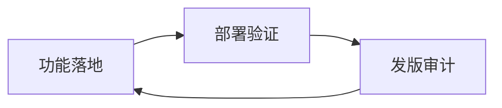
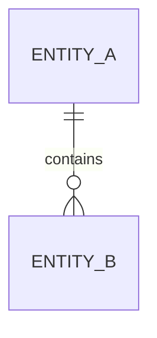
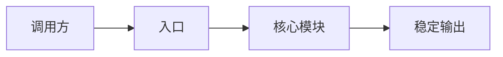

# Docs Site Bootstrap — Internal Instructions

Detailed execution guidance and the complete host-site templates for
`docs-site-bootstrap`. The public contract and all gates live in `../SKILL.md`.
This is the only internal instruction entry.

## 1. Execution Protocol

Use the fixed host-repository root `docs/site/` and execute in this order.

1. **Build the inventory.** Treat every path-labeled template in Section 3 as a
   target. Include `docs/site/.meta/bootstrap-manifest.json` as the manifest
   target, but generate its content from the run rather than from a static
   template.
2. **Load or establish the manifest first.** If a manifest already exists,
   parse it and preserve valid prior `kept-as-is` decisions. An invalid
   manifest is a conflict and blocks writes until resolved. For a first run,
   prepare the manifest in memory before any scaffold write and create its
   parent directory as the first filesystem change.
3. **Classify every path before overwriting anything.** For each embedded
   target, classify it as missing, identical, kept-as-is, or conflicting.
   Missing paths become `created`; a byte-identical pre-existing path becomes
   `skipped-identical`; paths already recorded as `kept-as-is` remain
   `kept-as-is` without template comparison; other differing paths enter the
   complete conflict list. When a path already has a valid `created` or
   `skipped-identical` manifest entry and still equals the template, preserve
   that recorded disposition so a repeated run does not rewrite the manifest.
4. **Apply only authorized changes.** Create missing paths in the confirmed
   bootstrap scope. Never overwrite a conflict until the user explicitly
   selects overwrite or approves a concrete merge. A user choice to retain the
   current file records `kept-as-is`; there is no implicit keep behavior.
5. **Write and read back the manifest.** After authorized file writes, write
   `docs/site/.meta/bootstrap-manifest.json` deterministically, with paths
   sorted lexically and one of `created`, `skipped-identical`, or `kept-as-is`
   for each processed path. These states record the path's bootstrap
   disposition, not a run counter. Read the manifest back, parse it, and verify
   every recorded path and state.
6. **Verify idempotency.** Reclassify the inventory from disk. A second run
   with unchanged templates and user decisions must require no file-content
   changes. Never reset populated `standards/change-map.yaml`,
   `.meta/releases.json`, or formal pages; a difference is a conflict unless a
   prior explicit `kept-as-is` decision applies.

Use this manifest shape (the timestamp is written only when the manifest is
first created; do not update it on a zero-change repeat run):

```json
{
  "schemaVersion": "1.0",
  "generatedRoot": "docs/site",
  "createdAt": "<ISO-8601 timestamp>",
  "files": {
    "docs/site/package.json": "created"
  }
}
```

Status semantics:

| Status | Persistent bootstrap disposition |
| --- | --- |
| `created` | The bootstrap created the path from the embedded template. |
| `skipped-identical` | The existing bytes equal the embedded template. |
| `kept-as-is` | The user explicitly retained differing existing content; later runs skip equality enforcement for that path. |

When unresolved conflicts exist, report all of them together with overwrite,
merge, and `kept-as-is` choices. Do not manufacture a successful manifest
state for an unresolved path.

## 2. Generated Inventory

The templates below cover the npm project; six entry scripts and their minimal
helpers; shared, public, and internal VitePress configuration; theme and
Mermaid rendering; two homepages; seven content-section entry pages; standards
and five content templates; the empty change map; and release metadata.

Static assets follow three publication rules. Put assets intended for both
targets in `docs/site/public/`; the complete directory is copied into both
generated trees using the VitePress public-directory convention. Other
non-Markdown assets are copied only when the target contains at least one page
in the asset's directory. Never copy `standards/change-map.yaml`, `.meta/**`,
`.vitepress/**` beyond the template's explicit config/theme wiring,
`node_modules/**`, or `.generated/**` into a generated tree. Hosts must not put
internal-only assets in `docs/site/public/`; keep an internal-only asset beside
its internal page instead.

## 3. Embedded Templates

### npm project

Target: `docs/site/package.json`

```json
{
  "name": "formal-docs-site",
  "private": true,
  "version": "0.1.0",
  "type": "module",
  "scripts": {
    "prepare:nav": "node scripts/prepare-nav.mjs",
    "prepare:site:public": "node scripts/prepare-site.mjs public",
    "prepare:site:internal": "node scripts/prepare-site.mjs internal",
    "dev:public": "node scripts/dev-site.mjs public --host 127.0.0.1 --port 4173",
    "dev:internal": "node scripts/dev-site.mjs internal --host 127.0.0.1 --port 4174",
    "build:public": "npm run prepare:site:public && vitepress build .generated/public",
    "build:internal": "npm run prepare:site:internal && vitepress build .generated/internal",
    "check:frontmatter": "node scripts/check-frontmatter.mjs",
    "check:affected": "node scripts/check-affected.mjs",
    "check:version": "node scripts/check-version.mjs",
    "test:docs": "npm run check:frontmatter && npm run check:affected && npm run check:version && npm run build:public && npm run build:internal"
  },
  "dependencies": {
    "fast-glob": "^3.3.3",
    "gray-matter": "^4.0.3",
    "mermaid": "^11.4.1",
    "picomatch": "^4.0.2",
    "vitepress": "^1.6.3",
    "yaml": "^2.7.0"
  }
}
```

### Shared script helpers

Target: `docs/site/scripts/lib/paths.mjs`

```js
import { dirname, relative, resolve, sep } from 'node:path';
import { fileURLToPath } from 'node:url';
import { mkdir, readFile, writeFile } from 'node:fs/promises';

const LIB_DIR = dirname(fileURLToPath(import.meta.url));
export const SITE_ROOT = resolve(LIB_DIR, '../..');
export const REPO_ROOT = resolve(SITE_ROOT, '../..');
export const GENERATED_ROOT = resolve(SITE_ROOT, '.generated');
export const NAV_ROOT = resolve(GENERATED_ROOT, '.navigation');

export const toPosix = (value) => value.split(sep).join('/');
export const repoRelative = (value) => toPosix(relative(REPO_ROOT, value));

export async function readText(path) {
  return readFile(path, 'utf8');
}

export async function writeText(path, content) {
  await mkdir(dirname(path), { recursive: true });
  await writeFile(path, content, 'utf8');
}
```

Target: `docs/site/scripts/lib/pages.mjs`

```js
import { resolve } from 'node:path';
import fg from 'fast-glob';
import matter from 'gray-matter';
import { readText, SITE_ROOT, toPosix } from './paths.mjs';

export const VISIBILITIES = new Set(['public', 'internal', 'both']);
export const DOC_TYPES = new Set([
  'landing', 'release', 'design', 'api', 'database', 'ops', 'product', 'standard'
]);
export const STAGES = new Set(['draft', 'dev', 'ops', 'release']);
export const CODE_DOC_TYPES = new Set(['api', 'database', 'design', 'ops', 'product']);
export const SECTION_ORDER = [
  'standards', 'product', 'design', 'api', 'database', 'ops', 'release-notes'
];
export const IGNORE_GLOBS = [
  '**/.meta/**', '**/.generated/**', '**/.vitepress/cache/**',
  '**/.vitepress/dist/**', '**/node_modules/**'
];

export function routeFor(relativePath) {
  const value = toPosix(relativePath).replace(/\.md$/i, '');
  if (value.endsWith('/index')) return `/${value.slice(0, -6)}/`;
  return value === 'index' ? '/' : `/${value}`;
}

export function visibleFor(visibility, target) {
  if (target === 'public') return visibility === 'public' || visibility === 'both';
  if (target === 'internal') return VISIBILITIES.has(visibility);
  throw new Error(`Unsupported site target: ${target}`);
}

export async function collectMarkdown({ includeHomes = true } = {}) {
  const patterns = includeHomes
    ? ['**/*.md']
    : SECTION_ORDER.map((section) => `${section}/**/*.md`);
  const entries = await fg(patterns, {
    cwd: SITE_ROOT,
    onlyFiles: true,
    dot: true,
    ignore: IGNORE_GLOBS
  });
  const pages = [];
  for (const relativePath of entries.sort()) {
    const source = await readText(resolve(SITE_ROOT, relativePath));
    const parsed = matter(source);
    pages.push({
      relativePath: toPosix(relativePath),
      absolutePath: resolve(SITE_ROOT, relativePath),
      source,
      data: parsed.data ?? {},
      content: parsed.content,
      route: routeFor(relativePath)
    });
  }
  return pages;
}
```

Target: `docs/site/scripts/lib/frontmatter.mjs`

```js
import {
  CODE_DOC_TYPES, DOC_TYPES, STAGES, VISIBILITIES, collectMarkdown
} from './pages.mjs';

const REQUIRED = [
  'title', 'visibility', 'doc_type', 'stage', 'owners', 'related_code',
  'last_verified_version'
];

const nonEmptyStrings = (value) => Array.isArray(value)
  && value.length > 0
  && value.every((item) => typeof item === 'string' && item.trim() !== '');

export function validatePage(page, { versionAnchorUnavailable = false } = {}) {
  const data = page.data;
  const errors = [];
  for (const key of REQUIRED) {
    if (key === 'last_verified_version' && versionAnchorUnavailable) continue;
    if (!(key in data) || data[key] === null || data[key] === '') {
      errors.push(`missing required field "${key}"`);
    }
  }
  if (typeof data.title !== 'string' || data.title.trim() === '') {
    errors.push('title must be a non-empty string');
  }
  if (!VISIBILITIES.has(data.visibility)) {
    errors.push('visibility must be public, internal, or both');
  }
  if (!DOC_TYPES.has(data.doc_type)) {
    errors.push('doc_type has an unsupported value');
  }
  if (!STAGES.has(data.stage)) {
    errors.push('stage must be draft, dev, ops, or release');
  }
  if (!nonEmptyStrings(data.owners)) {
    errors.push('owners must be a non-empty string array');
  }
  if (!Array.isArray(data.related_code)
      || data.related_code.some((item) => typeof item !== 'string' || item.trim() === '')) {
    errors.push('related_code must be a string array');
  } else if (CODE_DOC_TYPES.has(data.doc_type) && data.related_code.length === 0) {
    errors.push(`related_code must be non-empty for doc_type ${data.doc_type}`);
  }
  if (data.last_verified_version !== undefined
      && (typeof data.last_verified_version !== 'string'
        || data.last_verified_version.trim() === '')) {
    errors.push('last_verified_version must be a version anchor or unverified');
  }
  return errors;
}

export async function collectFrontmatterFailures({ versionAnchorUnavailable = false } = {}) {
  const failures = [];
  for (const page of await collectMarkdown()) {
    const errors = validatePage(page, { versionAnchorUnavailable });
    if (errors.length) failures.push({ path: page.relativePath, errors });
  }
  return failures;
}
```

Target: `docs/site/scripts/lib/sidebar.mjs`

```js
import { SECTION_ORDER, visibleFor } from './pages.mjs';

const SECTION_LABELS = {
  standards: '文档规范',
  product: '产品',
  design: '设计',
  api: 'API',
  database: '数据库',
  ops: '运维',
  'release-notes': '发布说明'
};

export function buildSidebar(pages, target) {
  const sidebar = {};
  for (const section of SECTION_ORDER) {
    const items = pages
      .filter((page) => page.relativePath.startsWith(`${section}/`))
      .filter((page) => visibleFor(page.data.visibility, target))
      .sort((left, right) => left.relativePath.localeCompare(right.relativePath, 'zh-CN'))
      .map((page) => ({ text: page.data.title, link: page.route }));
    if (items.length) {
      sidebar[`/${section}/`] = [{ text: SECTION_LABELS[section], items }];
    }
  }
  return sidebar;
}

export function renderSidebar(sidebar) {
  return `export default ${JSON.stringify(sidebar, null, 2)};\n`;
}
```

### Six entry scripts

Target: `docs/site/scripts/check-frontmatter.mjs`

```js
import { fileURLToPath } from 'node:url';
import { collectFrontmatterFailures } from './lib/frontmatter.mjs';

function parseArgs(argv) {
  const allowed = new Set(['--version-anchor-unavailable']);
  const unknown = argv.find((value) => !allowed.has(value));
  if (unknown) throw new Error(`Unknown argument: ${unknown}`);
  return {
    versionAnchorUnavailable: argv.includes('--version-anchor-unavailable')
      || process.env.DOCS_VERSION_ANCHOR === 'unavailable'
  };
}

export async function checkFrontmatter({
  versionAnchorUnavailable = process.env.DOCS_VERSION_ANCHOR === 'unavailable'
} = {}) {
  return collectFrontmatterFailures({ versionAnchorUnavailable });
}

async function main() {
  const options = parseArgs(process.argv.slice(2));
  const failures = await checkFrontmatter(options);
  if (options.versionAnchorUnavailable) {
    console.log('version_anchor: unavailable; last_verified_version may be omitted.');
  }
  for (const failure of failures) {
    console.error(failure.path);
    for (const error of failure.errors) console.error(`  - ${error}`);
  }
  if (failures.length) {
    process.exitCode = 1;
  } else {
    console.log('Frontmatter check passed.');
  }
}

if (fileURLToPath(import.meta.url) === process.argv[1]) {
  main().catch((error) => {
    console.error(error instanceof Error ? error.message : error);
    process.exitCode = 1;
  });
}
```

Target: `docs/site/scripts/check-affected.mjs`

```js
import { execFile } from 'node:child_process';
import { promisify } from 'node:util';
import { resolve } from 'node:path';
import { fileURLToPath } from 'node:url';
import picomatch from 'picomatch';
import YAML from 'yaml';
import { checkFrontmatter } from './check-frontmatter.mjs';
import { readText, REPO_ROOT, SITE_ROOT, toPosix } from './lib/paths.mjs';

const exec = promisify(execFile);
const MAP_PATH = resolve(SITE_ROOT, 'standards/change-map.yaml');

function parseArgs(argv) {
  const result = { strict: false, base: null };
  for (let index = 0; index < argv.length; index += 1) {
    if (argv[index] === '--strict') result.strict = true;
    else if (argv[index] === '--base') result.base = argv[++index];
    else throw new Error(`Unknown argument: ${argv[index]}`);
  }
  if (result.base === undefined) throw new Error('--base requires a git ref');
  return result;
}

async function git(args) {
  const { stdout } = await exec('git', args, { cwd: REPO_ROOT });
  return stdout;
}

function parseNameOnly(output) {
  return output.split('\n').map((item) => toPosix(item.trim())).filter(Boolean);
}

async function changedFiles(base) {
  if (base) {
    const mergeBase = (await git(['merge-base', base, 'HEAD'])).trim();
    const committed = parseNameOnly(await git(['diff', '--name-only', `${mergeBase}...HEAD`]));
    const working = parseNameOnly(await git(['diff', '--name-only', 'HEAD']));
    const untracked = parseNameOnly(await git(['ls-files', '--others', '--exclude-standard']));
    return [...new Set([...committed, ...working, ...untracked])].sort();
  }
  const unstaged = parseNameOnly(await git(['diff', '--name-only']));
  const staged = parseNameOnly(await git(['diff', '--name-only', '--cached']));
  const untracked = parseNameOnly(await git(['ls-files', '--others', '--exclude-standard']));
  return [...new Set([...unstaged, ...staged, ...untracked])].sort();
}

function matches(path, glob, excludes = []) {
  return picomatch(glob, { dot: true })(path)
    && !excludes.some((pattern) => picomatch(pattern, { dot: true })(path));
}

export async function checkAffected({ base = null, strict = false } = {}) {
  const frontmatterFailures = await checkFrontmatter();
  if (frontmatterFailures.length) {
    return { blocked: true, frontmatterFailures, changed: [], suspects: [] };
  }
  const raw = YAML.parse(await readText(MAP_PATH)) ?? {};
  const map = raw.change_map ?? {};
  if (typeof map !== 'object' || Array.isArray(map)) {
    throw new Error('change_map must be a mapping');
  }
  const changed = await changedFiles(base);
  const changedSet = new Set(changed);
  const suspects = [];
  for (const [codeGlob, rule] of Object.entries(map)) {
    const codeMatches = changed.filter((path) => matches(path, codeGlob, rule.exclude ?? []));
    if (!codeMatches.length) continue;
    const missingDocs = (rule.required_docs ?? []).filter((path) => !changedSet.has(path));
    if (missingDocs.length) {
      suspects.push({ codeGlob, trigger: rule.trigger ?? '', codeMatches, missingDocs });
    }
  }
  return { blocked: strict && suspects.length > 0, frontmatterFailures: [], changed, suspects };
}

async function main() {
  const options = parseArgs(process.argv.slice(2));
  const result = await checkAffected(options);
  for (const suspect of result.suspects) {
    console.warn(`suspect: ${suspect.codeGlob}`);
    console.warn(`  changed code: ${suspect.codeMatches.join(', ')}`);
    console.warn(`  required docs not changed: ${suspect.missingDocs.join(', ')}`);
    if (suspect.trigger) console.warn(`  trigger: ${suspect.trigger}`);
  }
  if (!result.suspects.length) console.log('No affected-document suspects found.');
  if (result.frontmatterFailures.length) console.error('Frontmatter is invalid; affected check blocked.');
  if (result.blocked) process.exitCode = 1;
}

if (fileURLToPath(import.meta.url) === process.argv[1]) {
  main().catch((error) => {
    console.error(error instanceof Error ? error.message : error);
    process.exitCode = 1;
  });
}
```

Target: `docs/site/scripts/check-version.mjs`

```js
import { execFile } from 'node:child_process';
import { promisify } from 'node:util';
import { resolve } from 'node:path';
import { fileURLToPath } from 'node:url';
import { readText, REPO_ROOT, SITE_ROOT } from './lib/paths.mjs';

const exec = promisify(execFile);

function explicitVersion(argv) {
  let requested = null;
  for (let index = 0; index < argv.length; index += 1) {
    if (argv[index] !== '--version') throw new Error(`Unknown argument: ${argv[index]}`);
    if (requested !== null) throw new Error('--version may be provided only once');
    if (!argv[index + 1]) throw new Error('--version requires a value');
    requested = argv[index + 1];
    index += 1;
  }
  return requested ?? process.env.RELEASE_VERSION ?? null;
}

async function versionAnchor(requested) {
  if (requested) return { value: requested, source: 'explicit' };
  try {
    const { stdout } = await exec('git', ['describe', '--tags', '--exact-match', 'HEAD'], {
      cwd: REPO_ROOT
    });
    return { value: stdout.trim(), source: 'git-tag' };
  } catch {
    return { value: null, source: 'unavailable' };
  }
}

export async function checkVersion({ requested = null } = {}) {
  const path = resolve(SITE_ROOT, '.meta/releases.json');
  const data = JSON.parse(await readText(path));
  const errors = [];
  if (!(data.latest === null || typeof data.latest === 'string')) {
    errors.push('latest must be null or a string');
  }
  if (!Array.isArray(data.released) || data.released.some((item) => typeof item !== 'string')) {
    errors.push('released must be a string array');
  }
  if (!data.verifiedDocs || typeof data.verifiedDocs !== 'object' || Array.isArray(data.verifiedDocs)) {
    errors.push('verifiedDocs must be an object');
  }
  const released = Array.isArray(data.released) ? data.released : [];
  if (data.latest === null && released.length) errors.push('latest cannot be null when released is non-empty');
  if (data.latest !== null && !released.includes(data.latest)) errors.push('latest must appear in released');
  if (data.latest !== null && released.at(-1) !== data.latest) errors.push('latest must be the final released entry');
  for (const [pathKey, version] of Object.entries(data.verifiedDocs ?? {})) {
    if (typeof version !== 'string' || !released.includes(version)) {
      errors.push(`verifiedDocs entry ${pathKey} must reference a released version`);
    }
  }
  const anchor = await versionAnchor(requested);
  if (anchor.value && data.latest !== anchor.value) {
    errors.push(`latest ${String(data.latest)} does not match ${anchor.source} ${anchor.value}`);
  }
  return { errors, anchor };
}

async function main() {
  const requested = explicitVersion(process.argv.slice(2));
  const result = await checkVersion({ requested });
  if (!result.anchor.value) {
    console.log('Version anchor unavailable; checked release metadata consistency only.');
  }
  for (const error of result.errors) console.error(`- ${error}`);
  if (result.errors.length) process.exitCode = 1;
  else console.log('Version metadata check passed.');
}

if (fileURLToPath(import.meta.url) === process.argv[1]) {
  main().catch((error) => {
    console.error(error instanceof Error ? error.message : error);
    process.exitCode = 1;
  });
}
```

Target: `docs/site/scripts/prepare-nav.mjs`

```js
import { resolve } from 'node:path';
import { fileURLToPath } from 'node:url';
import { collectMarkdown } from './lib/pages.mjs';
import { buildSidebar, renderSidebar } from './lib/sidebar.mjs';
import { NAV_ROOT, writeText } from './lib/paths.mjs';

export async function prepareNav() {
  const pages = await collectMarkdown({ includeHomes: false });
  for (const target of ['public', 'internal']) {
    const sidebar = buildSidebar(pages, target);
    await writeText(
      resolve(NAV_ROOT, `sidebar.${target}.mjs`),
      renderSidebar(sidebar)
    );
  }
}

if (fileURLToPath(import.meta.url) === process.argv[1]) {
  prepareNav().then(() => console.log('Navigation prepared.')).catch((error) => {
    console.error(error instanceof Error ? error.message : error);
    process.exitCode = 1;
  });
}
```

Target: `docs/site/scripts/prepare-site.mjs`

```js
import { cp, mkdir, rm } from 'node:fs/promises';
import { dirname, resolve } from 'node:path';
import { fileURLToPath } from 'node:url';
import fg from 'fast-glob';
import { collectMarkdown, visibleFor } from './lib/pages.mjs';
import { GENERATED_ROOT, NAV_ROOT, SITE_ROOT, readText, writeText } from './lib/paths.mjs';
import { prepareNav } from './prepare-nav.mjs';

const TARGETS = new Set(['public', 'internal']);

export async function prepareSite(target) {
  if (!TARGETS.has(target)) throw new Error('Target must be public or internal');
  await prepareNav();
  const output = resolve(GENERATED_ROOT, target);
  await rm(output, { recursive: true, force: true });
  await mkdir(output, { recursive: true });

  const visibleDirectories = new Set(['.']);
  for (const page of await collectMarkdown()) {
    if (page.relativePath === 'index.public.md' || page.relativePath === 'index.internal.md') continue;
    if (!visibleFor(page.data.visibility, target)) continue;
    await writeText(resolve(output, page.relativePath), page.source);
    visibleDirectories.add(dirname(page.relativePath));
  }
  const home = resolve(SITE_ROOT, `index.${target}.md`);
  await writeText(resolve(output, 'index.md'), await readText(home));

  const publicAssets = await fg(['public/**'], {
    cwd: SITE_ROOT,
    onlyFiles: true,
    dot: true,
    ignore: [
      '**/.meta/**', '**/.generated/**', '**/node_modules/**', '**/.vitepress/**'
    ]
  });
  const colocatedAssets = (await fg(['**/*'], {
    cwd: SITE_ROOT,
    onlyFiles: true,
    dot: true,
    ignore: [
      '**/*.md', 'public/**', 'standards/change-map.yaml', '.meta/**',
      '.generated/**', '**/node_modules/**', 'scripts/**', 'package.json',
      'package-lock.json', '.vitepress/**'
    ]
  })).filter((asset) => visibleDirectories.has(dirname(asset)));
  const vitepressAssets = await fg([
    '.vitepress/config.shared.ts', `.vitepress/config.${target}.ts`,
    '.vitepress/theme/**'
  ], {
    cwd: SITE_ROOT,
    onlyFiles: true,
    dot: true,
    ignore: ['**/.meta/**', '**/.generated/**', '**/node_modules/**']
  });
  for (const asset of new Set([...publicAssets, ...colocatedAssets, ...vitepressAssets])) {
    const destination = resolve(output, asset);
    await mkdir(dirname(destination), { recursive: true });
    await cp(resolve(SITE_ROOT, asset), destination);
  }
  await mkdir(resolve(output, '.vitepress/generated'), { recursive: true });
  await cp(
    resolve(NAV_ROOT, `sidebar.${target}.mjs`),
    resolve(output, `.vitepress/generated/sidebar.${target}.mjs`)
  );
  await writeText(
    resolve(output, '.vitepress/config.mts'),
    `export { default } from './config.${target}';\n`
  );
  return output;
}

if (fileURLToPath(import.meta.url) === process.argv[1]) {
  const target = process.argv[2];
  prepareSite(target).then((output) => {
    console.log(`Prepared ${target} site at ${output}.`);
  }).catch((error) => {
    console.error(error instanceof Error ? error.message : error);
    process.exitCode = 1;
  });
}
```

Target: `docs/site/scripts/dev-site.mjs`

```js
import { spawn } from 'node:child_process';
import { watch } from 'node:fs';
import { fileURLToPath } from 'node:url';
import { relative } from 'node:path';
import { GENERATED_ROOT, SITE_ROOT, toPosix } from './lib/paths.mjs';
import { prepareSite } from './prepare-site.mjs';

const IGNORED = ['.generated/', '.vitepress/cache/', '.vitepress/dist/', 'node_modules/'];

export async function devSite(target, extraArgs = []) {
  if (!['public', 'internal'].includes(target)) throw new Error('Target must be public or internal');
  await prepareSite(target);
  const command = process.platform === 'win32' ? 'npx.cmd' : 'npx';
  const child = spawn(command, ['vitepress', 'dev', `${GENERATED_ROOT}/${target}`, ...extraArgs], {
    cwd: SITE_ROOT,
    stdio: 'inherit'
  });
  let timer;
  const watcher = watch(SITE_ROOT, { recursive: true }, (_event, filename) => {
    if (!filename) return;
    const path = toPosix(relative(SITE_ROOT, `${SITE_ROOT}/${filename}`));
    if (IGNORED.some((prefix) => path.startsWith(prefix))) return;
    if (!/\.(md|ya?ml)$/i.test(path)) return;
    clearTimeout(timer);
    timer = setTimeout(() => {
      prepareSite(target).catch((error) => console.error(`Prepare failed: ${error.message}`));
    }, 120);
  });
  const close = () => {
    watcher.close();
    child.kill('SIGTERM');
  };
  process.once('SIGINT', close);
  process.once('SIGTERM', close);
  return child;
}

if (fileURLToPath(import.meta.url) === process.argv[1]) {
  const [target, ...args] = process.argv.slice(2);
  devSite(target, args).catch((error) => {
    console.error(error instanceof Error ? error.message : error);
    process.exitCode = 1;
  });
}
```

### VitePress configuration and theme

Target: `docs/site/.vitepress/config.shared.ts`

```ts
import { defineConfig } from 'vitepress';

export const shared = defineConfig({
  lang: 'zh-CN',
  title: '正式文档',
  description: '面向当前稳定状态的正式文档站',
  cleanUrls: true,
  markdown: { lineNumbers: true },
  themeConfig: {
    search: { provider: 'local' },
    outline: { level: [2, 3], label: '本页目录' },
    docFooter: { prev: '上一页', next: '下一页' },
    sidebarMenuLabel: '目录',
    returnToTopLabel: '返回顶部'
  }
});
```

Target: `docs/site/.vitepress/config.public.ts`

```ts
import { defineConfig, mergeConfig } from 'vitepress';
import sidebar from './generated/sidebar.public.mjs';
import { shared } from './config.shared';

export default mergeConfig(shared, defineConfig({
  title: '公开文档',
  themeConfig: {
    nav: [
      { text: '产品', link: '/product/' },
      { text: 'API', link: '/api/' },
      { text: '发布说明', link: '/release-notes/' }
    ],
    sidebar
  }
}));
```

Target: `docs/site/.vitepress/config.internal.ts`

```ts
import { defineConfig, mergeConfig } from 'vitepress';
import sidebar from './generated/sidebar.internal.mjs';
import { shared } from './config.shared';

export default mergeConfig(shared, defineConfig({
  title: '内部正式文档',
  themeConfig: {
    nav: [
      { text: '规范', link: '/standards/' },
      { text: '产品', link: '/product/' },
      { text: '设计', link: '/design/' },
      { text: 'API', link: '/api/' },
      { text: '数据库', link: '/database/' },
      { text: '运维', link: '/ops/' },
      { text: '发布说明', link: '/release-notes/' }
    ],
    sidebar
  }
}));
```

Target: `docs/site/.vitepress/theme/index.ts`

```ts
import { h } from 'vue';
import DefaultTheme from 'vitepress/theme';
import MermaidRenderer from './MermaidRenderer.vue';
import './custom.css';

export default {
  extends: DefaultTheme,
  Layout: () => h(DefaultTheme.Layout, null, {
    'layout-bottom': () => h(MermaidRenderer)
  }),
  enhanceApp({ app }) {
    app.component('MermaidRenderer', MermaidRenderer);
  }
};
```

Target: `docs/site/.vitepress/theme/MermaidRenderer.vue`

```vue
<script setup lang="ts">
import { nextTick, onMounted, watch } from 'vue';
import { useRoute } from 'vitepress';
import mermaid from 'mermaid';

const route = useRoute();
let sequence = 0;
mermaid.initialize({ startOnLoad: false, securityLevel: 'strict', theme: 'default' });

async function renderMermaid() {
  await nextTick();
  const blocks = document.querySelectorAll('pre > code.language-mermaid');
  for (const code of blocks) {
    const pre = code.parentElement;
    if (!pre || pre.dataset.mermaidRendered === 'true') continue;
    const container = document.createElement('div');
    container.className = 'mermaid-diagram';
    try {
      const id = `mermaid-${sequence++}`;
      const { svg } = await mermaid.render(id, code.textContent ?? '');
      container.innerHTML = svg;
      pre.dataset.mermaidRendered = 'true';
      pre.replaceWith(container);
    } catch (error) {
      container.classList.add('mermaid-diagram--error');
      container.textContent = error instanceof Error ? error.message : String(error);
      pre.replaceWith(container);
    }
  }
}

onMounted(renderMermaid);
watch(() => route.path, renderMermaid);
</script>

<template><span class="mermaid-renderer" aria-hidden="true" /></template>
```

Target: `docs/site/.vitepress/theme/custom.css`

```css
:root {
  --vp-c-brand-1: #2563eb;
  --vp-c-brand-2: #1d4ed8;
}

.mermaid-diagram {
  margin: 1.5rem 0;
  overflow-x: auto;
  text-align: center;
}

.mermaid-diagram svg {
  max-width: 100%;
  height: auto;
}

.mermaid-diagram--error {
  color: var(--vp-c-danger-1);
  text-align: left;
  white-space: pre-wrap;
}
```

### Homepages

Target: `docs/site/index.public.md`

````markdown
---
title: 公开文档首页
visibility: public
doc_type: landing
stage: release
owners:
  - docs
related_code: []
last_verified_version: unverified
---

# 公开文档

这里汇集可以对外发布的当前状态文档。内容通过页面的 `visibility`
字段筛选；尚未完成版本审计的页面保持 `unverified`。

## 内容入口

- [产品说明](/product/)
- [API 文档](/api/)
- [发布说明](/release-notes/)
````

Target: `docs/site/index.internal.md`

````markdown
---
title: 内部文档首页
visibility: internal
doc_type: landing
stage: dev
owners:
  - docs
related_code: []
last_verified_version: unverified
---

# 内部正式文档

这里汇集公开、内部和双端可见的当前状态文档。正式文档用于定位事实，
关键判断仍应回到当前代码、配置和测试证据核对。

## 内容入口

- [文档规范](/standards/)
- [产品说明](/product/)
- [系统设计](/design/)
- [API 文档](/api/)
- [数据库](/database/)
- [运维](/ops/)
- [发布说明](/release-notes/)
````

### Seven content-section entries

Target: `docs/site/api/index.md`

````markdown
---
title: API 文档
visibility: both
doc_type: landing
stage: dev
owners:
  - docs
related_code: []
last_verified_version: unverified
---

# API 文档

本目录按稳定接口边界组织 API 当前状态。新增页面应从真实路由、请求与
响应 schema、错误处理和契约测试提取事实。
````

Target: `docs/site/database/index.md`

````markdown
---
title: 数据库文档
visibility: internal
doc_type: landing
stage: dev
owners:
  - docs
related_code: []
last_verified_version: unverified
---

# 数据库文档

本目录描述当前 schema、实体关系、约束、索引和关键数据访问边界。
具体页面必须引用实际 schema 或迁移代码。
````

Target: `docs/site/design/index.md`

````markdown
---
title: 系统设计
visibility: internal
doc_type: landing
stage: dev
owners:
  - docs
related_code: []
last_verified_version: unverified
---

# 系统设计

本目录说明稳定模块边界、调用链、数据流和关键技术约束，不记录实现过程
流水账。设计声明应能追溯到当前代码与测试。
````

Target: `docs/site/product/index.md`

````markdown
---
title: 产品说明
visibility: both
doc_type: landing
stage: dev
owners:
  - docs
related_code: []
last_verified_version: unverified
---

# 产品说明

本目录面向产品、交付和支持角色说明当前能力、概念与用户流程。页面不
包含尚未落地的功能承诺。
````

Target: `docs/site/ops/index.md`

````markdown
---
title: 运维文档
visibility: internal
doc_type: landing
stage: ops
owners:
  - docs
related_code: []
last_verified_version: unverified
---

# 运维文档

本目录保存可执行的部署、验证、排障和回滚说明。命令、配置名和检查点
必须来自当前运行配置与验证证据。
````

Target: `docs/site/release-notes/index.md`

````markdown
---
title: 发布说明
visibility: both
doc_type: landing
stage: release
owners:
  - docs
related_code: []
last_verified_version: unverified
---

# 发布说明

本目录按已确认版本整理面向读者的发布说明。版本锚不可用时不应伪造
版本号或把页面标记为已验证。
````

Target: `docs/site/standards/index.md`

````markdown
---
title: 文档规范
visibility: internal
doc_type: standard
stage: dev
owners:
  - docs
related_code: []
last_verified_version: unverified
---

# 文档规范

正式文档只描述当前稳定状态，并通过 frontmatter、生命周期、文档粒度和
变更映射保持可发现、可核验、可审计。

## 规范入口

- [文档生命周期](./doc-lifecycle.md)
- [文档粒度](./doc-granularity.md)
- [API 模板](./templates/api-template.md)
- [数据库模板](./templates/database.md)
- [功能设计模板](./templates/feature-design.md)
- [运维手册模板](./templates/ops-runbook.md)
- [产品手册模板](./templates/product-handbook.md)
````

### Standards pages

Target: `docs/site/standards/doc-lifecycle.md`

````markdown
---
title: 文档生命周期
visibility: internal
doc_type: standard
stage: dev
owners:
  - docs
related_code: []
last_verified_version: unverified
---

# 文档生命周期

正式文档围绕三个通用节点维护，始终写成最新状态，不追加变更流水账。



## 功能落地

根据已确认范围和实际代码、测试更新受影响页面与 change map。新增或改动
页面使用 `last_verified_version: unverified`。

## 部署验证

根据真实部署配置、验证命令和环境差异维护运维事实；无法复现的步骤必须
明确标记为待核对，不能猜测。

## 发版审计

对受影响页面逐项核对声明与证据。只有全部通过审计，才可统一写入真实
版本锚；无版本体系时记录版本锚不可用。
````

Target: `docs/site/standards/doc-granularity.md`

````markdown
---
title: 文档粒度
visibility: internal
doc_type: standard
stage: dev
owners:
  - docs
related_code: []
last_verified_version: unverified
---

# 文档粒度

文档边界以读者任务和稳定事实边界为准，不按代码文件数量机械拆分。

## 选择单文件

满足以下条件时优先使用单文件：

- 主题只有一个稳定入口和一组紧密关联的事实；
- 页面在合理篇幅内可以完整回答读者任务；
- 子主题没有独立所有者、生命周期或导航价值。

## 选择目录

满足任一条件时使用目录并提供 `index.md`：

- 存在多个可独立阅读和维护的子域；
- 不同子域有不同证据、所有者或更新节奏；
- 单页已经妨碍定位、核验或导航。

## 约束

目录入口负责说明范围和导航，不复制子页面正文。不要按版本复制整套页面；
正式页面保留当前状态，历史由版本控制和发布说明承载。
````

### Five content templates

Target: `docs/site/standards/templates/api-template.md`

````markdown
---
title: API 文档模板
visibility: internal
doc_type: standard
stage: dev
owners:
  - docs
related_code: []
last_verified_version: unverified
---

# API 文档模板

复制本骨架时将页面 `doc_type` 改为 `api`，并把 `related_code` 填为真实
路由、schema、handler 和契约测试路径。正文只描述当前接口状态。

## 接口范围

- 调用方与用途：
- 鉴权与权限：
- 稳定性或兼容边界：

## 接口清单

| 方法 | 路径 | 用途 | 权限 |
| --- | --- | --- | --- |
| `<METHOD>` | `<path>` | `<当前用途>` | `<要求>` |

## 请求

记录 path、query、header 和 body 的真实字段、类型、必填性与约束；没有的
部分删除，不保留空表。

## 响应与错误

列出成功响应结构、状态码和可验证错误结构。流式或文件接口应单独说明事件
结束语义、Content-Type 与下载头。

## 证据

- 路由与处理入口：
- schema 或 contract：
- 测试：
````

Target: `docs/site/standards/templates/database.md`

````markdown
---
title: 数据库文档模板
visibility: internal
doc_type: standard
stage: dev
owners:
  - docs
related_code: []
last_verified_version: unverified
---

# 数据库文档模板

复制本骨架时将页面 `doc_type` 改为 `database`，并将 `related_code` 指向
真实 schema、迁移与关键数据访问代码。只描述最新 schema 当前状态。

## 范围与所有权

- 数据域：
- schema 权威入口：
- 读写所有者：

## 实体关系



## 表与字段

| 表 / 实体 | 字段 | 类型 | 约束 | 说明 |
| --- | --- | --- | --- | --- |
| `<entity>` | `<field>` | `<type>` | `<constraint>` | `<meaning>` |

## 索引与关系

记录真实索引、外键、逻辑引用、删除策略和查询依赖。不存在物理外键时应
明确逻辑约束所在位置。

## 数据生命周期

说明创建、更新、归档、删除、敏感字段保护和必要迁移边界。历史迁移过程
放在迁移说明，不混入当前字段定义。
````

Target: `docs/site/standards/templates/feature-design.md`

````markdown
---
title: 功能设计模板
visibility: internal
doc_type: standard
stage: dev
owners:
  - docs
related_code: []
last_verified_version: unverified
---

# 功能设计模板

复制本骨架时将页面 `doc_type` 改为 `design`，并将 `related_code` 指向
真实模块和测试。页面表达当前稳定设计，不保留方案讨论或实施日记。

## 能力与边界

- 负责什么：
- 不负责什么：
- 相邻模块：

## 结构与代码地图

用真实目录树或短列表标出入口、编排、数据访问和测试位置。

## 核心流程



## 数据、接口与配置

链接权威 API 和数据库页面，说明本模块直接拥有的状态、配置和兼容边界，
不要重复完整 contract。

## 错误、安全与验收

记录权限、敏感信息、失败归因、超时或重试边界，以及可以防回归的关键
测试场景。
````

Target: `docs/site/standards/templates/ops-runbook.md`

````markdown
---
title: 运维手册模板
visibility: internal
doc_type: standard
stage: ops
owners:
  - docs
related_code: []
last_verified_version: unverified
---

# 运维手册模板

复制本骨架时将页面 `doc_type` 改为 `ops`，并将 `related_code` 指向真实
部署配置、自动化脚本和健康检查。只保留当前可执行步骤。

## 服务与适用范围

- 服务或组件：
- 环境：
- 依赖与所有者：

## 前置条件

列出所需版本、权限、配置、备份和外部依赖。敏感值只引用安全存储位置，
不得写入文档。

## 执行步骤

1. `<准备与预检>`
2. `<执行命令或操作>`
3. `<验证健康状态>`

## 检查点与观测

记录可复现的接口、日志、指标、作业或数据检查，以及明确的成功标准。

## 回滚与故障处理

- 回滚触发条件：
- 回滚步骤：
- 回滚后验证：
- 常见症状与诊断入口：
````

Target: `docs/site/standards/templates/product-handbook.md`

````markdown
---
title: 产品手册模板
visibility: internal
doc_type: standard
stage: dev
owners:
  - docs
related_code: []
last_verified_version: unverified
---

# 产品手册模板

复制本骨架时将页面 `doc_type` 改为 `product`，并将 `related_code` 指向
支撑当前能力的真实入口与测试。只陈述已经存在的产品行为。

## 受众与范围

- 面向角色：
- 适用场景：
- 能力边界：

## 核心概念

定义读者必须理解的对象、角色、状态和约束，术语与当前界面和接口保持
一致。

## 用户流程


## 权限、限制与异常

说明不同角色可见操作、输入限制、失败反馈与恢复路径。

## 关联资料

- 功能设计：
- API 或数据说明：
- 运维说明：
````

### Change map and release metadata

Target: `docs/site/standards/change-map.yaml`

```yaml
title: 文档变更映射
visibility: internal
doc_type: standard
stage: dev
owners:
  - docs
related_code: []
last_verified_version: unverified

# Entry schema:
# change_map:
#   "<repository-relative code_glob>":
#     required_docs:
#       - docs/site/<section>/<page>.md
#     trigger: <when a code change requires documentation review>
#     exclude:
#       - "<optional glob that narrows only this entry>"
change_map: {}
```

Target: `docs/site/.meta/releases.json`

```json
{
  "latest": null,
  "released": [],
  "verifiedDocs": {}
}
```

## 4. Completion Report

After read-back, report created, identical-skipped, kept-as-is, and unresolved
conflict paths separately. State whether the second classification was
zero-diff. Do not claim bootstrap completion while a manifest parse error,
unauthorized conflict, write failure, or read-back mismatch remains.
