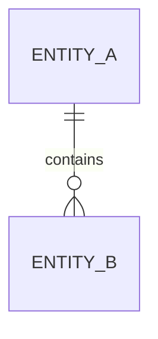

# 数据库文档模板

复制本骨架时将页面 `doc_type` 改为 `database`，并将 `related_code` 指向
真实 schema、迁移与关键数据访问代码。只描述最新 schema 当前状态。

## 范围与所有权

- 数据域：
- schema 权威入口：
- 读写所有者：

## 实体关系

## 表与字段

| 表 / 实体 | 字段 | 类型 | 约束 | 说明 |
| --- | --- | --- | --- | --- |
| `<entity>` | `<field>` | `<type>` | `<constraint>` | `<meaning>` |

## 索引与关系

记录真实索引、外键、逻辑引用、删除策略和查询依赖。不存在物理外键时应
明确逻辑约束所在位置。

## 数据生命周期

说明创建、更新、归档、删除、敏感字段保护和必要迁移边界。历史迁移过程
放在迁移说明，不混入当前字段定义。
