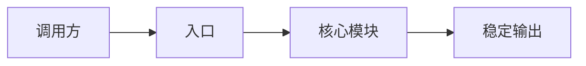

# 功能设计模板

复制本骨架时将页面 `doc_type` 改为 `design`，并将 `related_code` 指向
真实模块和测试。页面表达当前稳定设计，不保留方案讨论或实施日记。

## 能力与边界

- 负责什么：
- 不负责什么：
- 相邻模块：

## 结构与代码地图

用真实目录树或短列表标出入口、编排、数据访问和测试位置。

## 核心流程

## 数据、接口与配置

链接权威 API 和数据库页面，说明本模块直接拥有的状态、配置和兼容边界，
不要重复完整 contract。

## 错误、安全与验收

记录权限、敏感信息、失败归因、超时或重试边界，以及可以防回归的关键
测试场景。
