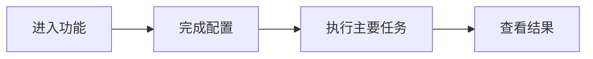

# 产品手册模板

复制本骨架时将页面 `doc_type` 改为 `product`，并将 `related_code` 指向
支撑当前能力的真实入口与测试。只陈述已经存在的产品行为。

## 受众与范围

- 面向角色：
- 适用场景：
- 能力边界：

## 核心概念

定义读者必须理解的对象、角色、状态和约束，术语与当前界面和接口保持
一致。

## 用户流程

## 权限、限制与异常

说明不同角色可见操作、输入限制、失败反馈与恢复路径。

## 关联资料

- 功能设计：
- API 或数据说明：
- 运维说明：
