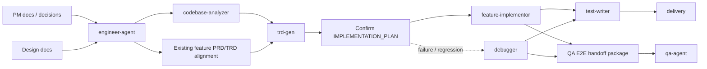

# Engineer Agent

`engineer-agent` is the engineering-role dispatcher skill. It routes codebase analysis, TRD generation, project bootstrap, feature implementation, test coverage, debugging, and delivery requests to the right engineering specialist skill.

> [!NOTE]
> Other languages: [中文](./README_zh.md)

> [!IMPORTANT]
> Engineer Agent should only take over after the requirement or fix target is clear. If the user is still defining product goals, or an empty repository only contains an idea, route back to `pm-agent` first.

## Quick Facts

| Item | Details |
| --- | --- |
| Entry skill | `engineer-agent` |
| Specialist skills | 7 |
| Main inputs | PM documents, optional design documents, existing codebase, test results, failure logs |
| Main outputs | TRDs, implementation plans, code changes, tests, engineering docs, Git commits / PRs |
| Collaboration | Upstream `pm-agent` / `designer-agent`; downstream `qa-agent` / `devops-agent` / `security-agent` |

## Skills

| Skill | When to use | Main output |
| --- | --- | --- |
| `engineer-agent` | Engineering request routing | Specialist selection and execution path |
| `codebase-analyzer` | Taking over an existing repo, understanding structure and constraints | Project profile, stack and architecture summary |
| `trd-gen` | Writing technical plans, API docs, and ADRs after PRD / DECISIONS are confirmed | `docs/engineer/{feature_path}/TRD.md`, optional `API.md` / `ADR-*.md` |
| `project-bootstrap` | Initializing a project from approved PRD/TRD | Project skeleton, base config, startup notes |
| `feature-implementor` | Implementing a confirmed TRD or design document | `docs/engineer/{feature_path}/IMPLEMENTATION_PLAN.md`, code changes, necessary docs |
| `test-writer` | Adding unit, integration, or validation coverage | Test files, test execution evidence |
| `debugger` | Reproducing, diagnosing, and fixing bugs or build failures | Minimal fix, regression evidence |
| `delivery` | Branches, commits, pushes, PRs, delivery wrap-up | Git commit, PR, delivery summary |

## Routing Rules

- Understand repository structure, stack, and architecture boundaries: use `codebase-analyzer`
- Write or update the technical plan, API docs, or ADRs after PRD confirmation: use `trd-gen`
- Bootstrap a new project or service: use `project-bootstrap`
- Implement features, behavior changes, or design handoff: use `feature-implementor`
- Frontend code updates, UI implementation, or design-to-code: enter through Engineer; hand off to Designer only when design deliverables are missing or stale
- Add tests, coverage, or implementation validation: use `test-writer`
- Debug bugs, failed logs, failing tests, or broken builds: use `debugger`
- Commit, push, open PRs, or finish delivery: use `delivery`

Default rule: if the request changes production behavior, first confirm the requirement source and code context. If the request starts from a failure symptom, prefer `debugger`.

## Typical Flow



## Inputs And Outputs

Engineer mainly consumes:

- `docs/pm/{feature_path}/PRD.md`
- `docs/pm/{feature_path}/DECISIONS.md`
- `docs/engineer/{feature_path}/TRD.md`
- `docs/design/{feature_path}/ui-ux-spec.md`
- `docs/design/{feature_path}/visual-system.md`

`feature_path` is the canonical path key for feature-scoped documents. New
Engineer documents mirror the PM path and include `feature_path`,
`parent_feature`, and `feature_level` frontmatter. Existing single-level docs
without those fields remain compatible as level-1 features.

Engineer's primary outputs include technical plans, API / ADR docs,
implementation plans, code, and tests:

- `docs/engineer/{feature_path}/TRD.md`
- `docs/engineer/{feature_path}/IMPLEMENTATION_PLAN.md`
- `docs/engineer/{feature_path}/API.md`
- `docs/engineer/{feature_path}/ADR-*.md`

## Collaboration Boundary

- Engineer is the only role that turns PM/Designer documents into code, tests, and delivery artifacts.
- Engineer owns TRD, API documentation, and ADR writing after PM scope is confirmed. `feature-implementor` consumes confirmed Engineer docs and produces implementation plans.
- Engineer does not replace PM for requirement definition or Designer for UX/visual decisions.
- Frontend UI implementation stays in Engineer after PRD/TRD alignment; if UI/UX or visual documents are missing or stale, Engineer hands that design gap to Designer before implementation planning.
- QA findings return to Engineer when they are implementation defects, and to PM when they are requirement gaps.
- DevOps and Security join only when deployment, runtime, or security review becomes the current goal.

## Local Maintenance

```bash
# Install one Engineer skill into the current project runtime
npx skills add ./agents/engineer/skills/trd-gen

# Inspect engineering eval definitions
find agents/engineer/test -path '*/evals/evals.json' -print
```
