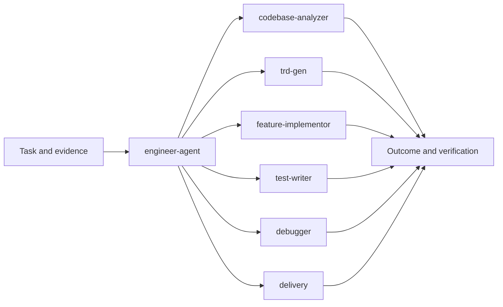

# Engineer Agent

`engineer-agent` helps select methods for engineer agent work. The plugin provides 7 directly usable skills for the specialist tasks below. The assistant combines this knowledge to complete the requested outcome.

> [!NOTE]
> [Architecture](../../docs/architecture.md) · [Documentation Guide](../../docs/AGENTS.md) · [中文](./README_zh.md)

## Quick Facts

| Item | Details |
| --- | --- |
| Role guide | `engineer-agent` |
| Specialist and composition skills | 6 |
| Main inputs | User requests, issues, source code, existing designs, test results, and failure logs |
| Main outputs | Implemented changes, technical designs, tests, commits, and pull requests |

## Skills

| Skill | When to use | Main output |
| --- | --- | --- |
| [engineer-agent](./skills/engineer-agent/SKILL.md) | Engineering capability guide | Engineering approach and verified result |
| [codebase-analyzer](./skills/codebase-analyzer/SKILL.md) | Code structure and dependency analysis | Architecture, runtime paths, project profile |
| [trd-gen](./skills/trd-gen/SKILL.md) | Technical design, APIs and architecture decisions | Technical design, API or ADR |
| [feature-implementor](./skills/feature-implementor/SKILL.md) | Feature implementation and fixes | Working code and verification |
| [test-writer](./skills/test-writer/SKILL.md) | Behavior-focused tests | Tests and execution evidence |
| [debugger](./skills/debugger/SKILL.md) | Root-cause analysis and fix verification | Root cause, repair, regression evidence |
| [delivery](./skills/delivery/SKILL.md) | Commits, pull requests and delivery checks | Commit, PR, delivery state |

## Choosing a Capability

- Inspect architecture and runtime paths with `codebase-analyzer` when the affected area is unfamiliar.
- Use `trd-gen` for technical choices, APIs, migrations, and decisions worth documenting.
- Use `feature-implementor` for a requested behavior change, `debugger` for a reported failure, and `test-writer` for meaningful regression coverage.
- Use `delivery` to review the final diff, prepare commits and a PR, and verify CI.

## Installation and Use

```text
/plugin marketplace add Neplich/dev-agent-skills
/plugin install engineer-agent@dev-agent-skills
```

For Codex personal and project installations, see the [installation guide](../../docs/README.codex.md). From the repository root, install all capabilities into the selected target:

```bash
python3 scripts/install_codex_skills.py --target /path/to/skills
```

Describe the goal directly or select a skill through the host, for example:

```text
/debugger "Fix the login failure and verify both success and rejection paths."
```

## Inputs and Artifacts

For a small repair, the task and PR can carry the plan and evidence. Longer work benefits from a maintained design or plan near the affected component. Record interfaces, compatibility, failure handling, and rollout details where they affect implementation.

For durable artifacts, use the project’s existing locations or adapt this layout:

```text
docs/engineer/{feature}/
  TRD.md
  API.md
  ADR-001-<topic>.md
  IMPLEMENTATION_PLAN.md
```

Choose the useful files for the task. Existing documents, code, and tests jointly support expectations and verification.

## Verification and Delivery Evidence

- Trace a behavior change through callers, state, persistence, and error handling.
- For a defect, demonstrate the original failure and exercise the corrected path.
- Choose unit, integration, and end-to-end checks from the affected behavior.
- Inspect rendered UI and interactions when the implementation changes user-facing screens.
- Review compatibility, migrations, and recovery for changes that affect stored data or integrations.
- Deliver the useful commit or PR with actual commands, results, and material remaining risk.

Use [coding practices](./skills/feature-implementor/_internal/_shared/coding-rules.md)
and [technical design guidance](./skills/trd-gen/_internal/trd-schema.md) for
additional detail where useful.

## Typical Workflow

Inspect → implement or repair → exercise relevant tests → review the diff → deliver


```mermaid
flowchart LR
    Context["Task and evidence"] --> Work["engineer-agent"]
    Work --> S0["codebase-analyzer"]
    S0 --> Result["Outcome and verification"]
    Work --> S1["trd-gen"]
    S1 --> Result["Outcome and verification"]
    Work --> S2["feature-implementor"]
    S2 --> Result["Outcome and verification"]
    Work --> S3["test-writer"]
    S3 --> Result["Outcome and verification"]
    Work --> S4["debugger"]
    S4 --> Result["Outcome and verification"]
    Work --> S5["delivery"]
    S5 --> Result["Outcome and verification"]
```

## Combining Capabilities

Combine design references for UI work, QA cases for user journeys, operational knowledge for deployment, and security analysis for sensitive paths. Existing scope and authorization remain valid throughout the work.

The assistant continues within existing authorization and identifies concrete decisions when a material product choice or additional operation permission is needed.

## Local Maintenance

Capability sources live under `skills/` in this directory. Update relevant descriptions and installation data with content changes; see the [maintenance guide](../../docs/cookbook/maintain-skills.md) for verification.
