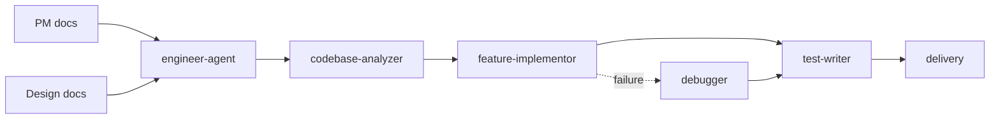

# Engineer Agent

`engineer-agent` 是工程角色的 dispatcher skill，负责把代码库分析、项目初始化、功能实现、测试补齐、缺陷修复和交付收尾请求路由到合适的工程 specialist skill。

> [!NOTE]
> 其他语言：[English](./README.md)

> [!IMPORTANT]
> Engineer Agent 只在需求或修复目标已经明确时接手。如果用户还在定义产品目标或空仓库里只有一个想法，应先回到 `pm-agent`。

## 快速信息

| 项目 | 内容 |
| --- | --- |
| 入口 skill | `engineer-agent` |
| Specialist skills | 6 个 |
| 主要输入 | PM 文档、可选设计文档、现有代码库、测试结果、失败日志 |
| 主要输出 | 代码变更、测试、工程文档、Git commit / PR |
| 上下游协作 | 上游 `pm-agent` / `designer-agent`，下游 `qa-agent` / `devops-agent` / `security-agent` |

## Skill 清单

| Skill | 适用场景 | 主要产物 |
| --- | --- | --- |
| `engineer-agent` | 工程请求入口与路由 | 下游 skill 选择与执行路径 |
| `codebase-analyzer` | 接手现有仓库、理解结构和约束 | Project Profile、技术栈与架构摘要 |
| `project-bootstrap` | 基于已确认 PRD/TRD 初始化项目 | 项目骨架、基础配置、启动说明 |
| `feature-implementor` | 按 spec 或设计文档实现功能 | 代码变更、必要工程文档 |
| `test-writer` | 补单测、集成测试或验证覆盖 | 测试文件、测试运行证据 |
| `debugger` | 复现、定位、修复 bug 或失败构建 | 最小修复、回归验证证据 |
| `delivery` | 分支、commit、push、PR、交付收尾 | Git 提交、PR、交付摘要 |

## 路由规则

- 理解仓库、技术栈、架构边界：使用 `codebase-analyzer`
- 新项目或新服务初始化：使用 `project-bootstrap`
- 功能实现、行为变更、按设计落地：使用 `feature-implementor`
- 测试补齐、覆盖率、验证实现：使用 `test-writer`
- bug、失败日志、测试失败、构建失败：使用 `debugger`
- commit、push、PR、交付整理：使用 `delivery`

默认规则：只要请求会改变生产行为，先确认需求来源和代码上下文；只要请求从失败症状开始，优先进入 `debugger`。

## 典型工作流



## 输入与产物

Engineer 主要消费：

- `docs/pm/{feature}/PRD.md`
- `docs/pm/{feature}/TRD.md`
- `docs/pm/{feature}/DECISIONS.md`
- `docs/design/{feature}/ui-ux-spec.md`
- `docs/design/{feature}/visual-system.md`

Engineer 的主产物通常是代码和测试；必要时可补充：

- `docs/engineer/{feature}/TRD.md`
- `docs/engineer/{feature}/API.md`
- `docs/engineer/{feature}/ADR.md`

## 协作边界

- Engineer 是唯一负责把 PM/Designer 文档转成代码、测试和交付资产的角色。
- Engineer 不替代 PM 做需求定义，也不替代 Designer 做视觉或交互决策。
- QA 发现实现缺陷时回到 Engineer；发现需求缺口时回到 PM。
- DevOps 和 Security 只在部署、运行、安全审查成为当前目标时介入。

## 本地维护

```bash
# 安装某个 Engineer skill 到当前项目运行时
npx skills add ./agents/engineer/skills/feature-implementor

# 查看工程 eval 定义
find agents/engineer/test -path '*/evals/evals.json' -print
```
