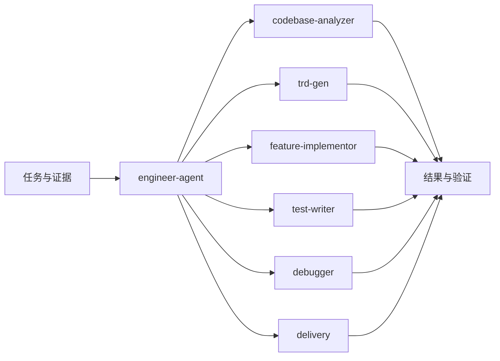

# Engineer Agent

`engineer-agent` 帮助选择工程能力相关方法。本插件提供 7 个可直接使用的 Skill，覆盖下表中的专项任务。助手根据用户目标组合专业知识，并持续完成请求范围内的工作。

> [!NOTE]
> [仓库架构](../../docs/architecture.md) · [文档说明](../../docs/AGENTS.md) · [English](./README.md)

## 快速信息

| 项目 | 详情 |
| --- | --- |
| 角色导航 | `engineer-agent` |
| 专项与组合 Skill | 6 |
| 主要输入 | 用户请求、issue、代码、已有设计、测试结果与失败日志 |
| 主要产物 | 实现变更、技术设计、测试、提交与 PR |

## Skill 清单

| Skill | 适用场景 | 主要产物 |
| --- | --- | --- |
| [engineer-agent](./skills/engineer-agent/SKILL.md) | 工程能力导航 | 工程方法与验证结果 |
| [codebase-analyzer](./skills/codebase-analyzer/SKILL.md) | 代码结构与依赖分析 | 架构、运行路径与项目概况 |
| [trd-gen](./skills/trd-gen/SKILL.md) | 技术设计、API 与架构决策 | 技术设计、API 或 ADR |
| [feature-implementor](./skills/feature-implementor/SKILL.md) | 实现功能与修复问题 | 实现代码与验证 |
| [test-writer](./skills/test-writer/SKILL.md) | 编写针对行为的测试 | 测试与执行证据 |
| [debugger](./skills/debugger/SKILL.md) | 根因定位与修复验证 | 根因、修复与回归证据 |
| [delivery](./skills/delivery/SKILL.md) | 提交、PR 与交付检查 | 提交、PR 与交付状态 |

## 能力选择

- 需要了解受影响区域时，通过 `codebase-analyzer` 查看架构和运行路径。
- 使用 `trd-gen` 记录有维护价值的技术选择、API、迁移和决策。
- 行为变更使用 `feature-implementor`，故障定位使用 `debugger`，有价值的回归覆盖使用 `test-writer`。
- 使用 `delivery` 核对最终 diff、准备提交和 PR，并验证 CI。

## 安装与使用

```text
/plugin marketplace add Neplich/dev-agent-skills
/plugin install engineer-agent@dev-agent-skills
```

Codex 的个人级和项目级安装见 [安装指南](../../docs/README.codex.md)。从仓库根目录安装全部能力到已选目标：

```bash
python3 scripts/install_codex_skills.py --target /path/to/skills
```

直接描述目标，或通过宿主的 Skill 选择器调用，例如：

```text
/debugger "修复登录失败，并验证成功与拒绝路径"
```

## 输入与产物组织

小修复可以在任务和 PR 中记录方案与证据。较长任务可在受影响组件附近维护设计或计划；接口、兼容性、错误处理和上线方式按实际影响展开。

需要持久化资料时，可沿用项目现有位置或参考下列布局：

```text
docs/engineer/{feature}/
  TRD.md
  API.md
  ADR-001-<topic>.md
  IMPLEMENTATION_PLAN.md
```

具体文件按任务价值选用；已有资料、代码和测试共同支持预期与验证。

## 验证与交付证据

- 沿调用方、状态、持久化和错误处理追踪行为变更。
- 修复缺陷时证明原始失败，并执行修正后的路径。
- 根据受影响行为选择单元、集成和端到端检查。
- 界面实现变化时检查实际渲染与交互。
- 涉及存储数据或集成时，核对兼容性、迁移与恢复方式。
- 交付有用的提交或 PR，并记录实际命令、结果与重要剩余风险。

需要更多细节时，可参考 [编码实践](./skills/feature-implementor/_internal/_shared/coding-rules.md) 与 [技术设计提纲](./skills/trd-gen/_internal/trd-schema.md)。

## 典型工作方式

查看实现 → 修改或修复 → 执行相关测试 → 审查差异 → 交付


```mermaid
flowchart LR
    Context["任务与证据"] --> Work["engineer-agent"]
    Work --> S0["codebase-analyzer"]
    S0 --> Result["结果与验证"]
    Work --> S1["trd-gen"]
    S1 --> Result["结果与验证"]
    Work --> S2["feature-implementor"]
    S2 --> Result["结果与验证"]
    Work --> S3["test-writer"]
    S3 --> Result["结果与验证"]
    Work --> S4["debugger"]
    S4 --> Result["结果与验证"]
    Work --> S5["delivery"]
    S5 --> Result["结果与验证"]
```

## 与其他能力组合

界面工作结合设计资料，用户流程结合 QA 用例，部署结合运维知识，敏感路径结合安全分析。整个工作过程持续沿用已有范围与授权。

助手在已有授权内贯穿相关工作；涉及关键产品选择或新增操作权限时，明确需要用户决定的具体事项。

## 本地维护

能力源码位于本目录的 `skills/`。修改专业内容后，同步相关说明和安装数据；验证方法见 [维护指南](../../docs/cookbook/maintain-skills.md)。
