# TRD Generator

Engineer-owned technical planning skill. It turns confirmed PM requirements into
`docs/engineer/{feature}/TRD.md`, then hands the confirmed TRD to
`feature-implementor` for an implementation plan and code execution.

## Role Boundary

`trd-gen` owns:

- technical approach and architecture trade-offs
- module and file impact analysis
- interface, data, deployment, observability, and validation strategy
- engineering risks, blockers, assumptions, and open technical questions
- writing or updating `docs/engineer/{feature}/TRD.md`
- resolving TRD gap packets from discoverers such as `engineer-agent`,
  `debugger`, or `feature-implementor`

`trd-gen` does not own:

- PM scope, user stories, business acceptance criteria, or product decisions
- UI/UX or visual design decisions
- code implementation
- implementation plan documents produced after TRD approval

If the PRD, `DECISIONS.md`, or acceptance scope is not stable, stop and hand
back to `pm-agent:idea-to-spec` with the missing decisions.

When another skill hands back a missing, incomplete, stale, or conflicting TRD,
the discoverer owns describing the TRD gaps and `trd-gen` owns completing the
TRD. Treat the handoff as a gap packet, not as an implementation request.

## Required Flow

```mermaid
flowchart LR
    PM["pm-agent: PRD / BRD / DECISIONS confirmed"] --> Handoff["Explicit handoff to engineer-agent:trd-gen"]
    Handoff --> TRD["trd-gen writes docs/engineer/{feature}/TRD.md"]
    TRD --> Review["Maintainer confirms TRD"]
    Review --> Plan["Explicit handoff to feature-implementor"]
    Plan --> ImplPlan["feature-implementor writes docs/engineer/{feature}/IMPLEMENTATION_PLAN.md"]
    ImplPlan --> Code["Implementation / tests / delivery"]
```



Use this checkpoint language:

```text
PRD 已确认，当前进入 Engineer TRD 阶段。
我会基于 PRD、DECISIONS 和仓库上下文编写 `docs/engineer/{feature}/TRD.md`。
TRD 确认后，再移交给 `feature-implementor` 编写实现计划文档并进入实现。
```

## Document-Writing Delegation

To avoid context drift during long document drafting, all TRD writing and TRD
revision work must be delegated to a fresh document-writing sub-agent when
sub-agent capabilities are available.

The main process keeps the source context and final judgment. The delegated
document-writing task must include:

- PRD, BRD, `DECISIONS.md`, design docs, and relevant issue links
- current codebase and repository constraints
- any TRD gap packet from the finder, including affected components, data flow,
  validation, release risk, and error-handling gaps
- required output path: `docs/engineer/{feature}/TRD.md`
- forbidden areas and instruction not to implement code
- required output: changed document path, summary, assumptions, open questions,
  and validation notes

After the sub-agent returns, the main process reviews the TRD for requirement
traceability, technical completeness, repository fit, and unresolved blockers
before asking for TRD confirmation.

## Inputs

- Required:
  - confirmed PRD or equivalent approved requirement document
  - `DECISIONS.md` or confirmed product decisions
  - repo path and current system context
- Optional:
  - BRD
  - design specs
  - existing API / ADR / deployment docs
  - issue or PR references
  - preferred stack or explicit technical constraints

## Output

Write or update:

```text
docs/engineer/{feature}/TRD.md
```

The TRD must include:

- metadata with `type: TRD`, `feature`, `version`, `date`, and `last_updated`
- source documents and requirement traceability
- technical overview and architecture diagram
- impacted modules, components, APIs, data, and integration points
- implementation constraints and non-goals
- validation strategy and concrete verification commands when known
- rollout, observability, security, and operational concerns when applicable
- risks, assumptions, and open technical questions
- explicit handoff conditions for `feature-implementor`

When updating a TRD from a gap packet, address each named gap directly or record
it as an open technical question with the owner and unblock condition.

## Quality Checks

Before handoff, verify:

1. Every P0 PRD requirement maps to a technical component or explicit non-goal.
2. Technical decisions do not change PM scope.
3. Unknowns are marked as assumptions or open questions, not hidden as facts.
4. The TRD path is under `docs/engineer/{feature}/`.
5. Any inbound TRD gap packet has been resolved or explicitly tracked as open.
6. The next step is `feature-implementor` only after the TRD is confirmed.

## Handoff

After the TRD is confirmed:

```text
TRD 已确认，当前移交给 `feature-implementor`。
下一步应基于 `docs/engineer/{feature}/TRD.md` 编写
`docs/engineer/{feature}/IMPLEMENTATION_PLAN.md`，确认后再进入代码实现。
```

Do not continue into implementation unless the user explicitly confirms the TRD
or asks to proceed despite open technical questions.
