# TRD Generator

Engineer-owned technical planning skill. It turns confirmed PM requirements into
`docs/engineer/{feature_path}/TRD.md`, mirroring
`docs/pm/{feature_path}/PRD.md`. When the confirmed technical scope includes
interface contracts or architecture decisions, it also owns
`docs/engineer/{feature_path}/API.md` and
`docs/engineer/{feature_path}/ADR-<NNN>-<decision-title>.md`, then hands the
confirmed Engineer document set to `feature-implementor` for an implementation
plan and code execution.

## Role Boundary

`trd-gen` owns:

- technical approach and architecture trade-offs
- module and file impact analysis
- interface, data, deployment, observability, and validation strategy
- engineering risks, blockers, assumptions, and open technical questions
- writing or updating `docs/engineer/{feature_path}/TRD.md`
- writing or updating `docs/engineer/{feature_path}/API.md` when interface
  contracts are in scope
- writing or updating `docs/engineer/{feature_path}/ADR-*.md` when durable
  technical decisions are in scope
- resolving TRD gap packets from discoverers such as `engineer-agent`,
  `debugger`, or `feature-implementor`

`trd-gen` does not own:

- PM scope, user stories, business acceptance criteria, or product decisions
- UI/UX or visual design decisions
- code implementation
- implementation plan documents produced after TRD approval

If the PRD, product decisions, or acceptance scope is not stable, stop and hand
back to `pm-agent:idea-to-spec` with the missing decisions. `DECISIONS.md` is a
valid decision record when present, but equivalent confirmed product decisions
are also acceptable.

If the target agent's plugin for a cross-agent handoff is not installed or
unavailable, state the missing stage and required plugin, mark that handoff
stage as blocked, and do not perform the missing agent's responsibilities
yourself.

When another skill hands back a missing, incomplete, stale, or conflicting TRD,
the discoverer owns describing the TRD gaps and `trd-gen` owns completing the
TRD. Treat the handoff as a gap packet, not as an implementation request.

## Required Flow

```mermaid
flowchart LR
    PM["pm-agent: PRD / BRD / product decisions confirmed"] --> Handoff["Explicit handoff to engineer-agent:trd-gen"]
    Handoff --> PathGate["Resolve feature_path from docs/pm/{feature_path}/PRD.md"]
    PathGate --> TRD["trd-gen writes docs/engineer/{feature_path}/TRD.md"]
    TRD --> OptionalDocs["API.md / ADR-*.md when in scope"]
    OptionalDocs --> Review["Maintainer confirms Engineer docs"]
    Review --> Plan["Explicit handoff to feature-implementor"]
    Plan --> ImplPlan["feature-implementor writes docs/engineer/{feature_path}/IMPLEMENTATION_PLAN.md"]
    ImplPlan --> Code["Implementation / tests / delivery"]
```



Use this checkpoint language:

```text
PRD 已确认，当前进入 Engineer TRD 阶段。
我会基于 PRD、产品决策记录和仓库上下文解析 `feature_path`，并编写
`docs/engineer/{feature_path}/TRD.md`。
Engineer 文档确认后，再移交给 `feature-implementor` 编写实现计划文档并进入实现。
```

## TRD Gap Packet Handling

Accept a TRD gap packet from `engineer-agent`, `feature-implementor`,
`debugger`, or QA E2E alignment when PM scope is stable but the TRD is missing,
incomplete, stale, or conflicts with implementation or test evidence.

The incoming packet should identify:

- source request, feature, and PRD / decision records already checked
- affected components, modules, APIs, data flow, integrations, or deployment
  surfaces
- missing or conflicting technical decisions
- validation commands or evidence that exposed the gap
- release, rollback, observability, security, error-handling, or E2E coverage
  risk when relevant
- the discoverer's boundary statement: the finder names the gaps; `trd-gen`
  completes or updates the TRD

`trd-gen` must either update `docs/engineer/{feature_path}/TRD.md` to resolve
each named gap or record an open technical question with owner, blocker, and
unblock condition. Do not route to `feature-implementor`, `debugger`, or QA E2E
documentation updates until the TRD is confirmed, mirrors the PRD feature path,
and any open questions are explicitly accepted as non-blocking.

## Document-Writing Delegation

To avoid context drift during long document drafting, all TRD writing and TRD
revision work must be delegated to a fresh document-writing sub-agent when
sub-agent capabilities are available.

The main process keeps the source context and final judgment. The delegated
document-writing task must include:

- PRD, BRD, `DECISIONS.md` when present, equivalent product decisions, design
  docs, and relevant issue links
- current codebase and repository constraints
- any TRD gap packet from the finder, including affected components, data flow,
  validation, release risk, and error-handling gaps
- required output path: `docs/engineer/{feature_path}/TRD.md`
- optional Engineer-owned output paths:
  `docs/engineer/{feature_path}/API.md` and
  `docs/engineer/{feature_path}/ADR-*.md`
- forbidden areas and instruction not to implement code
- required output: changed document path, summary, assumptions, open questions,
  and validation notes

After the sub-agent returns, the main process reviews the TRD for requirement
traceability, technical completeness, repository fit, and unresolved blockers
before asking for TRD confirmation.

## Inputs

- Required:
  - confirmed PRD or equivalent approved requirement document
  - `DECISIONS.md` or confirmed product decisions
  - repo path and current system context
  - resolved `feature_path`, `parent_feature`, and `feature_level` from the PRD
    or PM handoff
- Optional:
  - BRD
  - design specs
  - existing API / ADR / deployment docs
  - issue or PR references
  - preferred stack or explicit technical constraints

## Output

Write or update:

```text
docs/engineer/{feature_path}/TRD.md
docs/engineer/{feature_path}/API.md                 # when API docs are in scope
docs/engineer/{feature_path}/ADR-<NNN>-<slug>.md     # when an ADR is in scope
```

The TRD must include:

- metadata with `type: TRD`, `feature`, `feature_path`, `parent_feature`,
  `feature_level`, `version`, `date`, `last_updated`, and `related_prd`
- source documents and requirement traceability
- technical overview and architecture diagram
- impacted modules, components, APIs, data, and integration points
- API documentation when interface contracts are stable enough to document
- ADRs when a technical decision needs durable rationale
- implementation constraints and non-goals
- validation strategy and concrete verification commands when known
- rollout, observability, security, and operational concerns when applicable
- risks, assumptions, and open technical questions
- explicit handoff conditions for `feature-implementor`

When updating a TRD from a gap packet, address each named gap directly or record
it as an open technical question with the owner and unblock condition.

## Quality Checks

Before handoff, verify:

1. Every P0 PRD requirement maps to a technical component or explicit non-goal.
2. Technical decisions do not change PM scope.
3. Unknowns are marked as assumptions or open questions, not hidden as facts.
4. The TRD path is under `docs/engineer/{feature_path}/` and mirrors
   `docs/pm/{feature_path}/PRD.md`.
5. `feature_path`, `parent_feature`, and `feature_level` match the PRD. Old
   single-level PRDs without these fields may be read as
   `feature_path=<directory-name>`, `parent_feature=N/A`, and
   `feature_level=1`.
6. `related_prd` points to `docs/pm/{feature_path}/PRD.md`.
7. API and ADR documents, when produced, live under
   `docs/engineer/{feature_path}/` and do not use only the terminal feature
   name as a parallel top-level directory.
8. Any inbound TRD gap packet has been resolved or explicitly tracked as open.
9. The next step is `feature-implementor` only after the Engineer document set
   is confirmed.

## Handoff

After the TRD is confirmed:

```text
Engineer 文档已确认，当前移交给 `feature-implementor`。
下一步应基于 `docs/engineer/{feature_path}/TRD.md` 编写
`docs/engineer/{feature_path}/IMPLEMENTATION_PLAN.md`，确认后再进入代码实现。
```

Do not continue into implementation unless the user explicitly confirms the TRD
or asks to proceed despite open technical questions.
