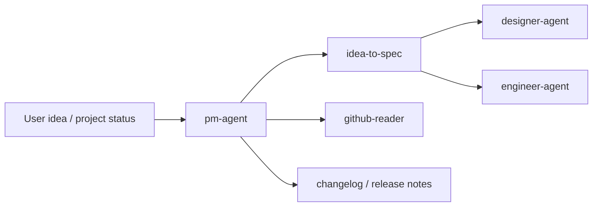

# Product Manager Agent

`pm-agent` is the product-role dispatcher skill. It routes requirement shaping, project status, competitor research, roadmap, changelog, and release communication requests to the right PM specialist skill. It produces product documents and does not implement code.

> [!NOTE]
> Other languages: [中文](./README_zh.md)

> [!TIP]
> Start with `pm-agent` when the user is still describing what to build, when scope is unclear, or when an empty repository only has a product idea.

## Quick Facts

| Item | Details |
| --- | --- |
| Entry skill | `pm-agent` |
| Specialist skills | 8 |
| Main inputs | User ideas, local `docs/`, repository state, GitHub Issues / PRs / Milestones / Releases |
| Main outputs | `docs/pm/{feature_path}/`, `docs/roadmap.md`, `docs/changelog/changelog-v{version}.md`, `docs/release-notes/` |
| Downstream agents | `designer-agent`, `engineer-agent` |

## Skills

| Skill | When to use | Main output |
| --- | --- | --- |
| `pm-agent` | PM request routing | Specialist selection and execution path |
| `idea-to-spec` | Product ideas, empty-repo app requests, feature changes, spec updates | `PRD.md`, `BRD.md`, `DECISIONS.md`, Engineer handoff |
| `feature-catalog` | Project take-over, feature directory and feature profile for existing code | Feature catalog draft, `docs/pm/FEATURE_CATALOG.md`, `prd-gen`/`trd-gen` handoff |
| `competitive-brief` | Competitor positioning, gap analysis, market scan | Competitive brief, positioning opportunities, risks |
| `competitive-intelligence` | Sales battlecards and deal support | HTML battlecard, competitor comparison matrix |
| `changelog-generator` | Developer-facing version change summaries | `docs/changelog/changelog-v{version}.md` |
| `release-notes-generator` | User-facing release announcements | Customer-friendly release notes |
| `roadmap-generator` | Milestones, issues, and version planning | `docs/roadmap.md` |
| `github-reader` | Project status, backlog, PR queue, release blockers | GitHub project health report |

## Routing Rules

- Idea shaping, scope definition, PRD/BRD/DECISIONS: use `idea-to-spec`
- Project take-over, feature catalog, feature profile for an existing repo: use `feature-catalog`
- Competitor research, positioning gaps, market scans: use `competitive-brief`
- Sales battlecards or deal support: use `competitive-intelligence`
- Developer-facing version changes: use `changelog-generator`
- User-facing release communication: use `release-notes-generator`
- Roadmap and milestone planning: use `roadmap-generator`
- GitHub project status, PR/Issue queues, release blockers: use `github-reader`

Default rule: if the core task is still product direction, requirements, scope, planning, or communication, keep it in PM Agent. Hand off to Designer or Engineer only after the requirement is stable enough.

## Typical Flow



## Document Structure

Feature-level PM documents use this directory shape:

```text
docs/
└── pm/
    └── {feature_path}/
        ├── PRD.md
        ├── BRD.md
        └── DECISIONS.md
```

`feature_path` is a multi-level path. Before creating PM feature docs, scan
`docs/pm/**/PRD.md`; attach child features under a confirmed parent PRD, and
block or clarify when parent ownership is unclear.

Repository-level PM artifacts can use:

- `docs/roadmap.md`
- `docs/changelog/changelog-v{version}.md`
- `docs/release-notes/`

## Collaboration Boundary

- PM Agent can produce requirement, business, technical constraints, and decision documents.
- PM Agent does not implement code, tests, deployment config, or security fixes.
- Designer mainly consumes `PRD.md`, `BRD.md`, and `DECISIONS.md`.
- Engineer consumes PM docs, then owns `docs/engineer/{feature_path}/TRD.md` through `engineer-agent:trd-gen`.

## Local Maintenance

```bash
# Install one PM skill into the current project runtime
npx skills add ./agents/product_manager/skills/idea-to-spec

# Run idea-to-spec tests
uv run --with pytest pytest agents/product_manager/test/idea-to-spec
```
