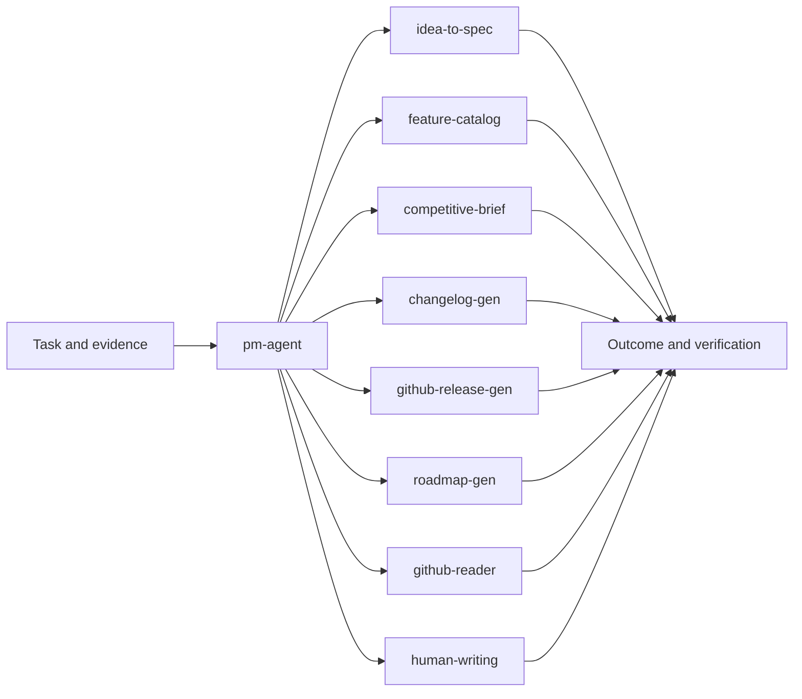

# Product Manager Agent

`pm-agent` helps select methods for product manager agent work. The plugin provides 9 directly usable skills for the specialist tasks below. The assistant combines this knowledge to complete the requested outcome.

> [!NOTE]
> [Architecture](../../docs/architecture.md) · [Documentation Guide](../../docs/AGENTS.md) · [中文](./README_zh.md)

## Quick Facts

| Item | Details |
| --- | --- |
| Role guide | `pm-agent` |
| Specialist and composition skills | 8 |
| Main inputs | User ideas, product context, repository evidence, issues, PRs, milestones, and releases |
| Main outputs | Requirements, feature inventories, research, roadmaps, changelogs, release content, and clear prose |

## Skills

| Skill | When to use | Main output |
| --- | --- | --- |
| [pm-agent](./skills/pm-agent/SKILL.md) | Product capability guide | Selected methods and product outcome |
| [idea-to-spec](./skills/idea-to-spec/SKILL.md) | Requirements and acceptance criteria | Requirements, PRD, decision notes |
| [feature-catalog](./skills/feature-catalog/SKILL.md) | Feature catalogs from existing projects | Feature inventory and evidence map |
| [competitive-brief](./skills/competitive-brief/SKILL.md) | Competitive research and positioning | Comparison, positioning, opportunities |
| [changelog-gen](./skills/changelog-gen/SKILL.md) | Developer changelogs | Versioned developer changelog |
| [github-release-gen](./skills/github-release-gen/SKILL.md) | GitHub Release preparation and publication | Release content, draft, authorized publication |
| [roadmap-gen](./skills/roadmap-gen/SKILL.md) | Roadmaps and milestones | Milestones, priorities, roadmap |
| [github-reader](./skills/github-reader/SKILL.md) | GitHub project status | Issue/PR/milestone status with sources |
| [human-writing](./skills/human-writing/SKILL.md) | Natural, reader-oriented writing | Clear, natural reader-facing prose |

## Choosing a Capability

- Use `idea-to-spec` for product goals, scope, acceptance criteria, and useful specifications.
- Use `feature-catalog` to map implemented capabilities before planning changes.
- Use `competitive-brief` for positioning and comparisons, and `roadmap-gen` for priorities and milestones.
- Use `github-reader` for repository state, `changelog-gen` for version changes, and `github-release-gen` for release preparation or authorized publication.
- Use `human-writing` to make reader-facing material clear and natural.

## Installation and Use

```text
/plugin marketplace add Neplich/dev-agent-skills
/plugin install pm-agent@dev-agent-skills
```

For Codex personal and project installations, see the [installation guide](../../docs/README.codex.md). From the repository root, install all capabilities into the selected target:

```bash
python3 scripts/install_codex_skills.py --target /path/to/skills
```

Describe the goal directly or select a skill through the host, for example:

```text
/idea-to-spec "Define a useful first version of a team task manager."
```

## Inputs and Artifacts

Use a stable feature path when a product specification will be maintained. A PRD explains the problem, users, behavior, and acceptance criteria; a decision record captures the chosen direction and relevant rationale. Roadmaps and release communication use actual issue and version evidence.

For durable artifacts, use the project’s existing locations or adapt this layout:

```text
docs/pm/{feature}/
  PRD.md
  DECISIONS.md
docs/roadmap.md
docs/changelog/changelog-v{version}.md
```

Choose the useful files for the task. Existing documents, code, and tests jointly support expectations and verification.

## Selecting the Product Artifact

| Need | Useful artifact |
| --- | --- |
| Decide what to build | Problem, users, scope, alternatives, acceptance criteria |
| Understand an existing system | Evidence-linked feature inventory and gaps |
| Compare market approaches | Sourced comparison, positioning, opportunities |
| Communicate priorities | Roadmap tied to actual milestones and issues |
| Explain a release | Themed changes, compatibility, upgrade actions, source links |

GitHub summaries retain source links, capture dates, pagination, and incomplete
result notices. Version summaries use a verified reachable commit range.
Reader-facing documents preserve exact names, interfaces, and commands while
organizing the material around the reader's task.

[idea-to-spec resources](./skills/idea-to-spec/README.md) provide generation,
revision, analysis, and validation references that can be selected independently.

## Typical Workflow

Understand the goal → inspect evidence → shape the useful artifact → verify facts → continue the task


```mermaid
flowchart LR
    Context["Task and evidence"] --> Work["pm-agent"]
    Work --> S0["idea-to-spec"]
    S0 --> Result["Outcome and verification"]
    Work --> S1["feature-catalog"]
    S1 --> Result["Outcome and verification"]
    Work --> S2["competitive-brief"]
    S2 --> Result["Outcome and verification"]
    Work --> S3["changelog-gen"]
    S3 --> Result["Outcome and verification"]
    Work --> S4["github-release-gen"]
    S4 --> Result["Outcome and verification"]
    Work --> S5["roadmap-gen"]
    S5 --> Result["Outcome and verification"]
    Work --> S6["github-reader"]
    S6 --> Result["Outcome and verification"]
    Work --> S7["human-writing"]
    S7 --> Result["Outcome and verification"]
```

## Combining Capabilities

Product knowledge can be combined with design, engineering, testing, operations, security, and documentation in the same task. Use `docs-agent:release-notes-gen` for versioned site pages and `github-release-gen` for the GitHub release surface.

The assistant continues within existing authorization and identifies concrete decisions when a material product choice or additional operation permission is needed.

## Local Maintenance

Capability sources live under `skills/` in this directory. Update relevant descriptions and installation data with content changes; see the [maintenance guide](../../docs/cookbook/maintain-skills.md) for verification.
