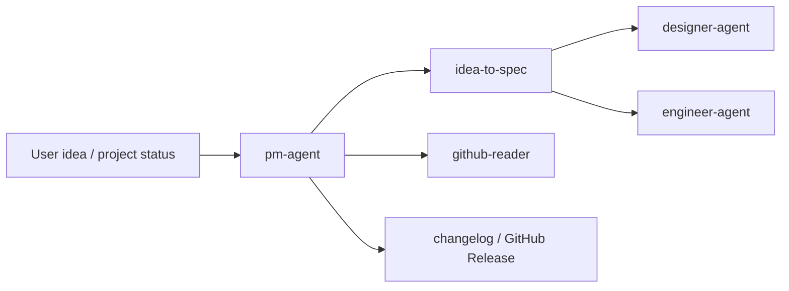

# Product Manager Agent

`pm-agent` is the product-role dispatcher skill. It routes requirement shaping, project status, competitor research, roadmap, changelog, and release communication requests to the right PM specialist skill. It produces product documents and does not implement code.

> [!NOTE]
> Other languages: [中文](./README_zh.md)

> [!TIP]
> Start with `pm-agent` when the user is still describing what to build, when scope is unclear, or when an empty repository only has a product idea.

## Quick Facts

| Item | Details |
| --- | --- |
| Entry skill | `pm-agent` |
| Specialist skills | 7 |
| Main inputs | User ideas, local `docs/`, repository state, GitHub Issues / PRs / Milestones / Releases |
| Main outputs | `docs/pm/{feature_path}/`, `docs/roadmap.md`, `docs/changelog/changelog-v{version}.md` |
| Downstream agents | `designer-agent`, `engineer-agent`, `qa-agent`, `devops-agent`, `security-agent`, `docs-agent` |

## Skills

| Skill | When to use | Main output |
| --- | --- | --- |
| `pm-agent` | PM request routing | Specialist selection and execution path |
| `idea-to-spec` | Product ideas, empty-repo app requests, feature changes, spec updates | `PRD.md`, `DECISIONS.md`, Engineer handoff |
| `feature-catalog` | Project take-over, feature directory and feature profile for existing code | Feature catalog draft, `docs/pm/FEATURE_CATALOG.md`, `prd-gen`/`trd-gen` handoff |
| `competitive-brief` | Competitor positioning, gap analysis, market scan | Competitive brief, positioning opportunities, risks |
| `changelog-gen` | Developer-facing version change summaries | `docs/changelog/changelog-v{version}.md` |
| `github-release-gen` | GitHub Release work after confirmed site Release Notes and release audits | Traceable preview or draft; approved publication after the tag and post-tag audit |
| `roadmap-gen` | Milestones, issues, and version planning | `docs/roadmap.md` |
| `github-reader` | Project status, backlog, PR queue, release blockers | GitHub project health report |

## Routing Rules

Explicit invocation of `pm-agent`, a role agent, or any skill always proceeds
through that capability's existing gate. Without an explicit invocation,
product or engineering R&D intent enters `pm-agent`; ordinary non-R&D requests
remain with the current assistant. Project docs, code, and markers are context
only after PM entry.

- Idea shaping, scope definition, PRD/DECISIONS: use `idea-to-spec`
- Project take-over, feature catalog, feature profile for an existing repo: use `feature-catalog`
- Competitor research, positioning gaps, market scans: use `competitive-brief`
- Developer-facing version changes: use `changelog-gen`
- GitHub Release preview, draft, or approved publication: use
  `github-release-gen` after the Docs release gates pass.
- User-facing version notes and versioned pages under `docs/site/release-notes/`: hand off to
  `docs-agent:release-notes-gen`.
- Roadmap and milestone planning: use `roadmap-gen`
- GitHub project status, PR/Issue queues, release blockers: use `github-reader`
- Explicit read-only bug diagnosis: classify as `bug_report` and hand off to
  Engineer with `mode: diagnosis_only` and `allowed_mutations: none`; ordinary
  repair requests still require expected-behavior alignment.

Default rule: if the core task is still product direction, requirements, scope, planning, or communication, keep it in PM Agent. Hand off to Designer or Engineer only after the requirement is stable enough.

## Typical Flow


```mermaid
flowchart LR
    Idea["User idea / project status"] --> PM["pm-agent"]
    PM --> Spec["idea-to-spec"]
    PM --> GitHub["github-reader"]
    PM --> Release["changelog / GitHub Release"]
    Spec --> Designer["designer-agent"]
    Spec --> Engineer["engineer-agent"]
```

## Document Structure

Feature-level PM documents use this directory shape:

```text
docs/
└── pm/
    └── {feature_path}/
        ├── PRD.md
        └── DECISIONS.md
```

`feature_path` is a multi-level path. Before creating PM feature docs, scan
`docs/pm/**/PRD.md`; attach child features under a confirmed parent PRD, and
block or clarify when parent ownership is unclear.

Repository-level PM artifacts can use:

- `docs/roadmap.md`
- `docs/changelog/changelog-v{version}.md`

Site Release Notes are owned by `docs-agent:release-notes-gen` under the
host site's `docs/site/release-notes/`; PM only produces GitHub Releases via
`github-release-gen`.

## Collaboration Boundary

- PM Agent can produce requirement, business, technical constraints, and decision documents.
- PM Agent does not implement code, tests, deployment config, or security fixes.
- Designer mainly consumes `PRD.md` and `DECISIONS.md`.
- Engineer consumes PM docs, then owns `docs/engineer/{feature_path}/TRD.md` through `engineer-agent:trd-gen`.

## Collaboration Dependencies

PM Agent hands off to peer agents that are packaged and installed as separate plugins:

- `designer-agent` for confirmed UX, UI structure, visual-system, or design handoff work
- `engineer-agent` for confirmed TRD, implementation, tests, debugging, delivery, or codebase work, plus explicitly bounded read-only diagnosis
- `qa-agent` for confirmed acceptance, exploratory, bug analysis, or regression validation work
- `devops-agent` for confirmed deployment, CI/CD, environment, release readiness, rollback, or runbook work
- `security-agent` for confirmed AppSec, auth/authz, dependency, privacy, or data-flow review work
- `docs-agent` for confirmed formal documentation site bootstrap, synchronization, backfill, illustrated user operation manuals from real running interfaces, or release documentation audit work

If a target agent is not installed, the corresponding handoff stage is unavailable; PM Agent reports the missing stage and the recommended plugin and marks that stage blocked instead of doing the work itself.

## Local Maintenance

```bash
# Install one PM skill into the current project runtime
npx skills add ./agents/product_manager/skills/idea-to-spec

# Run idea-to-spec tests
uv run --with pytest pytest agents/product_manager/test/idea-to-spec
```
