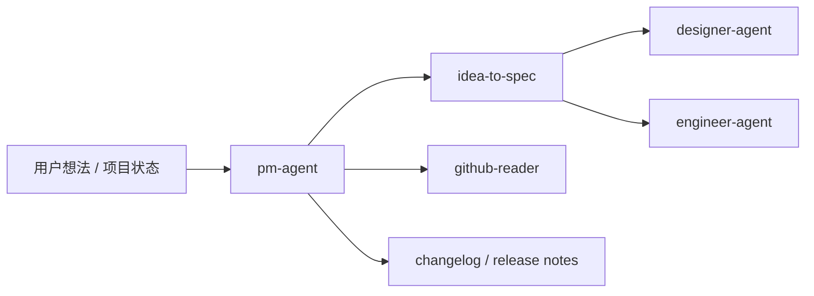

# Product Manager Agent

`pm-agent` 是产品角色的 dispatcher skill，负责把需求、项目状态、竞品、路线图和发布沟通类请求路由到合适的 PM specialist skill。它面向文档化产出，不直接进入代码实现。

> [!NOTE]
> 其他语言：[English](./README.md)

> [!TIP]
> 当用户还在描述“想做什么”、范围还没有定清楚，或者空仓库里只有一个产品想法时，优先从 `pm-agent` 开始，而不是直接交给工程实现。

## 快速信息

| 项目 | 内容 |
| --- | --- |
| 入口 skill | `pm-agent` |
| Specialist skills | 7 个 |
| 主要输入 | 用户想法、本地 `docs/`、代码库现状、GitHub Issues / PRs / Milestones / Releases |
| 主要输出 | `docs/pm/{feature}/`、`docs/roadmap.md`、`docs/changelog.md`、`docs/release-notes/` |
| 下游协作 | `designer-agent`、`engineer-agent` |

## Skill 清单

| Skill | 适用场景 | 主要产物 |
| --- | --- | --- |
| `pm-agent` | PM 请求入口与路由 | 下游 skill 选择与执行路径 |
| `idea-to-spec` | 产品想法、空仓库 app 请求、已有功能变更、spec 更新 | `PRD.md`、`BRD.md`、`DECISIONS.md`、`TRD.md` |
| `competitive-brief` | 竞品定位、差距分析、市场扫描 | 竞品简报、定位机会、风险与建议 |
| `competitive-intelligence` | 销售向 battlecard、deal support | HTML battlecard、竞品对比矩阵 |
| `changelog-generator` | 面向开发者的版本变化整理 | `docs/changelog.md` |
| `release-notes-generator` | 面向用户或客户的发版说明 | 用户友好的 release notes |
| `roadmap-generator` | milestone、issue、版本计划整理 | `docs/roadmap.md` |
| `github-reader` | 项目状态、backlog、PR 队列、release blocker | GitHub 项目健康报告 |

## 路由规则

- 想法收敛、范围定义、PRD/BRD/TRD/ADR：使用 `idea-to-spec`
- 竞品研究、定位差距、市场扫描：使用 `competitive-brief`
- 销售 battlecard 或 deal support：使用 `competitive-intelligence`
- 开发者视角版本变化：使用 `changelog-generator`
- 用户视角版本公告：使用 `release-notes-generator`
- 路线图、milestone 规划：使用 `roadmap-generator`
- GitHub 项目状态、PR/Issue 队列、release blocker：使用 `github-reader`

默认规则：只要核心问题仍是“产品方向、需求、范围、计划或沟通”，留在 PM Agent；只有需求已经足够稳定时，才交给 Designer 或 Engineer。

## 典型工作流



## 文档结构

Feature 级 PM 文档使用固定目录：

```text
docs/
└── pm/
    └── {feature-name}/
        ├── PRD.md
        ├── BRD.md
        ├── DECISIONS.md
        └── TRD.md
```

Repo 级 PM 产物可以放在：

- `docs/roadmap.md`
- `docs/changelog.md`
- `docs/release-notes/`

## 协作边界

- PM Agent 可以产出需求、业务、技术范围和决策文档。
- PM Agent 不直接实现代码、测试、部署配置或安全修复。
- Designer 主要消费 `PRD.md`、`BRD.md`、`DECISIONS.md`。
- Engineer 主要消费 `PRD.md`、`TRD.md`、`DECISIONS.md`。

## 本地维护

```bash
# 安装某个 PM skill 到当前项目运行时
npx skills add ./agents/product_manager/skills/idea-to-spec

# 运行 idea-to-spec 的本地测试
uv run --with pytest pytest agents/product_manager/test/idea-to-spec
```
