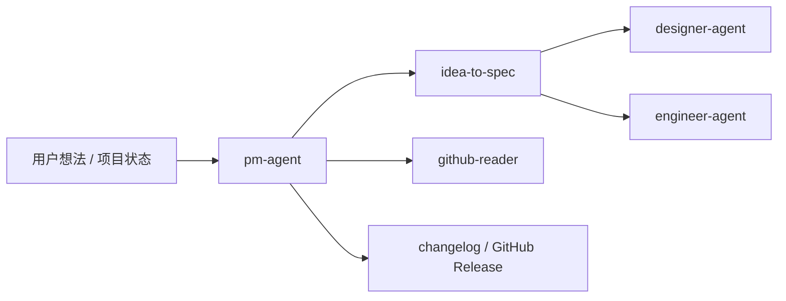

# Product Manager Agent

`pm-agent` 是产品角色的 dispatcher skill，负责把需求、项目状态、竞品、路线图和发布沟通类请求路由到合适的 PM specialist skill。它面向文档化产出，不直接进入代码实现。

> [!NOTE]
> 其他语言：[English](./README.md)

> [!TIP]
> 当用户还在描述“想做什么”、范围还没有定清楚，或者空仓库里只有一个产品想法时，优先从 `pm-agent` 开始，而不是直接交给工程实现。

## 快速信息

| 项目 | 内容 |
| --- | --- |
| 入口 skill | `pm-agent` |
| Specialist skills | 7 个 |
| 主要输入 | 用户想法、本地 `docs/`、代码库现状、GitHub Issues / PRs / Milestones / Releases |
| 主要输出 | `docs/pm/{feature_path}/`、`docs/roadmap.md`、`docs/changelog/changelog-v{version}.md` |
| 下游协作 | `designer-agent`、`engineer-agent`、`qa-agent`、`devops-agent`、`security-agent`、`docs-agent` |

## Skill 清单

| Skill | 适用场景 | 主要产物 |
| --- | --- | --- |
| `pm-agent` | PM 请求入口与路由 | 下游 skill 选择与执行路径 |
| `idea-to-spec` | 产品想法、空仓库 app 请求、已有功能变更、spec 更新 | `PRD.md`、`DECISIONS.md`、Engineer handoff |
| `feature-catalog` | 接手已有项目、建立功能目录、项目功能画像 | 功能目录草案、`docs/pm/FEATURE_CATALOG.md`、`prd-gen`/`trd-gen` handoff |
| `competitive-brief` | 竞品定位、差距分析、市场扫描 | 竞品简报、定位机会、风险与建议 |
| `changelog-gen` | 面向开发者的版本变化整理 | `docs/changelog/changelog-v{version}.md` |
| `github-release-gen` | 已确认站内版本说明和发版审计后的 GitHub Release 工作 | 可追溯预览或 draft；实际 tag 与 post-tag 审计通过后经批准发布 |
| `roadmap-gen` | milestone、issue、版本计划整理 | `docs/roadmap.md` |
| `github-reader` | 项目状态、backlog、PR 队列、release blocker | GitHub 项目健康报告 |

## 路由规则

- 想法收敛、范围定义、PRD/DECISIONS：使用 `idea-to-spec`
- 接手已有项目、建立功能目录、功能画像：使用 `feature-catalog`
- 竞品研究、定位差距、市场扫描：使用 `competitive-brief`
- 开发者视角版本变化：使用 `changelog-gen`
- GitHub Release 预览、draft 或经批准发布：完成 Docs 发版门禁后使用
  `github-release-gen`
- 面向用户的版本说明和 `docs/site/release-notes/` 站内版本页：交给
  `docs-agent:release-notes-gen`
- 路线图、milestone 规划：使用 `roadmap-gen`
- GitHub 项目状态、PR/Issue 队列、release blocker：使用 `github-reader`

默认规则：只要核心问题仍是“产品方向、需求、范围、计划或沟通”，留在 PM Agent；只有需求已经足够稳定时，才交给 Designer 或 Engineer。

## 典型工作流


```mermaid
flowchart LR
    Idea["用户想法 / 项目状态"] --> PM["pm-agent"]
    PM --> Spec["idea-to-spec"]
    PM --> GitHub["github-reader"]
    PM --> Release["changelog / GitHub Release"]
    Spec --> Designer["designer-agent"]
    Spec --> Engineer["engineer-agent"]
```

## 文档结构

Feature 级 PM 文档使用固定目录：

```text
docs/
└── pm/
    └── {feature_path}/
        ├── PRD.md
        └── DECISIONS.md
```

`feature_path` 支持多级。创建 PM 功能文档前先扫描 `docs/pm/**/PRD.md`；
如果新需求明确属于已有父 PRD，就挂到父目录下；父功能归属不清时先澄清或
blocked，不创建新的并列顶层目录。

Repo 级 PM 产物可以放在：

- `docs/roadmap.md`
- `docs/changelog/changelog-v{version}.md`

站内 Release Notes 归 `docs-agent:release-notes-gen`，写入宿主站点的
`docs/site/release-notes/`；PM 只通过 `github-release-gen` 产出 GitHub Release。

## 协作边界

- PM Agent 可以产出需求、业务、技术约束和决策文档。
- PM Agent 不直接实现代码、测试、部署配置或安全修复。
- Designer 主要消费 `PRD.md`、`DECISIONS.md`。
- Engineer 消费 PM 文档后，通过 `engineer-agent:trd-gen` 负责 `docs/engineer/{feature_path}/TRD.md`。

## 协作依赖

PM Agent 依赖可能作为独立插件打包的同级能力：

- `designer-agent` 用于已确认的 UX、UI 结构、视觉系统或设计 handoff 工作
- `engineer-agent` 用于已确认的 TRD、实现、测试、调试、交付或代码库工作
- `qa-agent` 用于已确认的验收、探索、缺陷分析或回归验证工作
- `devops-agent` 用于已确认的部署、CI/CD、环境、发版就绪、回滚或 runbook 工作
- `security-agent` 用于已确认的 AppSec、认证授权、依赖、隐私或数据流审查工作
- `docs-agent` 用于已确认的正式文档站 bootstrap、同步、回填或发版文档审计工作

如果所需目标不可用，PM Agent 会识别缺失的阶段和插件，将该阶段标记为 blocked，并且不会执行缺失角色的工作。

## 本地维护

```bash
# 安装某个 PM skill 到当前项目运行时
npx skills add ./agents/product_manager/skills/idea-to-spec

# 运行 idea-to-spec 的本地测试
uv run --with pytest pytest agents/product_manager/test/idea-to-spec
```
