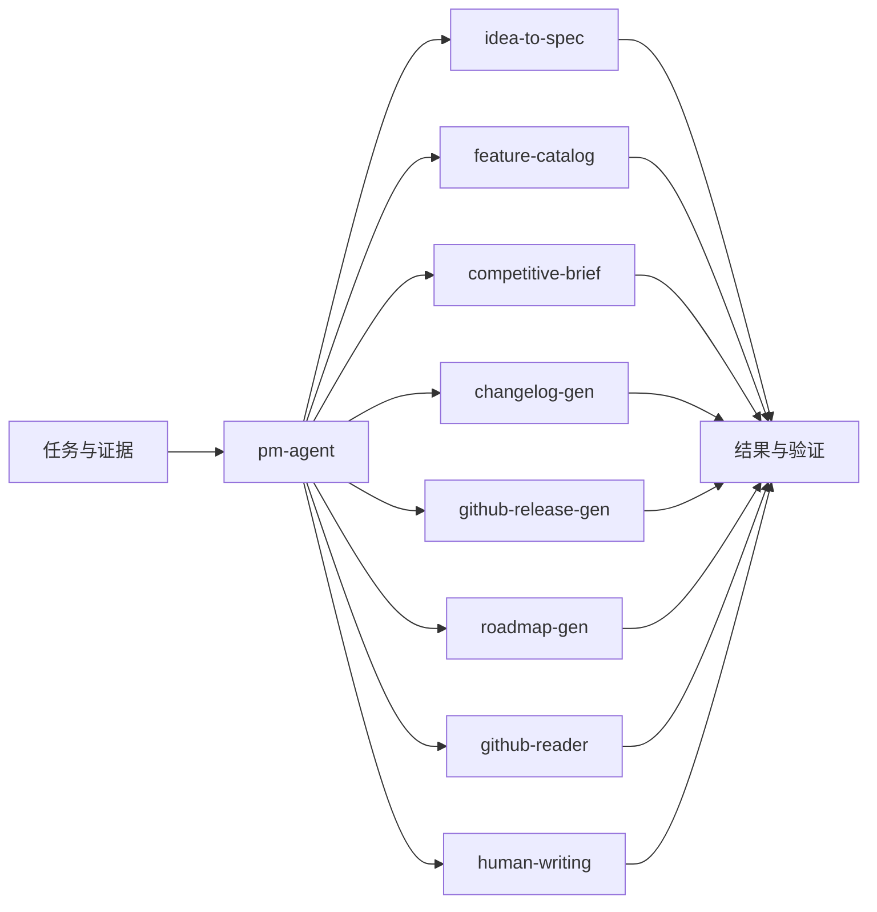

# Product Manager Agent

`pm-agent` 帮助选择产品能力相关方法。本插件提供 9 个可直接使用的 Skill，覆盖下表中的专项任务。助手根据用户目标组合专业知识，并持续完成请求范围内的工作。

> [!NOTE]
> [仓库架构](../../docs/architecture.md) · [文档说明](../../docs/AGENTS.md) · [English](./README.md)

## 快速信息

| 项目 | 详情 |
| --- | --- |
| 角色导航 | `pm-agent` |
| 专项与组合 Skill | 8 |
| 主要输入 | 用户想法、产品背景、仓库证据、issue、PR、milestone 与 release |
| 主要产物 | 需求、功能目录、研究、路线图、变更记录、发布内容与清晰文稿 |

## Skill 清单

| Skill | 适用场景 | 主要产物 |
| --- | --- | --- |
| [pm-agent](./skills/pm-agent/SKILL.md) | 产品能力导航 | 选定方法与产品产物 |
| [idea-to-spec](./skills/idea-to-spec/SKILL.md) | 梳理需求与验收标准 | 需求、PRD、决策说明 |
| [feature-catalog](./skills/feature-catalog/SKILL.md) | 从现有项目整理功能目录 | 功能清单与证据映射 |
| [competitive-brief](./skills/competitive-brief/SKILL.md) | 竞争研究与产品定位 | 比较、定位与机会 |
| [changelog-gen](./skills/changelog-gen/SKILL.md) | 开发者版本变更记录 | 版本化开发者变更记录 |
| [github-release-gen](./skills/github-release-gen/SKILL.md) | GitHub Release 内容与发布 | 发布内容、草稿、已授权发布 |
| [roadmap-gen](./skills/roadmap-gen/SKILL.md) | 路线图与里程碑 | 里程碑、优先级与路线图 |
| [github-reader](./skills/github-reader/SKILL.md) | GitHub 项目状态读取 | 有来源的 issue/PR/milestone 状态 |
| [human-writing](./skills/human-writing/SKILL.md) | 面向读者的自然写作 | 清晰自然的读者文稿 |

## 能力选择

- 产品目标、范围、验收条件和规格使用 `idea-to-spec`。
- 规划已有系统变更前，可用 `feature-catalog` 盘点已实现能力。
- 定位与比较使用 `competitive-brief`，优先级与里程碑使用 `roadmap-gen`。
- 仓库状态使用 `github-reader`，版本变更使用 `changelog-gen`，发布准备与已授权发布使用 `github-release-gen`。
- 面向读者的材料可结合 `human-writing` 改善表达和组织。

## 安装与使用

```text
/plugin marketplace add Neplich/dev-agent-skills
/plugin install pm-agent@dev-agent-skills
```

Codex 的个人级和项目级安装见 [安装指南](../../docs/README.codex.md)。从仓库根目录安装全部能力到已选目标：

```bash
python3 scripts/install_codex_skills.py --target /path/to/skills
```

直接描述目标，或通过宿主的 Skill 选择器调用，例如：

```text
/idea-to-spec "梳理团队任务管理工具的第一版范围和验收条件"
```

## 输入与产物组织

需要长期维护产品规格时使用稳定功能路径。PRD 说明问题、用户、行为和验收条件；决策记录保存选择与必要理由。路线图和发布沟通使用实际 issue 与版本证据。

需要持久化资料时，可沿用项目现有位置或参考下列布局：

```text
docs/pm/{feature}/
  PRD.md
  DECISIONS.md
docs/roadmap.md
docs/changelog/changelog-v{version}.md
```

具体文件按任务价值选用；已有资料、代码和测试共同支持预期与验证。

## 选择产品产物

| 需要解决的问题 | 有用产物 |
| --- | --- |
| 决定做什么 | 问题、用户、范围、备选方向、验收条件 |
| 理解已有系统 | 带证据的功能目录与缺口 |
| 比较市场方案 | 有来源的比较、定位与机会 |
| 沟通优先级 | 对应真实 milestone 和 issue 的路线图 |
| 说明版本变化 | 主题化变更、兼容性、升级动作、来源链接 |

GitHub 汇总保留来源链接、采集时间、分页和结果完整性说明。版本记录使用核实过的可达提交范围。面向读者的文档保留准确名称、接口和命令，围绕读者任务组织材料。

[idea-to-spec 资料](./skills/idea-to-spec/README.md) 提供可按需选择的生成、修订、分析和校验方法。

## 典型工作方式

理解目标 → 查看证据 → 形成所需产物 → 核对事实 → 持续完成任务


```mermaid
flowchart LR
    Context["任务与证据"] --> Work["pm-agent"]
    Work --> S0["idea-to-spec"]
    S0 --> Result["结果与验证"]
    Work --> S1["feature-catalog"]
    S1 --> Result["结果与验证"]
    Work --> S2["competitive-brief"]
    S2 --> Result["结果与验证"]
    Work --> S3["changelog-gen"]
    S3 --> Result["结果与验证"]
    Work --> S4["github-release-gen"]
    S4 --> Result["结果与验证"]
    Work --> S5["roadmap-gen"]
    S5 --> Result["结果与验证"]
    Work --> S6["github-reader"]
    S6 --> Result["结果与验证"]
    Work --> S7["human-writing"]
    S7 --> Result["结果与验证"]
```

## 与其他能力组合

产品知识可在同一任务中与设计、工程、测试、运维、安全和文档结合。站内版本页可参考 `docs-agent:release-notes-gen`，GitHub 发布面使用 `github-release-gen`。

助手在已有授权内贯穿相关工作；涉及关键产品选择或新增操作权限时，明确需要用户决定的具体事项。

## 本地维护

能力源码位于本目录的 `skills/`。修改专业内容后，同步相关说明和安装数据；验证方法见 [维护指南](../../docs/cookbook/maintain-skills.md)。
