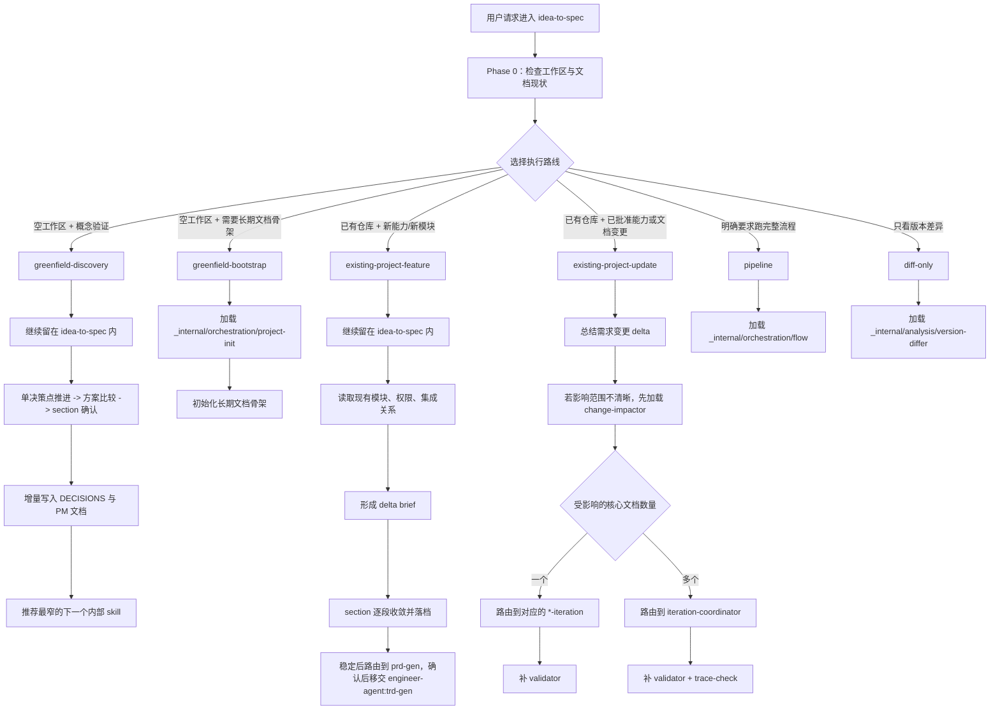

# idea-to-spec

`idea-to-spec` skills 组的公共入口 skill。

`idea-to-spec` 负责接住用户的第一轮诉求，
先判断当前请求属于哪一类，再按需加载 `_internal/` 下最窄的 `INSTRUCTIONS.md` 指令资源。
它同时负责控制功能设计对话的推进方式，而不仅仅是做文档路由。

## 它覆盖什么

- 从零开始的想法探索与验证
- 基于已有项目的新功能规划
- 基于已有文档的变更影响分析与更新编排
- 面向生成、校验、迭代、流程编排的渐进式交接

## 设计协议

对功能设计类请求，`idea-to-spec` 默认采用以下协议：

- 先做工作区与文档上下文检测
- 每个回合只推进一个待确认决策点
- 在关键设计取舍上先给 `2-3` 个备选方案与 trade-off
- 按固定 section 顺序逐段推进
- 已确认决策写入 `docs/pm/{feature_path}/DECISIONS.md`
- 已收敛 section 增量写入 PM 文档
- 每个阶段结束后做一次文档收束，正文只保留当前有效设计
- 写入 PRD/BRD/DECISIONS/design.md 前扫描 `docs/pm/**/PRD.md`，确认最多三级
  `feature_path`；父功能不清楚时先澄清或 blocked，不创建新的并列顶层目录

## 逻辑路线图



## 内部结构

```text
idea-to-spec/
├─ SKILL.md
├─ README.md
└─ _internal/
   ├─ analysis/
   ├─ gen/
   ├─ iteration/
   ├─ orchestration/
   ├─ validator/
   └─ _shared/
```

以下划线开头的目录都视为内部资源。它们由 `idea-to-spec` 按需加载，内部代理指令统一使用
`INSTRUCTIONS.md` 文件名，不应该作为独立 skill 出现在 marketplace 或自动生成的 skill catalog 中。

## 文档输出约定

feature 文档统一采用短命名体系：

- `docs/pm/{feature_path}/DECISIONS.md`
- `docs/pm/{feature_path}/PRD.md`
- `docs/pm/{feature_path}/BRD.md`
- `docs/pm/{feature_path}/design.md`
- `docs/design/{feature_path}/...`
- `docs/engineer/{feature_path}/...`
- `docs/qa/e2e/{一级功能}/{二级功能}/{三级功能}/...`
- `docs/devops/{feature_path}/...`
- `docs/security/{feature_path}/...`

`feature_path` 最多三级；新正式文档 frontmatter 包含 `feature_path`、
`feature`、`parent_feature` 和 `feature_level`。旧单层 PM 文档缺少这些字段时，
读取时兼容为一级功能。

## 安装

本地项目安装：

```bash
cp -r agents/product_manager/skills/idea-to-spec .claude/skills/idea-to-spec
```

全局安装：

```bash
cp -r agents/product_manager/skills/idea-to-spec ~/.claude/skills/idea-to-spec
```
