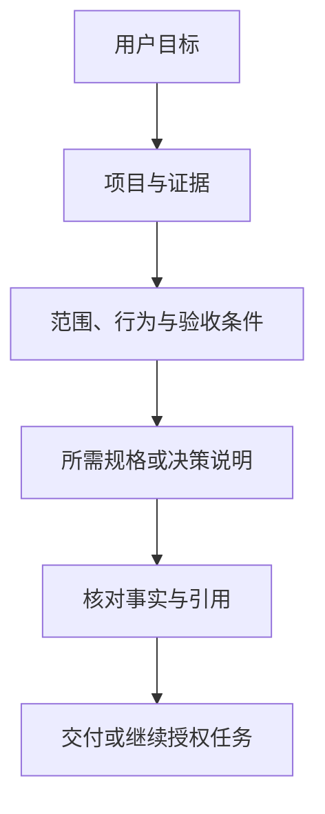

# idea-to-spec

`idea-to-spec` 提供从产品想法到可用规格的专业方法。它适用于第一版产品、已有项目的新功能、需求变更，以及规格整理。当前助手依据用户目标选择必要资料，持续完成授权范围内的工作。

[Skill 入口](./SKILL.md) · [产品能力目录](../../README_zh.md) · [内部资料索引](./_internal/_shared/skill-map.md)

## 它覆盖什么

- 梳理问题、目标用户、核心场景和预期收益。
- 区分第一版范围、后续机会和实际约束。
- 从代码、测试和现有资料理解已有项目的能力与缺口。
- 将需求组织为行为、边界情况和可验证的验收条件。
- 分析文档变更影响，修订已有规格并核对引用。
- 编写 PRD、API、ADR、测试规格或清晰的决策说明。

## 如何使用

```text
/idea-to-spec "为团队任务管理应用梳理第一版目标和验收条件"
/idea-to-spec "根据现有导出实现，整理新增筛选条件的需求"
/idea-to-spec "检查这份产品规格的遗漏，并更新相关章节"
```

已有用户说明、issue、代码、测试和文档都可以作为输入。先核实影响结果的事实；存在重要选择时比较选项、成本和收益。其余细节采用适合项目的合理假设，说明后继续。

## 常见任务与方法

| 任务 | 方法与产物 |
| --- | --- |
| 从想法开始 | 明确问题、受众、关键任务和第一版范围，形成简洁方案 |
| 为已有项目加功能 | 查看现状，描述行为差异、依赖、兼容性和验收条件 |
| 修订规格 | 定位受影响章节与引用，按当前事实增量更新 |
| 比较版本 | 对照两版事实、接口和行为，说明差异与影响 |
| 整理文档树 | 按读者任务归并主题，更新索引和链接 |
| 形成长期规格 | 保存需求、设计选择、验证策略和必要上下文 |

## 工作方式


```mermaid
flowchart TD
    Goal["用户目标"] --> Context["项目与证据"]
    Context --> Shape["范围、行为与验收条件"]
    Shape --> Artifact["所需规格或决策说明"]
    Artifact --> Verify["核对事实与引用"]
    Verify --> Result["交付或继续授权任务"]
```

小任务可以在对话或 PR 中说明需求。涉及长期维护、多组件配合或重要决策时，独立规格便于后续使用。技术设计可结合 `trd-gen`，实现、测试和文档可由当前助手按需要继续。

## 内部资料

```text
idea-to-spec/
  SKILL.md
  README.md
  _internal/
    analysis/
    gen/
    iteration/
    validator/
    _shared/
```

| 目录 | 内容 |
| --- | --- |
| analysis | 变更影响、结构整理、需求追踪和版本比较 |
| gen | PRD、API、ADR、测试规格、图示和报告生成参考 |
| iteration | 需求、技术、接口、决策和测试文档的修订方法 |
| validator | 规格质量与完整性检查 |
| _shared | schema、格式、证据和资料使用参考 |

具体入口见 [资料索引](./_internal/_shared/skill-map.md)。这些文件提供按需读取的细节；注册的 Skill 入口保持为 `idea-to-spec`。

## 文档组织

沿用宿主已有结构。需要持久化时，可参考：

```text
docs/pm/{feature}/
  PRD.md
  DECISIONS.md
docs/engineer/{feature}/
  TRD.md
  API.md
  ADR-001-<topic>.md
```

正文围绕当前问题、用户、行为和验收条件展开。范围与深度根据实际维护价值选择。默认正式规格格式见 [output-conventions.md](./_internal/_shared/output-conventions.md)，其中 `title`、`type` 和 `status` 帮助识别文档；其他元数据按需要维护。

## 安装与维护

通过产品插件安装：

```text
/plugin install pm-agent@dev-agent-skills
```

Codex 安装方式见仓库的安装指南。修改本 Skill 资料后，同步引用与内容哈希，运行仓库和文档检查。直接使用资料时，保持事实、命令、路径与当前项目一致。
