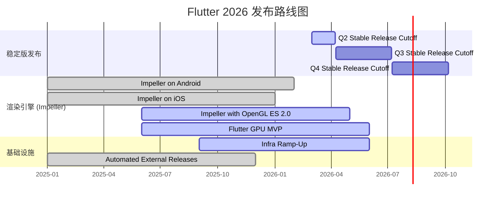

# Flutter 项目路线图

> 基于 [flutter/flutter](https://github.com/flutter/flutter) GitHub 仓库数据自动生成
> 生成日期：2026-03-20 | ⭐ 175,617 Stars | 🍴 30,135 Forks | 📋 12,463 Open Issues

---

## 📊 里程碑总览

| 里程碑 | 状态 | 进度 | 已完成 | 待处理 | 截止日期 |
|--------|------|------|--------|--------|----------|
| [2026] Q2 Stable Release Cutoff | 🟡 进行中 | `████░░░░░░` 12% | 1 | 7 | 2026-04-07 |
| [2026] Q3 Stable Release Cutoff | ⚪ 未开始 | `░░░░░░░░░░` 0% | 0 | 0 | 2026-07-07 |
| [2026] Q4 Stable Release Cutoff | ⚪ 未开始 | `░░░░░░░░░░` 0% | 0 | 0 | 2026-10-06 |
| Flutter GPU MVP | 🟡 进行中 | `██████░░░░` 67% | 8 | 4 | — |
| Impeller on Android | 🟢 完成 | `██████████` 100% | 61 | 0 | — |
| Impeller on iOS | 🟢 完成 | `██████████` 100% | 26 | 0 | — |
| Impeller with OpenGL ES 2.0 | 🟡 进行中 | `█████████░` 90% | 9 | 1 | — |
| Infra Ramp-Up | 🟡 进行中 | `██████░░░░` 58% | 7 | 5 | — |
| Automated External Releases | 🟢 完成 | `██████████` 100% | 2 | 0 | — |

---

## 🗓️ 时间线甘特图

---

## 🚀 第一阶段：当前冲刺（2026 Q2 — 截止 2026-04-07）

### 里程碑：[2026] Q2 Stable Release Cutoff

> 分支点：稳定版发布。进度：**12%**（1/8）
> `████░░░░░░░░░░░░░░░░` 12%

#### 功能特性

| # | 标题 | 优先级 | 状态 |
|---|------|--------|------|
| [#182570](https://github.com/flutter/flutter/issues/182570) | Close all PRs in flutter/flutter that change Material or Cupertino | P1 | 🔴 Open |
| [#182569](https://github.com/flutter/flutter/issues/182569) | Add dependencies to Material and Cupertino pub packages | P2 | 🔴 Open |
| [#182568](https://github.com/flutter/flutter/issues/182568) | Publish (as listed) the Cupertino and Material pub packages | P1 | 🔴 Open |
| [#182567](https://github.com/flutter/flutter/issues/182567) | Move Material and Cupertino samples to flutter/packages | P1 | 🔴 Open |
| [#182566](https://github.com/flutter/flutter/issues/182566) | Move Material to flutter/packages maintaining git history | P1 | 🔴 Open |
| [#182565](https://github.com/flutter/flutter/issues/182565) | Move Cupertino to flutter/packages maintaining git history | P1 | 🔴 Open |

#### 技术债务 / 基础设施

| # | 标题 | 优先级 | 状态 |
|---|------|--------|------|
| [#154652](https://github.com/flutter/flutter/issues/154652) | [Release] Update release note example documentation | P3 | 🔴 Open |

#### 已完成

| # | 标题 | 状态 |
|---|------|------|
| [#182511](https://github.com/flutter/flutter/issues/182511) | Test sub issue please delete | ✅ Closed |

---

## 🔧 第二阶段：渲染引擎演进

### 里程碑：Flutter GPU MVP

> 进度：**67%**（8/12）
> `█████████████░░░░░░░` 67%

#### 待处理

| # | 标题 | 优先级 | 状态 |
|---|------|--------|------|
| [#150953](https://github.com/flutter/flutter/issues/150953) | [Flutter GPU] Design: Improve uniform upload workflow | P2 | 🔴 Open |
| [#145027](https://github.com/flutter/flutter/issues/145027) | [Flutter GPU] Add support for cubemaps | P2 | 🔴 Open |
| [#143893](https://github.com/flutter/flutter/issues/143893) | [Flutter GPU] Add comprehensive docstrings to all public Dart API symbols | P2 | 🔴 Open |
| [#142734](https://github.com/flutter/flutter/issues/142734) | [Flutter GPU] Add an easier interface for packing uniform data types | P3 | 🔴 Open |

#### 已完成

| # | 标题 | 状态 |
|---|------|------|
| [#145011](https://github.com/flutter/flutter/issues/145011) | [Flutter GPU] Vulkan support | ✅ Closed |
| [#144640](https://github.com/flutter/flutter/issues/144640) | [Flutter GPU] Establish a better unittesting scheme | ✅ Closed |
| [#144267](https://github.com/flutter/flutter/issues/144267) | [Flutter GPU] Make the C files not be next to the Dart sources | ✅ Closed |
| [#144265](https://github.com/flutter/flutter/issues/144265) | [Flutter GPU] Create a simple package that demonstrates model rendering | ✅ Closed |
| [#144264](https://github.com/flutter/flutter/issues/144264) | [Flutter GPU] Support resolve textures for MSAA | ✅ Closed |
| [#144259](https://github.com/flutter/flutter/issues/144259) | [Flutter GPU] Add automation to make importing Flutter GPU shaders easy | ✅ Closed |
| [#142731](https://github.com/flutter/flutter/issues/142731) | [Flutter GPU] Add missing stencil configuration | ✅ Closed |
| [#131711](https://github.com/flutter/flutter/issues/131711) | [Flutter GPU] Make Dart source package available through the flutter framework | ✅ Closed |

---

### 里程碑：Impeller with OpenGL ES 2.0

> 进度：**90%**（9/10）
> `██████████████████░░` 90%

#### 待处理

| # | 标题 | 优先级 | 状态 |
|---|------|--------|------|
| [#130048](https://github.com/flutter/flutter/issues/130048) | [Impeller] Discarding stencil attachment on default FBO causes Angle to invalidate color texture | P3 | 🔴 Open |

#### 已完成（9 项）

点击展开已完成项目

| # | 标题 |
|---|------|
| [#157064](https://github.com/flutter/flutter/issues/157064) | [Impeller] Emulate glBlitFramebuffer using shaders for drivers that don't support GLES 3 |
| [#151497](https://github.com/flutter/flutter/issues/151497) | [Impeller] Wire up support in OpenGL for KHR_blend_equation_advanced |
| [#145125](https://github.com/flutter/flutter/issues/145125) | [Impeller] GLES pipeline libraries must ignore all descriptor fields except the shader stages |
| [#142355](https://github.com/flutter/flutter/issues/142355) | [Impeller] Gaussian blurs fail in OpenGL |
| [#141732](https://github.com/flutter/flutter/issues/141732) | [Impeller] Implement mipmap generation for backdrop filters for OpenGLES |
| [#141636](https://github.com/flutter/flutter/issues/141636) | [Impeller] SurfaceTextures created by some critical plugins do not render in OpenGL |
| [#135818](https://github.com/flutter/flutter/issues/135818) | [Impeller] Texture to Texture blits are misconfigured in GLES backend |
| [#120223](https://github.com/flutter/flutter/issues/120223) | [Impeller] Use hardware features to improve performance of advanced blends |
| [#111775](https://github.com/flutter/flutter/issues/111775) | [Impeller] Support gradients with overlapping stops on non-SSBO backends |

---

## ✅ 第三阶段：已完成里程碑

### 里程碑：Impeller on Android

> 进度：**100%**（61/61）— Impeller 渲染引擎在 Android 平台的功能完整性
> `████████████████████` 100%

点击展开关键已完成项目（61 项）

| # | 标题 |
|---|------|
| [#155035](https://github.com/flutter/flutter/issues/155035) | [Impeller] Make a go/no-go call on device-transient texture support for Vulkan eligibility on Android |
| [#152579](https://github.com/flutter/flutter/issues/152579) | [Impeller] AHB sampled textures use nearest sampling instead of linear |
| [#150630](https://github.com/flutter/flutter/issues/150630) | Impeller opt-outs via manifest files are no longer reported to GA4 |
| [#149360](https://github.com/flutter/flutter/issues/149360) | [Impeller] Android: Impeller opt-out via the command-line and manifest options must work |
| [#142082](https://github.com/flutter/flutter/issues/142082) | [Impeller] Support Vulkan YUV texture sampling for composition of video player frames |
| [#134175](https://github.com/flutter/flutter/issues/134175) | [Impeller] Add devicelab test to verify validation layers in debug builds |
| [#132984](https://github.com/flutter/flutter/issues/132984) | [Impeller] Force fallback to OpenGL ES on Android versions < 29 |
| [#132712](https://github.com/flutter/flutter/issues/132712) | Tell Flutter tool that Impeller is enabled by default |
| [#130892](https://github.com/flutter/flutter/issues/130892) | [Impeller] Support Android Platform Views |
| [#130118](https://github.com/flutter/flutter/issues/130118) | [Impeller] Create OpenGL & Vulkan variants of common perf. benchmarks |

*...及其他 51 项已完成任务*

### 里程碑：Impeller on iOS

> 进度：**100%**（26/26）— Impeller 渲染引擎在 iOS 平台的功能完整性
> `████████████████████` 100%

点击展开关键已完成项目（26 项）

| # | 标题 |
|---|------|
| [#124269](https://github.com/flutter/flutter/issues/124269) | [Impeller] Image loading error after suspending an iOS app that renders a large animated image |
| [#123027](https://github.com/flutter/flutter/issues/123027) | [Impeller] Failure on image load in a background worker thread |
| [#122406](https://github.com/flutter/flutter/issues/122406) | [Impeller] Investigate increased measured memory footprint |
| [#122223](https://github.com/flutter/flutter/issues/122223) | [Impeller] On iOS, make Impeller on by default with an opt-out |
| [#119810](https://github.com/flutter/flutter/issues/119810) | [Impeller] StrokeCap.round only round on one side |
| [#119805](https://github.com/flutter/flutter/issues/119805) | [Impeller] Incorrect Arabic Text Rendering |
| [#119489](https://github.com/flutter/flutter/issues/119489) | [Impeller] Text glyphs get transformed incorrectly when drawing with some font weights |
| [#118613](https://github.com/flutter/flutter/issues/118613) | [Impeller] Fonts are blurry |
| [#113110](https://github.com/flutter/flutter/issues/113110) | [Impeller] Implement two-point conical gradient |

*...及其他 17 项已完成任务*

---

## 🏗️ 第四阶段：基础设施建设

### 里程碑：Infra Ramp-Up

> 进度：**58%**（7/12）
> `████████████░░░░░░░░` 58%

#### 待处理

| # | 标题 | 优先级 | 状态 |
|---|------|--------|------|
| [#175368](https://github.com/flutter/flutter/issues/175368) | Provide a way to cancel queued builds (not running) | P2 | 🔴 Open |
| [#169142](https://github.com/flutter/flutter/issues/169142) | `{PLAT} packaging_release_builder` times in Cocoon are horribly wrong | P2 | 🔴 Open |
| [#168987](https://github.com/flutter/flutter/issues/168987) | Make `checkRunGuard` a non-`String` object | P2 | 🔴 Open |
| [#166477](https://github.com/flutter/flutter/issues/166477) | We need alerting when a scheduled Cloud Build (deployment) fails | P2 | 🔴 Open |
| [#162656](https://github.com/flutter/flutter/issues/162656) | Allow re-opening PRs instead of failing with an error | P2 | 🔴 Open |

#### 已完成（7 项）

点击展开已完成项目

| # | 标题 |
|---|------|
| [#172984](https://github.com/flutter/flutter/issues/172984) | Don't run / cancel tests on closed PRs |
| [#172245](https://github.com/flutter/flutter/issues/172245) | Broken tree-status on `master` blocks release branch PRs |
| [#170476](https://github.com/flutter/flutter/issues/170476) | Disallow merging PRs where the base is older than 1 week |
| [#169108](https://github.com/flutter/flutter/issues/169108) | Cleanup and make explicit the `flutter/docs` recipe and related tools |
| [#169089](https://github.com/flutter/flutter/issues/169089) | Switching from `master` -> other branch initially shows wrong commits |
| [#168984](https://github.com/flutter/flutter/issues/168984) | Update LUCI recipes to run/display sub-builds in a more human-readable way |
| [#166466](https://github.com/flutter/flutter/issues/166466) | Add a `/api/vacuum-stale-mq`-like batch job to fix stuck merge queue guards |

---

## 📋 待办事项（无里程碑）

### 功能特性请求

| # | 标题 | 优先级 | 标签 |
|---|------|--------|------|
| [#183817](https://github.com/flutter/flutter/issues/183817) | [Impeller] Support GL_TEXTURE_EXTERNAL_OES in Embedder Texture | — | engine, e: impeller |
| [#183560](https://github.com/flutter/flutter/issues/183560) | Support undecorated windows on macOS | — | platform-macos |
| [#183559](https://github.com/flutter/flutter/issues/183559) | Support undecorated windows on Windows | — | platform-windows |
| [#183558](https://github.com/flutter/flutter/issues/183558) | Support undecorated windows on Linux | P3 | platform-linux |
| [#183557](https://github.com/flutter/flutter/issues/183557) | Add API to enable undecorated windows | P2 | framework |
| [#183556](https://github.com/flutter/flutter/issues/183556) | Support undecorated windows | P2 | framework, platform-windows, platform-linux, platform-macos |
| [#183439](https://github.com/flutter/flutter/issues/183439) | [google_maps_flutter] Support EdgeInsets in CameraUpdate.newLatLngBounds | P2 | p: maps, package |
| [#183229](https://github.com/flutter/flutter/issues/183229) | [camera] Add API to control JPEG compression quality | P2 | p: camera, platform-android, platform-ios |
| [#183185](https://github.com/flutter/flutter/issues/183185) | Ban HTTP on iOS and Android platforms by default (again) | P2 | engine, platform-android, platform-ios |
| [#182936](https://github.com/flutter/flutter/issues/182936) | [Proposal] Add alignment to SliverConstrainedCrossAxis | P3 | framework, f: scrolling |
| [#182890](https://github.com/flutter/flutter/issues/182890) | Add scrollPadding property to DropdownMenu | P3 | framework, f: material design |
| [#182735](https://github.com/flutter/flutter/issues/182735) | Flutter Web: Add true SPA routing with state preservation | P2 | platform-web |
| [#182724](https://github.com/flutter/flutter/issues/182724) | RemoteFlutterWidgets: Make Icon optional to enable tree shaking | — | package |
| [#182694](https://github.com/flutter/flutter/issues/182694) | [mustache_template] Add support for ~inheritance optional specification | P3 | package |
| [#182532](https://github.com/flutter/flutter/issues/182532) | Support for Custom/Extended WidgetState Values | P3 | framework |

### 技术债务

| # | 标题 | 优先级 | 标签 |
|---|------|--------|------|
| [#182978](https://github.com/flutter/flutter/issues/182978) | SemanticsHandle dispose should be called in addTearDown | P3 | framework |
| [#182032](https://github.com/flutter/flutter/issues/182032) | [two_dimensional_scrollables] Migrate cacheExtent | P2 | package |
| [#181090](https://github.com/flutter/flutter/issues/181090) | Deduplicate "TestPage" implementations in widget tests | P2 | framework, f: material design |
| [#181052](https://github.com/flutter/flutter/issues/181052) | Update Flutter Module Templates to Use Declarative Apply | P2 | platform-android, tool |
| [#179631](https://github.com/flutter/flutter/issues/179631) | Stop generating Windows IA32 binaries to target Android | P2 | platform-android, platform-windows |
| [#178120](https://github.com/flutter/flutter/issues/178120) | [vector_graphics] `scaled` and `translate` are deprecated | — | package |
| [#177517](https://github.com/flutter/flutter/issues/177517) | `fetch flutter` from depot_tools is outdated | P2 | engine |
| [#177271](https://github.com/flutter/flutter/issues/177271) | [packages] Add deprecation notes to deprecated platform interface methods | P2 | package |
| [#175816](https://github.com/flutter/flutter/issues/175816) | Consider using ffigen for dart ui ffi code | P2 | framework |
| [#175623](https://github.com/flutter/flutter/issues/175623) | AccessibilityBridge in Android needs to use `BreakIterator` | P2 | platform-android, engine |
| [#174665](https://github.com/flutter/flutter/issues/174665) | Update the Angle dependency to address warnings with C++20 | P2 | engine |
| [#174233](https://github.com/flutter/flutter/issues/174233) | Make userData.check_suite_id not nullable | P2 | team-infra |
| [#174148](https://github.com/flutter/flutter/issues/174148) | Remove legacy build cache for `gradle` | P1 | team-infra |
| [#174147](https://github.com/flutter/flutter/issues/174147) | Remove `caches = ci_yaml.legacy_swarming_caches` | P2 | team-infra |
| [#173589](https://github.com/flutter/flutter/issues/173589) | [Impeller]: Switch PowerVR block from allowlist to denylist | P2 | e: impeller |

---

## 🔄 近期合并的重要 PR

| # | 标题 | 合并日期 |
|---|------|----------|
| [#183288](https://github.com/flutter/flutter/pull/183288) | [Impeller] Do not wait for a frame's acquire fence if the frame was never presented | 2026-03-06 |
| [#182661](https://github.com/flutter/flutter/pull/182661) | [ios][engine] Fix keyboard flicker when switching text fields | 2026-03-12 |
| [#183851](https://github.com/flutter/flutter/pull/183851) | Update CHANGELOG for Flutter 3.41.5 release | 2026-03-18 |

---

## 📈 项目健康度指标

| 指标 | 数值 |
|------|------|
| GitHub Stars | 175,617 |
| Forks | 30,135 |
| Open Issues | 12,463 |
| 活跃里程碑 | 6 个（3 个有截止日期） |
| 已完成里程碑 | 3 个（Impeller Android/iOS, Automated External Releases） |
| 下一个截止日期 | 2026-04-07（Q2 Stable Release Cutoff） |

---

## 📌 关键风险与关注点

1. **Q2 稳定版发布风险**：截止日期为 2026-04-07，但当前仅完成 12%（1/8），且 6 个待处理 Issue 均为 P1 优先级（Material/Cupertino 包迁移至 flutter/packages）。需密切关注进度。
2. **Flutter GPU MVP**：4 个待处理 Issue 涉及 API 文档和核心功能（cubemap 支持、uniform 上传工作流），需在 GPU 功能正式发布前完成。
3. **基础设施**：Infra Ramp-Up 里程碑仍有 5 个 P2 Issue 待处理，涉及构建取消、告警和 PR 管理等关键 CI/CD 能力。
4. **技术债务积累**：多个 P1/P2 技术债务 Issue 尚未分配里程碑，包括 Gradle 缓存清理（[#174148](https://github.com/flutter/flutter/issues/174148)）等影响开发体验的问题。

---

*本路线图基于 GitHub API 数据自动生成，反映截至 2026-03-20 的项目状态。*
