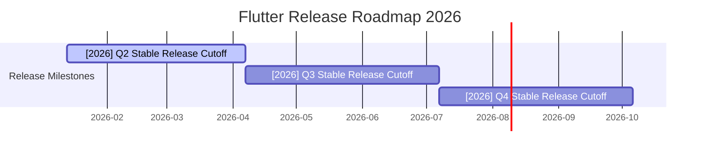

# Flutter Project Roadmap

> **Repository:** [flutter/flutter](https://github.com/flutter/flutter)
> **Generated:** 2026-03-20
> **Source:** GitHub Milestones, Issues, and PRs via `gh` CLI

---

## 🔴 当前冲刺 (Current Sprint)

> Milestones due within 30 days or past due with open issues.

---

### [2026] Q2 Stable Release Cutoff
**Milestone:** [#83](https://github.com/flutter/flutter/milestone/83) | **Due:** 2026-04-07 | **Progress:** 1/8 closed

`█░░░░░░░░░░░░░░░` 12%

> Branching point for the stable release.

- [ ] [#182570 Close all PRs in flutter/flutter that change Material or Cupertino](https://github.com/flutter/flutter/issues/182570)
- [ ] [#182569 Add dependencies to Material and Cupertino pub packages](https://github.com/flutter/flutter/issues/182569)
- [ ] [#182568 Publish (as listed) the Cupertino and Material pub packages](https://github.com/flutter/flutter/issues/182568)
- [ ] [#182567 Move Material and Cupertino samples to flutter/packages](https://github.com/flutter/flutter/issues/182567)
- [ ] [#182566 Move Material to flutter/packages maintaining git history](https://github.com/flutter/flutter/issues/182566)
- [ ] [#182565 Move Cupertino to flutter/packages maintaining git history](https://github.com/flutter/flutter/issues/182565)
- [ ] [#154652 [Release] Update release note example documentation](https://github.com/flutter/flutter/issues/154652) @itsjustkevin
- [x] [#182511 Test sub issue please delete](https://github.com/flutter/flutter/issues/182511)

---

## 🟡 近期计划 (Near-term)

> Milestones due 31–90 days out.

*(No milestones with due dates fall in the 31–90 day window.)*

---

## 🔵 远期规划 (Long-term)

> Milestones due 90+ days out.

---

### [2026] Q3 Stable Release Cutoff
**Milestone:** [#84](https://github.com/flutter/flutter/milestone/84) | **Due:** 2026-07-07 | **Progress:** 0/0

`░░░░░░░░░░░░░░░░` 0%

> Branching point for the stable release.

暂无关联 issue

---

### [2026] Q4 Stable Release Cutoff
**Milestone:** [#85](https://github.com/flutter/flutter/milestone/85) | **Due:** 2026-10-06 | **Progress:** 0/0

`░░░░░░░░░░░░░░░░` 0%

> Branching point for the stable release.

暂无关联 issue

---

## ⚪ 未排期 (Unscheduled)

> Milestones with no due date.

---

### Impeller on Android
**Milestone:** [#76](https://github.com/flutter/flutter/milestone/76) | **Due:** No due date | **Progress:** 61/61 closed

`████████████████` 100%

> Impeller Feature Completeness on Android.

- [x] [#155035 [Impeller] Make a go/no-go call on device-transient texture support for Vulkan eligibility on Android](https://github.com/flutter/flutter/issues/155035)
- [x] [#152579 [Impeller] AHB sampled textures use nearest sampling instead of linear](https://github.com/flutter/flutter/issues/152579) @chinmaygarde
- [x] [#150630 Impeller opt-outs via manifest files are no longer reported to GA4](https://github.com/flutter/flutter/issues/150630)
- [x] [#149360 [Impeller] Android: Impeller opt-out via the command-line and manifest options must work](https://github.com/flutter/flutter/issues/149360) @chinmaygarde
- [x] [#142082 [Impeller] Support Vulkan YUV texture sampling for composition of video player frames](https://github.com/flutter/flutter/issues/142082) @chinmaygarde
- [x] [#134175 [Impeller] Add devicelab test to verify validation layers in debug builds](https://github.com/flutter/flutter/issues/134175)
- [x] [#132984 [Impeller] Force fallback to OpenGL ES on Android versions < 29](https://github.com/flutter/flutter/issues/132984) @dnfield
- [x] [#132712 Tell Flutter tool that Impeller is enabled by default](https://github.com/flutter/flutter/issues/132712) @chinmaygarde
- [x] [#131730 [Impeller] Hybrid composition requires synchronous presentation in Vulkan backend](https://github.com/flutter/flutter/issues/131730)
- [x] [#131518 [Impeller] Audit existing shaders to see if there are opportunities to avoid uniform computation](https://github.com/flutter/flutter/issues/131518)
- [x] [#131515 [Impeller] Implement pooling of render target textures](https://github.com/flutter/flutter/issues/131515)
- [x] [#130892 [Impeller] Support Android Platform Views](https://github.com/flutter/flutter/issues/130892) @johnmccutchan
- [x] [#130118 [Impeller] Create OpenGL & Vulkan variants of common perf. benchmarks](https://github.com/flutter/flutter/issues/130118) @gaaclarke
- [x] [#130045 [Impeller] OpenGL: Support offscreen MSAA](https://github.com/flutter/flutter/issues/130045) @matanlurey
- [x] [#129853 [Impeller] Texture to Texture blit for advanced blends is misconfigured on Vulkan](https://github.com/flutter/flutter/issues/129853) @chinmaygarde
- [x] [#129774 [Impeller] Swapchain re-creation has unresolved issues on some non-ARM devices](https://github.com/flutter/flutter/issues/129774) @matanlurey
- [x] [#129737 [Impeller] Vulkan: Clearing signaled fences and calling dtors stalls fence waiter](https://github.com/flutter/flutter/issues/129737)
- [x] [#129660 [Impeller] Be smarter about Vulkan pipeline cache persistence](https://github.com/flutter/flutter/issues/129660)
- [x] [#129659 [Impeller] Compiler does not generate a runtime stage with valid SPIR-V with --runtime-stage-vulkan](https://github.com/flutter/flutter/issues/129659) @dnfield
- [x] [#129461 [Impeller] Swapchain acquisition can time out on S10](https://github.com/flutter/flutter/issues/129461)
> *(61 issues total; showing 20 most recent)*

---

### Impeller on iOS
**Milestone:** [#77](https://github.com/flutter/flutter/milestone/77) | **Due:** No due date | **Progress:** 26/26 closed

`████████████████` 100%

> Impeller Feature Completeness on iOS.

- [x] [#124269 [Impeller] Image loading error after suspending an iOS app that renders a large animated image](https://github.com/flutter/flutter/issues/124269) @dnfield
- [x] [#123027 [Impeller] Failure on image load in a background worker thread](https://github.com/flutter/flutter/issues/123027) @chinmaygarde
- [x] [#122406 [Impeller] Investigate increased measured memory footprint](https://github.com/flutter/flutter/issues/122406) @jonahwilliams
- [x] [#122223 [Impeller] On iOS, make Impeller on by default with an opt-out](https://github.com/flutter/flutter/issues/122223) @jonahwilliams
- [x] [#121893 [Impeller] Incorrect Transform.scale child position when setting filterQuality](https://github.com/flutter/flutter/issues/121893) @ColdPaleLight
- [x] [#121887 [Impeller] Inconsistent Transform.scale Text Rendering](https://github.com/flutter/flutter/issues/121887) @bdero
- [x] [#121531 [Impeller] Subtle pixel shifts in text during page transitions](https://github.com/flutter/flutter/issues/121531) @bdero
- [x] [#121128 [Impeller] Emojis become black occasionally](https://github.com/flutter/flutter/issues/121128) @jonahwilliams
- [x] [#120879 [Impeller] Matrix4 rotate not working correctly](https://github.com/flutter/flutter/issues/120879) @ColdPaleLight
- [x] [#120272 Transform Widget not working correctly with Impeller enable](https://github.com/flutter/flutter/issues/120272) @luckysmg
- [x] [#120220 [Impeller] iOS crashed with SIGABRT when `ClipPath` is used](https://github.com/flutter/flutter/issues/120220) @bdero
- [x] [#120003 [Impeller] Paint()..shader does't work in TextStyle](https://github.com/flutter/flutter/issues/120003) @jonahwilliams
- [x] [#119810 [Impeller] StrokeCap.round only round on one side](https://github.com/flutter/flutter/issues/119810) @luckysmg
- [x] [#119805 [Impeller] Incorrect Arabic Text Rendering](https://github.com/flutter/flutter/issues/119805) @bdero
- [x] [#119672 [Impeller] draw emojis without alpha](https://github.com/flutter/flutter/issues/119672) @jonahwilliams
- [x] [#119489 [Impeller] Text glyphs get transformed incorrectly when drawing with some font weights](https://github.com/flutter/flutter/issues/119489) @bdero
- [x] [#119234 [Impeller] Different text weight vs Skia](https://github.com/flutter/flutter/issues/119234) @bdero
- [x] [#118945 [Impeller] Canvas.drawArc with large stroke width has closing artifacts](https://github.com/flutter/flutter/issues/118945) @bdero
- [x] [#118847 [Impeller] Float samplers can get re-ordered compared to SkSL](https://github.com/flutter/flutter/issues/118847) @jonahwilliams
- [x] [#118613 [Impeller] fonts are blurry](https://github.com/flutter/flutter/issues/118613) @bdero
> *(26 issues total; showing 20 most recent)*

---

### Automated External Releases
**Milestone:** [#78](https://github.com/flutter/flutter/milestone/78) | **Due:** No due date | **Progress:** 2/2 closed

`████████████████` 100%

- [x] [#128821 [Release] Cherry-pick issues should be validated](https://github.com/flutter/flutter/issues/128821) @itsjustkevin

---

### Flutter GPU MVP
**Milestone:** [#80](https://github.com/flutter/flutter/milestone/80) | **Due:** No due date | **Progress:** 8/12 closed

`██████████░░░░░░` 66%

- [ ] [#150953 [Flutter GPU] Design: Improve uniform upload workflow](https://github.com/flutter/flutter/issues/150953) @bdero
- [ ] [#145027 [Flutter GPU] Add support for cubemaps](https://github.com/flutter/flutter/issues/145027)
- [x] [#145011 [Flutter GPU] Vulkan support](https://github.com/flutter/flutter/issues/145011) @bdero
- [x] [#144640 [Flutter GPU] Establish a better unittesting scheme to cover API behavior changes](https://github.com/flutter/flutter/issues/144640) @bdero
- [x] [#144267 [Flutter GPU] Make the C files not be next to the Dart sources to make it easier to copy as a package](https://github.com/flutter/flutter/issues/144267) @bdero
- [x] [#144265 [Flutter GPU] Create a simple package that demonstrates model rendering using Flutter GPU](https://github.com/flutter/flutter/issues/144265) @bdero
- [x] [#144264 [Flutter GPU] Support resolve textures for MSAA](https://github.com/flutter/flutter/issues/144264) @bdero
- [x] [#144259 [Flutter GPU] Add automation to make importing Flutter GPU shaders easy](https://github.com/flutter/flutter/issues/144259) @bdero
- [ ] [#143893 [Flutter GPU] Add comprehensive docstrings to all public Dart API symbols](https://github.com/flutter/flutter/issues/143893)
- [ ] [#142734 [Flutter GPU] Add an easier interface for packing uniform data types](https://github.com/flutter/flutter/issues/142734)
- [x] [#142731 [Flutter GPU] Add missing stencil configuration](https://github.com/flutter/flutter/issues/142731)
- [x] [#131711 [Flutter GPU] Make Dart source package developed in flutter/engine available through the flutter framework](https://github.com/flutter/flutter/issues/131711) @bdero

---

### Impeller with OpenGL ES 2.0
**Milestone:** [#81](https://github.com/flutter/flutter/milestone/81) | **Due:** No due date | **Progress:** 9/10 closed

`██████████████░░` 90%

- [x] [#157064 [Impeller] Emulate glBlitFramebuffer using shaders for drivers that don't support GLES 3](https://github.com/flutter/flutter/issues/157064)
- [x] [#151497 [Impeller] Wire up support in OpenGL for KHR_blend_equation_advanced](https://github.com/flutter/flutter/issues/151497)
- [x] [#145125 [Impeller] GLES pipeline libraries must ignore all descriptor fields except the shader stages](https://github.com/flutter/flutter/issues/145125) @chinmaygarde
- [x] [#142355 [Impeller] guassian blurs fail in opengl](https://github.com/flutter/flutter/issues/142355)
- [x] [#141732 [Impeller] Implement mipmap generation for backdrop filters for opengles](https://github.com/flutter/flutter/issues/141732)
- [x] [#141636 [Impeller] `SurfaceTexture`s created by some critical plugins do not render in OpenGL](https://github.com/flutter/flutter/issues/141636)
- [x] [#135818 [Impeller] Texture to Texture blits are misconfigured in GLES backend](https://github.com/flutter/flutter/issues/135818) @jonahwilliams
- [ ] [#130048 [Impeller] Discarding stencil attachment on default FBO causes Angle to invalidate color texture](https://github.com/flutter/flutter/issues/130048)
- [x] [#120223 [Impeller] ☂️ Use hardware features to improve performance of advanced blends](https://github.com/flutter/flutter/issues/120223)
- [x] [#111775 [Impeller] Support gradients with overlapping stops on non-SSBO backends](https://github.com/flutter/flutter/issues/111775) @flar

---

### Infra Ramp-Up
**Milestone:** [#82](https://github.com/flutter/flutter/milestone/82) | **Due:** No due date | **Progress:** 7/12 closed

`█████████░░░░░░░` 58%

- [ ] [#175368 Provide a way to cancel queued builds (not running)](https://github.com/flutter/flutter/issues/175368)
- [x] [#172984 Don't run / cancel tests on closed PRs](https://github.com/flutter/flutter/issues/172984) @ievdokdm
- [x] [#172245 Broken tree-status on `master` blocks release branch PRs](https://github.com/flutter/flutter/issues/172245)
- [x] [#170476 Disallow merging PRs where the (`base`?) is older than 1 week](https://github.com/flutter/flutter/issues/170476) @ievdokdm
- [ ] [#169142 `{PLAT} packaging_release_builder` times in Cocoon are horribly wrong](https://github.com/flutter/flutter/issues/169142)
- [x] [#169108 Cleanup and make explicit the `flutter/docs` recipe and related tools](https://github.com/flutter/flutter/issues/169108) @ievdokdm
- [x] [#169089 Switching from `master` -> other branch initially shows wrong commits](https://github.com/flutter/flutter/issues/169089)
- [ ] [#168987 Make `checkRunGuard` a non-`String` object](https://github.com/flutter/flutter/issues/168987)
- [x] [#168984 Update LUCI recipes to run/display sub-builds in a more human-readable way](https://github.com/flutter/flutter/issues/168984) @ievdokdm
- [ ] [#166477 We need alerting when a scheduled Cloud Build (deployment) fails](https://github.com/flutter/flutter/issues/166477)
- [x] [#166466 Add a `/api/vacuum-stale-mq`-like batch job to fix stuck merge queue guards](https://github.com/flutter/flutter/issues/166466) @ievdokdm
- [ ] [#162656 Allow re-opening PRs instead of failing with an error](https://github.com/flutter/flutter/issues/162656)

---

## ✅ 已完成 (Completed Milestones)

> Recently closed milestones.

| Milestone | Closed Issues | Closed At |
|-----------|--------------|-----------|
| [Declined Customer Request](https://github.com/flutter/flutter/milestone/32) | 20 | 2022-01-21 |
| [Next](https://github.com/flutter/flutter/milestone/12) | 26 | 2016-08-01 |
| [Unassigned customer work](https://github.com/flutter/flutter/milestone/31) | 24 | 2022-01-21 |
| [July Beta Release (1.32)](https://github.com/flutter/flutter/milestone/70) | 5 | 2022-01-21 |
| [June Beta Release (1.31)](https://github.com/flutter/flutter/milestone/71) | 0 | 2022-01-21 |

---

## 📋 Backlog

> Open issues with no milestone (most recent 20 of many).

- [ ] [#183918 [tool_crash] FileSystemException: Failed to decode data using encoding 'utf-8', null](https://github.com/flutter/flutter/issues/183918)
- [ ] [#183911 Share view shaders in Linux embedder](https://github.com/flutter/flutter/issues/183911)
- [ ] [#183910 [AGP 9] Add `android.builtInKotlin=false` Flag By Default](https://github.com/flutter/flutter/issues/183910) @jesswrd
- [ ] [#183909 [AGP 9] Add Support for Built-in Kotlin in FGP](https://github.com/flutter/flutter/issues/183909) @jesswrd
- [ ] [#183904 Proposal: SelectionGroup — generic selection and focus management for grouped widgets (TV, desktop, keyboard navigation)](https://github.com/flutter/flutter/issues/183904)
- [ ] [#183902 Debug builds unusable for diagnosing untethered-only crashes (iOS 14+ JIT restriction)](https://github.com/flutter/flutter/issues/183902)
- [ ] [#183900 SIGSEGV in VSyncClient initWithTaskRunner on iOS 26.4 beta — race condition in implicit engine flow](https://github.com/flutter/flutter/issues/183900)
- [ ] [#183898 Implement Job Filtering](https://github.com/flutter/flutter/issues/183898) @ievdokdm
- [ ] [#183894 [HCPP] Loupe does not capture some flutter content](https://github.com/flutter/flutter/issues/183894)
- [ ] [#183892 [google_maps_flutter] Revisit advanced marker support query/enabling flow](https://github.com/flutter/flutter/issues/183892)
- [ ] [#183884 CustomPainter: saveLayer with ImageFilter.blur gives unexpected offset from the edge](https://github.com/flutter/flutter/issues/183884)
- [ ] [#183882 [Web]: Tooltips on ListTiles of ListView are appeared too quickly](https://github.com/flutter/flutter/issues/183882)
- [ ] [#183881 "write access" is not found in the contribution access rules](https://github.com/flutter/flutter/issues/183881)
- [ ] [#183880 [camera_android_camerax]Errors when recording videos and changing the app's lifecycle](https://github.com/flutter/flutter/issues/183880)
- [ ] [#183878 [Web] Cannot scroll ListView when mouse is over the tooltip](https://github.com/flutter/flutter/issues/183878)
- [ ] [#183877 My device's info is XiaoMi 15、Hyper OS3.0 、android 16](https://github.com/flutter/flutter/issues/183877)
- [ ] [#183874 [tool_crash] FileSystemException: Cannot create file, OS Error](https://github.com/flutter/flutter/issues/183874)
- [ ] [#183872 Dart Analyzer freezes Android Studio permanently in specific file](https://github.com/flutter/flutter/issues/183872)
- [ ] [#183869 Linux: `Gdk-CRITICAL: gdk_device_get_source: assertion 'GDK_IS_DEVICE (device)' failed`](https://github.com/flutter/flutter/issues/183869)
- [ ] [#183860 [packages] Enable `unintended_html_in_doc_comment`](https://github.com/flutter/flutter/issues/183860) @stuartmorgan-g

> *(Showing 20 of many open backlog issues)*

---

## Timeline (Mermaid Gantt)

> Only milestones with due dates are shown.

---

*Generated by roadmap-generator skill on 2026-03-20. Data sourced from [flutter/flutter](https://github.com/flutter/flutter) GitHub repository.*
