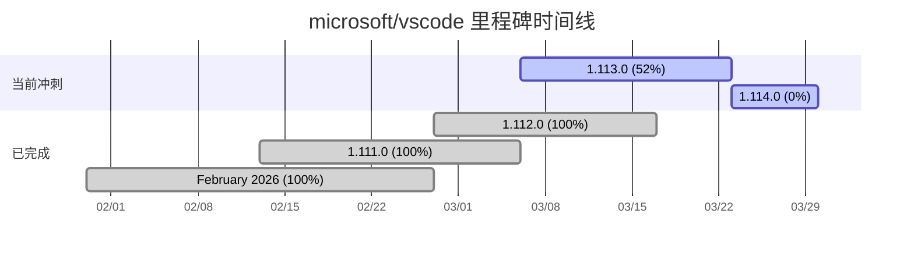

# 🗺️ Roadmap — microsoft/vscode

> **Visual Studio Code**
> 🔗 https://github.com/microsoft/vscode
> 📅 生成时间：2026-03-20

---

## 🔴 当前冲刺

### 1.113.0

📅 截止日期：2026-03-23
📊 进度：306 / 588 (52%)

`████████░░░░░░░░` 52%

> ⚠️ 该里程碑包含 588 个 issue（282 个未关闭），仅显示统计摘要。

| 状态 | 数量 |
|------|------|
| ✅ 已关闭 | 306 |
| 🔲 未关闭 | 282 |
| 合计 | 588 |

---

### 1.114.0

📅 截止日期：2026-03-30
📊 进度：0 / 7 (0%)

`░░░░░░░░░░░░░░░░` 0%

- [ ] [#302215 /troubleshoot relies on independent log flush](https://github.com/microsoft/vscode/issues/302215) — @pwang347 @vijayupadya
- [ ] [#302181 Skills duplication when 'Agent Skills Location' overlaps with 'Plugin Locations'](https://github.com/microsoft/vscode/issues/302181) — @aeschli @pwang347
- [ ] [#302052 Support Gemini 3.1 Pro to BYOK Models in GitHub Copilot](https://github.com/microsoft/vscode/issues/302052) — @vijayupadya
- [ ] [#301758 Chats in Editor are not able get Debug Logs](https://github.com/microsoft/vscode/issues/301758) — @pwang347 @vijayupadya
- [ ] [#301690 Tool conflict between MCP and built-in tools](https://github.com/microsoft/vscode/issues/301690) — @connor4312
- [ ] [#301538 chat debug event log: repeated entries](https://github.com/microsoft/vscode/issues/301538) — @pwang347 @vijayupadya
- [ ] 暂缺第 7 个 issue（API 返回 6 条，可能有 1 条为 PR）

---

## ⚪ 未排期

### Backlog

📊 进度：10758 / 16283 (66%)

`██████████░░░░░░` 66%

> ⚠️ 该里程碑包含 16283 个 issue（5525 个未关闭），仅显示统计摘要。

| 状态 | 数量 |
|------|------|
| ✅ 已关闭 | 10758 |
| 🔲 未关闭 | 5525 |
| 合计 | 16283 |

---

### On Deck

📊 进度：1056 / 2054 (51%)

`████████░░░░░░░░` 51%

> ⚠️ 该里程碑包含 2054 个 issue（998 个未关闭），仅显示统计摘要。

| 状态 | 数量 |
|------|------|
| ✅ 已关闭 | 1056 |
| 🔲 未关闭 | 998 |
| 合计 | 2054 |

---

### Backlog Candidates

📊 进度：6338 / 6499 (97%)

`███████████████░` 97%

> ⚠️ 该里程碑包含 6499 个 issue（161 个未关闭），仅显示统计摘要。

| 状态 | 数量 |
|------|------|
| ✅ 已关闭 | 6338 |
| 🔲 未关闭 | 161 |
| 合计 | 6499 |

---

## ✅ 已完成（最近 5 个）

### 1.112.0

📅 截止日期：2026-03-17
📊 进度：588 / 588 (100%)

`████████████████` 100%

> ⚠️ 该里程碑包含 588 个已关闭 issue，仅显示统计摘要。

---

### 1.111.0

📅 截止日期：2026-03-06
📊 进度：478 / 478 (100%)

`████████████████` 100%

> ⚠️ 该里程碑包含 478 个已关闭 issue，仅显示统计摘要。

---

### February 2026

📅 截止日期：2026-02-27
📊 进度：2068 / 2068 (100%)

`████████████████` 100%

> ⚠️ 该里程碑包含 2068 个已关闭 issue，仅显示统计摘要。

---

### January 2026 Chat Recovery 8

📅 截止日期：2026-02-20
📊 进度：2 / 2 (100%)

`████████████████` 100%

暂无关联 issue（仅 2 个已关闭 issue）

---

### January 2026 Chat Recovery 6

📅 截止日期：2026-02-19
📊 进度：0 / 0 (100%)

`████████████████` 100%

暂无关联 issue

---

## 📋 Backlog（无里程碑）

> 共 7415 个未关闭 issue 未分配里程碑，以下展示最近 20 个：

- [ ] [#303279 Add block-no-verify PreToolUse hook to .claude/settings.json](https://github.com/microsoft/vscode/issues/303279)
- [ ] [#303278 .agent.md vscode terminal issues/problems](https://github.com/microsoft/vscode/issues/303278)
- [ ] [#303272 I buyed so many times copilot, i want my money.](https://github.com/microsoft/vscode/issues/303272) — @lszomoru
- [ ] [#303265 terminal output is missing when using Copilot CLI](https://github.com/microsoft/vscode/issues/303265) — @DonJayamanne
- [ ] [#303264 \[Regression\] .instructions.md, agents, and skills discovery broken after Insiders update — only hooks load](https://github.com/microsoft/vscode/issues/303264) — @aeschli
- [ ] [#303260 ps terminal spam](https://github.com/microsoft/vscode/issues/303260) — @Tyriar @meganrogge
- [ ] [#303257 Timeline: operator precedence bug in pageSize calculation causes ~24x over-fetch](https://github.com/microsoft/vscode/issues/303257) — @lramos15
- [ ] [#303251 Terminal background color from workbench.colorCustomizations ignored when moved to new window (v1.112.0, Linux)](https://github.com/microsoft/vscode/issues/303251) — @dmitrivMS
- [ ] [#303248 Rate Limits](https://github.com/microsoft/vscode/issues/303248) — @osortega
- [ ] [#303246 terminal.background in workbench.colorCustomizations ignored for light-base themes in 1.111.0 on macOS](https://github.com/microsoft/vscode/issues/303246) — @amunger
- [ ] [#303241 ERR_CONNECTION_RESET: response is not come with this log](https://github.com/microsoft/vscode/issues/303241)
- [ ] [#303239 Open file automatically adding to contexted files](https://github.com/microsoft/vscode/issues/303239) — @lramos15
- [ ] [#303238 Please no more Copilot shit](https://github.com/microsoft/vscode/issues/303238) — @mjbvz
- [ ] [#303237 gimme a rate limit error](https://github.com/microsoft/vscode/issues/303237) — @lszomoru
- [ ] [#303236 New VSCode Themes - Colors do not match demostration](https://github.com/microsoft/vscode/issues/303236) — @aeschli
- [ ] [#303235 Chat: Keep all Chat Edits, not usable/ discoverable unless specific tab is open](https://github.com/microsoft/vscode/issues/303235) — @alexr00
- [ ] [#303232 Inline chat affordance set to "gutter" not clickable](https://github.com/microsoft/vscode/issues/303232) — @chrmarti
- [ ] [#303231 No upgrade flow for no-auth users](https://github.com/microsoft/vscode/issues/303231) — @sandy081
- [ ] [#303230 Erro do Servidor](https://github.com/microsoft/vscode/issues/303230) — @meganrogge
- [ ] [#303229 No prompt is being validated and worked on. Chat debug shows models not being called.](https://github.com/microsoft/vscode/issues/303229) — @zhichli

> … 还有 7395 个未展示的 issue

---

## 📊 Gantt 图

---

> 🤖 由 roadmap-generator 自动生成 | 数据来源：GitHub API | 生成时间：2026-03-20
