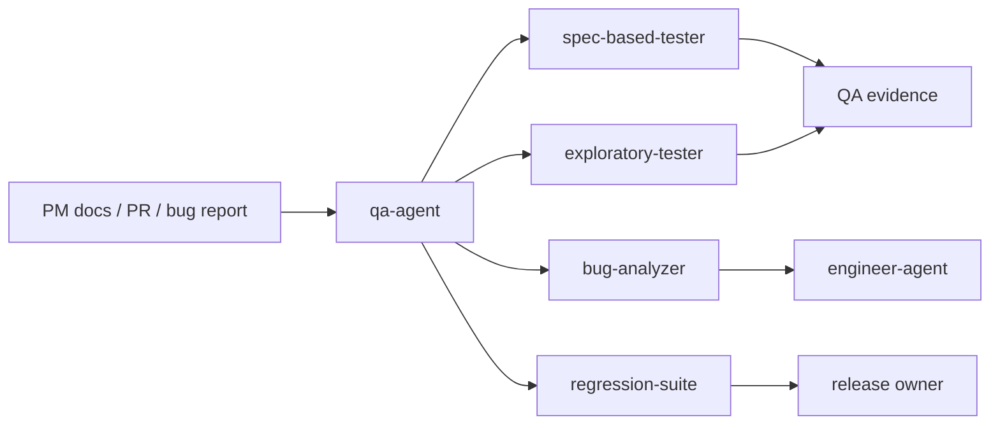

# QA Agent

`qa-agent` is an evidence-first QA dispatcher skill. It routes acceptance validation, exploratory testing, bug analysis, and regression verification requests to the right QA specialist skill. Its goal is not to "test more", but to produce traceable quality evidence.

> [!NOTE]
> Other languages: [中文](./README_zh.md)

> [!NOTE]
> Standalone QA or E2E requests should reuse existing test cases under `docs/qa/{feature}/` before expanding project exploration.

## Quick Facts

| Item | Details |
| --- | --- |
| Entry skill | `qa-agent` |
| Specialist skills | 4 |
| Main inputs | PM docs, test cases, code changes, PR descriptions, failure logs, screenshots, recordings |
| Main outputs | Validation matrix, exploratory report, bug report, regression conclusion |
| Downstream collaboration | Implementation defects go to `engineer-agent`; requirement gaps go to `pm-agent` |

## Skills

| Skill | When to use | Main output |
| --- | --- | --- |
| `qa-agent` | QA request routing | Specialist selection and execution path |
| `spec-based-tester` | Validating against PRD/TRD/Test Spec | Test summary, pass/fail result, coverage gaps, evidence |
| `exploratory-tester` | Smoke testing, boundary discovery, UX exploration | Exploration notes, anomalies, risk points, open questions |
| `bug-analyzer` | Reproducing failures and documenting defects | Reproduction steps, failure evidence, defect matrix, impact |
| `regression-suite` | Verifying fixes and rechecking known issues | Regression result, fix confirmation, residual risk |

## Routing Rules

- Documented acceptance or spec validation: use `spec-based-tester`
- Exploratory discovery, smoke, or boundary exploration: use `exploratory-tester`
- Failure reproduction, bug writing, or impact analysis: use `bug-analyzer`
- Fix verification, regression sweep, or known-issue recheck: use `regression-suite`

Default rule: decide what evidence the user needs, then choose the smallest sufficient QA skill. Do not present exploratory testing as full acceptance.

## Test Case Persistence

Standalone QA defaults to this directory shape:

```text
docs/
└── qa/
    └── {feature-name}/
        ├── TEST_SPEC.md
        ├── FILE_EXPLORATION.md
        ├── test-cases/
        │   └── TC-NNN-<short-slug>.md
        └── reports/
```

Workflow:

1. Read `TEST_SPEC.md` and `test-cases/*.md`
2. Ask whether there are new feature changes and whether exploration should expand test cases
3. Update `FILE_EXPLORATION.md` and add new test cases only when needed
4. Execute validation from durable test cases and produce a report

## Typical Flow



## Collaboration Boundary

- QA produces evidence, risk notes, and reproduction materials. It does not directly change production code.
- Implementation issues go to Engineer; requirement or acceptance-criteria issues go to PM.
- QA reports should clearly separate verified results, uncovered areas, blocked items, and residual risk.

## Local Maintenance

```bash
# Install one QA skill into the current project runtime
npx skills add ./agents/qa/skills/spec-based-tester

# Run QA eval
uv run agents/qa/test/run_all_evals.py
```
