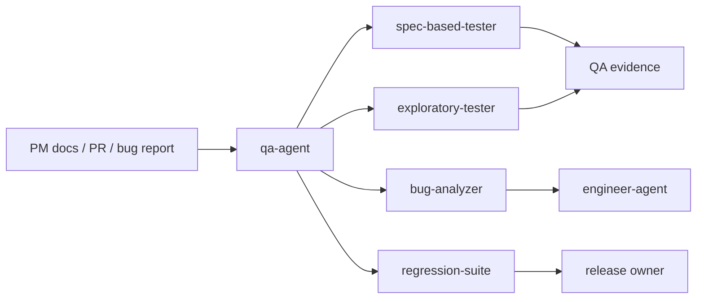

# QA Agent

`qa-agent` is an evidence-first QA dispatcher skill. It routes acceptance validation, exploratory testing, bug analysis, and regression verification requests to the right QA specialist skill. Its goal is not to "test more", but to produce traceable quality evidence.

> [!NOTE]
> Other languages: [中文](./README_zh.md)

> [!NOTE]
> Standalone E2E requests should reuse existing function-tree cases under `docs/qa/e2e/{一级功能}/{二级功能}/{三级功能}/` before expanding project exploration.

## Quick Facts

| Item | Details |
| --- | --- |
| Entry skill | `qa-agent` |
| Specialist skills | 4 |
| Main inputs | PM docs, test cases, code changes, PR descriptions, failure logs, screenshots, recordings |
| Main outputs | Validation matrix, exploratory report, bug report, regression conclusion |
| Downstream collaboration | Implementation defects go to `engineer-agent`; requirement gaps go to `pm-agent` |

## Skills

| Skill | When to use | Main output |
| --- | --- | --- |
| `qa-agent` | QA request routing | Specialist selection and execution path |
| `spec-based-tester` | Validating against PRD/TRD/Test Spec | Test summary, pass/fail result, coverage gaps, evidence |
| `exploratory-tester` | Smoke testing, boundary discovery, UX exploration | Exploration notes, anomalies, risk points, open questions |
| `bug-analyzer` | Reproducing failures and documenting defects | Reproduction steps, failure evidence, defect matrix, impact |
| `regression-suite` | Verifying fixes and rechecking known issues | Regression result, fix confirmation, residual risk |

## Routing Rules

- Documented acceptance or spec validation: use `spec-based-tester`
- Exploratory discovery, smoke, or boundary exploration: use `exploratory-tester`
- Failure reproduction, bug writing, or impact analysis: use `bug-analyzer`
- Fix verification, regression sweep, or known-issue recheck: use `regression-suite`

Default rule: decide what evidence the user needs, then choose the smallest sufficient QA skill. Do not present exploratory testing as full acceptance.

## E2E Case Persistence

Standalone E2E and feature-scoped QA persistence defaults to this directory shape:

```text
docs/qa/e2e/
├── _shared/
│   ├── login-flows/
│   └── data/
├── _reports/
│   └── {platform-version}/
│       └── test-reports-{test-time}.md
└── {一级功能}/
    └── {二级功能}/
        └── {三级功能}/
            ├── TEST_SUITE.md
            ├── FLOW_INDEX.md
            ├── cases/
            │   └── TC-NNN-<short-slug>.md
            ├── scripts/
            │   └── TC-NNN-<short-slug>.spec.md
            ├── results/
            │   └── TC-NNN-<short-slug>/{platform-version}/
            └── _reports/
                └── {platform-version}/test-reports-{test-time}.md
```

Workflow:

1. Confirm the E2E scenario: `feature-update` for local development validation, or `release` for full active E2E on the release test environment.
2. Confirm the platform version before execution; missing versions are `blocked`, never archived under `unknown`.
3. Read `TEST_SUITE.md`, `FLOW_INDEX.md`, `cases/*.md`, `scripts/*.spec.md`, prior `results/`, and `_reports/` before exploring.
4. For existing-feature changes, bug fixes, or code-complete E2E updates, consume a confirmed `feature_path`, read `docs/pm/{feature_path}/PRD.md`, `docs/engineer/{feature_path}/TRD.md`, and a confirmed `docs/engineer/{feature_path}/IMPLEMENTATION_PLAN.md`, then create, update, or execute acceptance TC only when those documents align.
5. Execute each E2E TC through a subagent by default; the main agent owns scope, result confirmation, and the summary report.
6. Choose the execution entry in this order: repo harness > Chrome plugin / browser connector > Playwright fallback.
7. Store credentials only in `.qa/e2e/accounts.local.json` using account IDs from `agents/qa/skills/qa-agent/references/e2e-credential-store.md`; committed QA docs must not contain plaintext credentials.
8. Write the main-agent report using `agents/qa/skills/qa-agent/references/e2e-test-report.md`.

## Typical Flow



## Collaboration Boundary

- QA produces evidence, risk notes, and reproduction materials. It does not directly change production code.
- Implementation issues go to Engineer; requirement or acceptance-criteria issues go to PM.
- QA reports should clearly separate verified results, uncovered areas, blocked items, and residual risk.

## Local Maintenance

```bash
# Install one QA skill into the current project runtime
npx skills add ./agents/qa/skills/spec-based-tester

# Run QA eval
uv run agents/qa/test/run_all_evals.py
```
