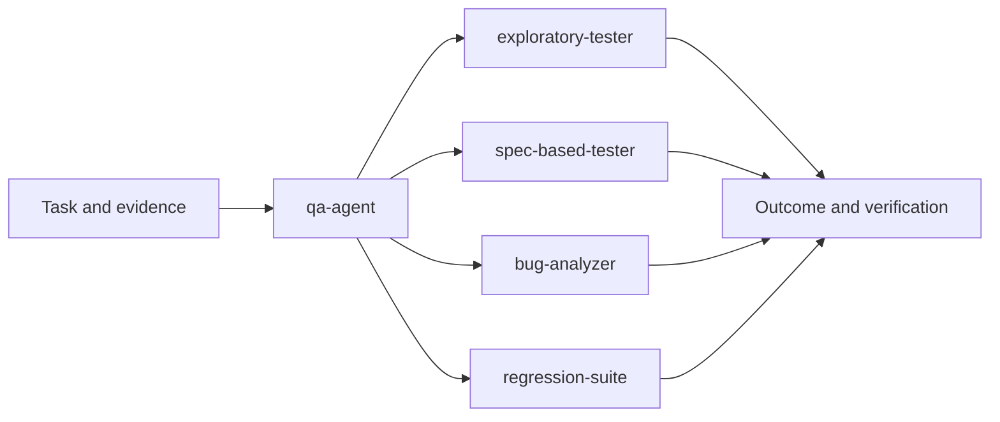

# QA Agent

`qa-agent` helps select methods for qa agent work. The plugin provides 5 directly usable skills for the specialist tasks below. The assistant combines this knowledge to complete the requested outcome.

> [!NOTE]
> [Architecture](../../docs/architecture.md) · [Documentation Guide](../../docs/AGENTS.md) · [中文](./README_zh.md)

## Quick Facts

| Item | Details |
| --- | --- |
| Role guide | `qa-agent` |
| Specialist and composition skills | 4 |
| Main inputs | Expected behavior, user journeys, existing cases, changes, logs, screenshots, and running environments |
| Main outputs | Acceptance evidence, exploration results, reproducible defects, and regression conclusions |

## Skills

| Skill | When to use | Main output |
| --- | --- | --- |
| [qa-agent](./skills/qa-agent/SKILL.md) | QA capability guide | Verification scope and evidence |
| [exploratory-tester](./skills/exploratory-tester/SKILL.md) | Explore real user journeys | Observed behavior and reproducible findings |
| [spec-based-tester](./skills/spec-based-tester/SKILL.md) | Verify behavior against known expectations | Expectation matrix and results |
| [bug-analyzer](./skills/bug-analyzer/SKILL.md) | Reproduce and analyze defects | Defect record, reproduction, impact |
| [regression-suite](./skills/regression-suite/SKILL.md) | Organize and run regression tests | Fix verification and adjacent coverage |

## Choosing a Capability

- Use `spec-based-tester` to check stated expectations and show which were exercised.
- Use `exploratory-tester` for smoke checks, alternate paths, boundaries, and usability observations.
- Use `bug-analyzer` to reproduce a finding, assess impact, and create a usable defect record.
- Use `regression-suite` to recheck a fix and adjacent behavior selected from the actual diff.

## Installation and Use

```text
/plugin marketplace add Neplich/dev-agent-skills
/plugin install qa-agent@dev-agent-skills
```

For Codex personal and project installations, see the [installation guide](../../docs/README.codex.md). From the repository root, install all capabilities into the selected target:

```bash
python3 scripts/install_codex_skills.py --target /path/to/skills
```

Describe the goal directly or select a skill through the host, for example:

```text
/regression-suite "Verify the checkout fix and related discount paths."
```

## Inputs and Artifacts

Reuse existing cases and login helpers. Identify the build with a release version, commit SHA, or accurate local description. Record actual actions, expected and observed results, and sanitized evidence; distinguish executed failures from checks blocked by an unavailable environment.

For durable artifacts, use the project’s existing locations or adapt this layout:

```text
docs/qa/e2e/{feature}/
  TEST_SUITE.md
  FLOW_INDEX.md
  cases/TC-NNN-<slug>.md
  scripts/TC-NNN-<slug>.spec.md
  results/{build}/TC-NNN/{test-time}/result.md
  _reports/{build}/test-reports-{test-time}.md
```

Choose the useful files for the task. Existing documents, code, and tests jointly support expectations and verification.

## Reusable E2E Evidence

1. Read the existing suite, flow index, cases, execution entries, and previous results.
2. Select the relevant journeys and identify the environment and build.
3. Execute through the repository harness or suitable browser tooling; reuse shared login flows and test data.
4. Record `pass`, `fail`, or `blocked` with the observation or unavailable execution dependency.
5. Keep useful new cases and append distinct run results for later comparison.

Credential values use the project's protected secret mechanism or the local,
Git-ignored `.qa/e2e/accounts.local.json`. Committed cases and reports reference
account IDs and sanitized evidence.

Detailed references: [case format](./skills/qa-agent/references/e2e-case-format.md),
[credential storage](./skills/qa-agent/references/e2e-credential-store.md), and
[test reports](./skills/qa-agent/references/e2e-test-report.md).

## Typical Workflow

Select expectations → reuse cases → execute → investigate findings → report or verify repairs


```mermaid
flowchart LR
    Context["Task and evidence"] --> Work["qa-agent"]
    Work --> S0["exploratory-tester"]
    S0 --> Result["Outcome and verification"]
    Work --> S1["spec-based-tester"]
    S1 --> Result["Outcome and verification"]
    Work --> S2["bug-analyzer"]
    S2 --> Result["Outcome and verification"]
    Work --> S3["regression-suite"]
    S3 --> Result["Outcome and verification"]
```

## Combining Capabilities

Combine test evidence with engineering work when repair is part of the request. Coverage and conclusions reflect the journeys actually checked. Persistent cases and distinct run records help later regression work.

The assistant continues within existing authorization and identifies concrete decisions when a material product choice or additional operation permission is needed.

## Local Maintenance

Capability sources live under `skills/` in this directory. Update relevant descriptions and installation data with content changes; see the [maintenance guide](../../docs/cookbook/maintain-skills.md) for verification.
