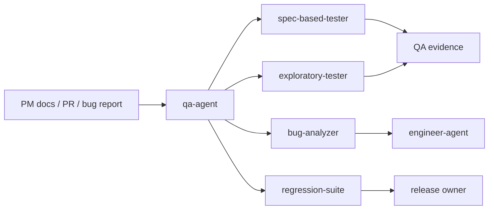

# QA Agent

`qa-agent` 是证据优先的 QA dispatcher skill，负责把验收验证、探索测试、缺陷分析和回归复测请求路由到合适的 QA specialist skill。它的目标不是“多测一点”，而是产出可追溯、可交接的质量证据。

> [!NOTE]
> 其他语言：[English](./README.md)

> [!NOTE]
> 独立 E2E 请求应先复用 `docs/qa/e2e/{feature_path}/` 下的功能树用例，再决定是否扩充探索范围。

## 快速信息

| 项目 | 内容 |
| --- | --- |
| 入口 skill | `qa-agent` |
| Specialist skills | 4 个 |
| 主要输入 | PM 文档、测试用例、代码变更、PR 描述、失败日志、截图、录屏 |
| 主要输出 | 验证矩阵、探索报告、缺陷报告、回归结论 |
| 下游协作 | 实现缺陷交给 `engineer-agent`，需求缺口交给 `pm-agent` |

## Skill 清单

| Skill | 适用场景 | 主要产物 |
| --- | --- | --- |
| `qa-agent` | QA 请求入口与路由 | 下游 skill 选择与执行路径 |
| `spec-based-tester` | 按 PRD/TRD/Test Spec 做文档化验收 | 测试摘要、通过/失败判定、覆盖缺口、证据 |
| `exploratory-tester` | 冒烟、边界发现、体验探索 | 探索记录、异常发现、风险点、待确认事项 |
| `bug-analyzer` | 复现失败、整理缺陷、判断影响 | 复现步骤、失败证据、缺陷矩阵、影响评估 |
| `regression-suite` | 验证修复、扫回归、复核已知问题 | 回归结果、修复确认、残余风险 |

## 路由规则

- 文档化验收、规范验证：使用 `spec-based-tester`
- 探索式发现、冒烟、边界发现：使用 `exploratory-tester`
- 失败复现、缺陷写作、归因整理：使用 `bug-analyzer`
- 修复验证、回归扫测、已知问题复核：使用 `regression-suite`

默认规则：先判断用户要的证据类型，再选择最小足够的 QA skill，不把探索测试伪装成全量验收。

## E2E 用例持久化

独立 E2E 和功能范围 QA 持久化默认使用以下目录：

```text
docs/qa/e2e/
├── _shared/
│   ├── login-flows/
│   └── data/
├── _reports/
│   └── {platform-version}/
│       └── test-reports-{test-time}.md
└── {feature_path}/
    ├── TEST_SUITE.md
    ├── FLOW_INDEX.md
    ├── cases/
    │   └── TC-NNN-<short-slug>.md
    ├── scripts/
    │   └── TC-NNN-<short-slug>.spec.md
    ├── results/
    │   └── TC-NNN-<short-slug>/{platform-version}/
    └── _reports/
        └── {platform-version}/test-reports-{test-time}.md
```

工作顺序：

1. 确认 E2E 场景：`feature-update` 用于开发环境本地验证，`release` 用于发版版本测试环境全量 active E2E。
2. 执行前确认测试平台版本；缺失时标记 `blocked`，不得写入 `unknown` 目录。
3. 先读取 `TEST_SUITE.md`、`FLOW_INDEX.md`、`cases/*.md`、`scripts/*.spec.md`、历史 `results/` 和 `_reports/`，再决定是否探索。
4. 现有功能变更、bug 修复或代码完成后的 E2E 文档补充，必须消费已确认的 `feature_path`，读取 `docs/pm/{feature_path}/PRD.md`、`docs/engineer/{feature_path}/TRD.md` 和已确认的 `docs/engineer/{feature_path}/IMPLEMENTATION_PLAN.md`，三者对齐后才创建、更新或执行验收 TC。
5. 每个 E2E TC 默认交给 subagent 执行；主 agent 负责范围、结果确认和汇总报告。
6. 执行入口按 repo harness > Chrome plugin / browser connector > Playwright fallback 选择。
7. 凭据只写入 `.qa/e2e/accounts.local.json`，并按 `agents/qa/skills/qa-agent/references/e2e-credential-store.md` 使用账号 ID；提交文档不得包含明文凭据。
8. 主 agent 汇总报告使用 `agents/qa/skills/qa-agent/references/e2e-test-report.md` 的固定格式。

## 典型工作流



## 协作边界

- QA 输出证据、风险和复现材料，不直接修改生产代码。
- 实现问题交给 Engineer；需求或验收标准问题交给 PM。
- QA 报告应明确区分已验证、未覆盖、被阻塞和残余风险。

## 本地维护

```bash
# 安装某个 QA skill 到当前项目运行时
npx skills add ./agents/qa/skills/spec-based-tester

# 运行 QA eval
uv run agents/qa/test/run_all_evals.py
```
