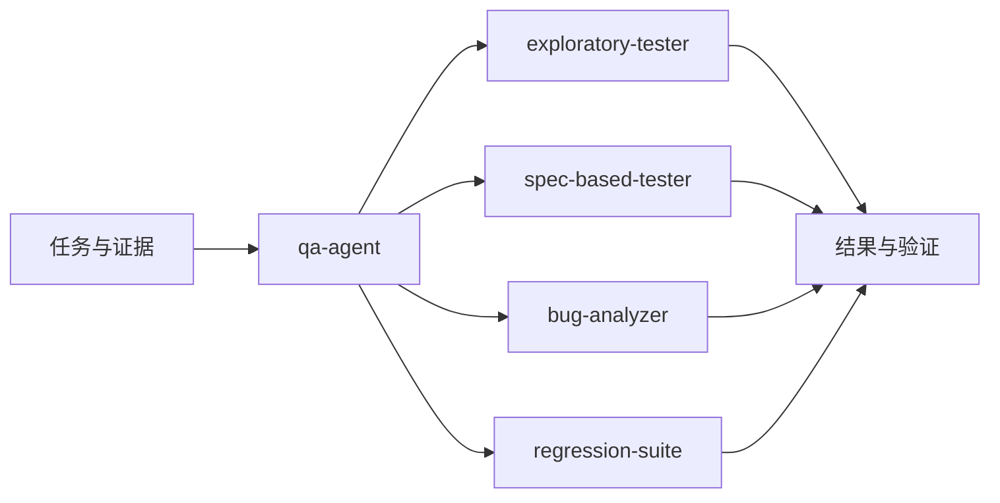

# QA Agent

`qa-agent` 帮助选择QA 能力相关方法。本插件提供 5 个可直接使用的 Skill，覆盖下表中的专项任务。助手根据用户目标组合专业知识，并持续完成请求范围内的工作。

> [!NOTE]
> [仓库架构](../../docs/architecture.md) · [文档说明](../../docs/AGENTS.md) · [English](./README.md)

## 快速信息

| 项目 | 详情 |
| --- | --- |
| 角色导航 | `qa-agent` |
| 专项与组合 Skill | 4 |
| 主要输入 | 预期行为、用户流程、已有用例、变更、日志、截图与运行环境 |
| 主要产物 | 验收证据、探索结果、可复现缺陷与回归结论 |

## Skill 清单

| Skill | 适用场景 | 主要产物 |
| --- | --- | --- |
| [qa-agent](./skills/qa-agent/SKILL.md) | 测试能力导航 | 验证范围与证据 |
| [exploratory-tester](./skills/exploratory-tester/SKILL.md) | 探索真实用户路径 | 观察行为与可复现发现 |
| [spec-based-tester](./skills/spec-based-tester/SKILL.md) | 按已知预期验证行为 | 预期矩阵与结果 |
| [bug-analyzer](./skills/bug-analyzer/SKILL.md) | 复现与分析缺陷 | 缺陷记录、复现与影响 |
| [regression-suite](./skills/regression-suite/SKILL.md) | 组织与执行回归测试 | 修复验证与邻近覆盖 |

## 能力选择

- 使用 `spec-based-tester` 核对明确预期，并说明实际覆盖项。
- 使用 `exploratory-tester` 进行冒烟、分支、边界和可用性探索。
- 使用 `bug-analyzer` 复现发现、判断影响并形成可用缺陷记录。
- 使用 `regression-suite` 验证修复，并根据实际差异检查邻近行为。

## 安装与使用

```text
/plugin marketplace add Neplich/dev-agent-skills
/plugin install qa-agent@dev-agent-skills
```

Codex 的个人级和项目级安装见 [安装指南](../../docs/README.codex.md)。从仓库根目录安装全部能力到已选目标：

```bash
python3 scripts/install_codex_skills.py --target /path/to/skills
```

直接描述目标，或通过宿主的 Skill 选择器调用，例如：

```text
/regression-suite "验证结算修复以及相关优惠分支"
```

## 输入与产物组织

复用已有用例与登录辅助流程。构建可用发布版本、commit SHA 或准确的本地描述标识。记录实际动作、预期与观察结果及脱敏证据，区分已执行的失败和环境不可用导致的未执行项。

需要持久化资料时，可沿用项目现有位置或参考下列布局：

```text
docs/qa/e2e/{feature}/
  TEST_SUITE.md
  FLOW_INDEX.md
  cases/TC-NNN-<slug>.md
  scripts/TC-NNN-<slug>.spec.md
  results/{build}/TC-NNN/{test-time}/result.md
  _reports/{build}/test-reports-{test-time}.md
```

具体文件按任务价值选用；已有资料、代码和测试共同支持预期与验证。

## 可复用 E2E 证据

1. 查看已有 suite、流程索引、用例、执行入口和历史结果。
2. 选择相关用户流程，标识实际环境与构建。
3. 通过仓库测试工具或适用浏览器工具执行，复用登录流程与测试数据。
4. 以 `pass`、`fail` 或 `blocked` 记录结果，附观察事实或不可用的执行依赖。
5. 保存有价值的新用例，追加独立运行结果，供后续比较。

凭据值使用项目受保护的存储方式，或被 Git 忽略的本地 `.qa/e2e/accounts.local.json`。提交的用例和报告引用账号 ID 与脱敏证据。

详细格式见 [用例参考](./skills/qa-agent/references/e2e-case-format.md)、[凭据存储](./skills/qa-agent/references/e2e-credential-store.md) 和 [测试报告](./skills/qa-agent/references/e2e-test-report.md)。

## 典型工作方式

选择预期 → 复用用例 → 执行 → 分析发现 → 报告或验证修复


```mermaid
flowchart LR
    Context["任务与证据"] --> Work["qa-agent"]
    Work --> S0["exploratory-tester"]
    S0 --> Result["结果与验证"]
    Work --> S1["spec-based-tester"]
    S1 --> Result["结果与验证"]
    Work --> S2["bug-analyzer"]
    S2 --> Result["结果与验证"]
    Work --> S3["regression-suite"]
    S3 --> Result["结果与验证"]
```

## 与其他能力组合

请求包含修复时，将测试证据与工程工作结合。覆盖范围和结论对应实际检查的流程；持久化用例与独立运行记录支持后续回归。

助手在已有授权内贯穿相关工作；涉及关键产品选择或新增操作权限时，明确需要用户决定的具体事项。

## 本地维护

能力源码位于本目录的 `skills/`。修改专业内容后，同步相关说明和安装数据；验证方法见 [维护指南](../../docs/cookbook/maintain-skills.md)。
