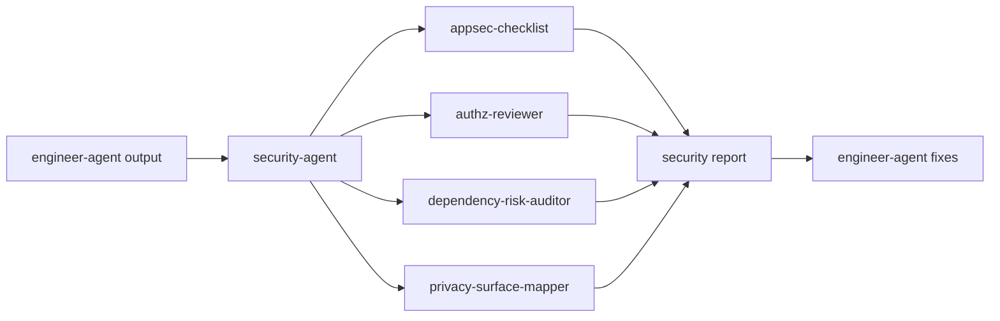

# Security Agent

`security-agent` is the security-review dispatcher skill. It routes pre-release security gates, application security checks, authorization review, dependency risk, and privacy data-flow requests to the right security specialist skill.

> [!NOTE]
> Other languages: [中文](./README_zh.md)

> [!NOTE]
> Security Agent produces evidence-backed risk judgment and actionable remediation guidance. It does not replace Engineer for code fixes or PM for requirement boundary changes.

## Quick Facts

| Item | Details |
| --- | --- |
| Entry skill | `security-agent` |
| Specialist skills | 4 |
| Main inputs | Codebase, dependency manifests, PM docs, engineering docs, QA feedback |
| Main outputs | Security reports under `docs/security/{feature_path}/` |
| Trigger timing | After sensitive features are implemented, before release, or during focused risk review |

## Skills

| Skill | When to use | Main output |
| --- | --- | --- |
| `security-agent` | Security request routing | Specialist selection and execution path |
| `appsec-checklist` | General application security review, pre-release security gate, common vulnerability scan | Application security report |
| `authz-reviewer` | Login, sessions, roles, tenant isolation, authorization bypass risk | Auth/authz review report |
| `dependency-risk-auditor` | Dependency vulnerabilities, abandoned packages, supply-chain risk | Dependency risk audit |
| `privacy-surface-mapper` | PII, consent, retention, data sharing, GDPR/CCPA risk | Privacy data-flow map |

## Routing Rules

- General security review or pre-release gate: use `appsec-checklist`
- Authentication, authorization, roles, tenant isolation, session handling: use `authz-reviewer`
- Dependencies, vulnerabilities, abandoned packages, supply chain: use `dependency-risk-auditor`
- PII, privacy data flow, consent, retention, GDPR/CCPA: use `privacy-surface-mapper`

Default rule: security requests that do not clearly focus on auth, dependencies, or privacy start with `appsec-checklist`.

## Output Directory

```text
docs/
└── security/
    └── {feature_path}/
        ├── appsec-checklist.md
        ├── authz-review.md
        ├── dependency-audit.md
        └── privacy-map.md
```

Feature-scoped security work consumes the `feature_path` confirmed by PM and
Engineer. If the path is unclear, Security returns to PM for PRD/path
clarification or Engineer for missing/stale TRD or implementation plan instead
of creating a new top-level security directory.

## Typical Flow



## Collaboration Boundary

- Security outputs risk severity, evidence, impact, and remediation guidance.
- Security does not directly implement business code or deployment changes.
- Code, dependency, or config changes go to Engineer or DevOps.
- Requirement-driven risk goes back to PM for constraint clarification.
- Security does not decide parent feature ownership; it reads
  `docs/pm/{feature_path}/PRD.md` and the matching Engineer TRD/implementation
  plan when feature scope is required.

## Collaboration Dependencies

Security Agent hands off to peer agents that are packaged and installed as separate plugins:

- `engineer-agent` and `devops-agent` for remediation of confirmed findings
- `pm-agent` for requirement-driven risk and feature-path clarification

If a target agent is not installed, the corresponding handoff stage is unavailable; Security Agent reports the missing stage and the recommended plugin and marks that stage blocked instead of doing the work itself.

## Local Maintenance

```bash
# Install one Security skill into the current project runtime
npx skills add ./agents/security/skills/appsec-checklist

# Inspect security eval definitions
find agents/security/test -path '*/evals/evals.json' -print
```
